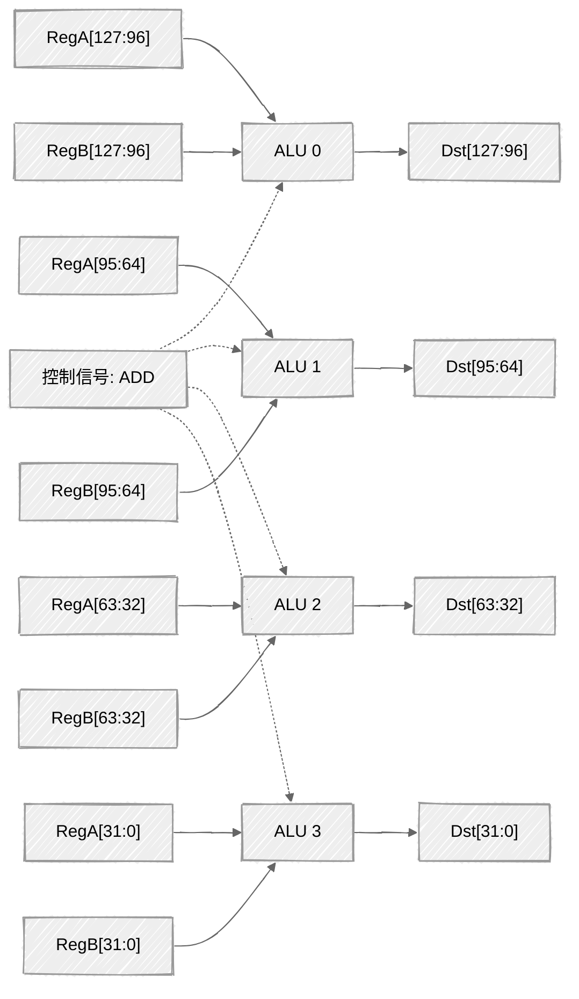
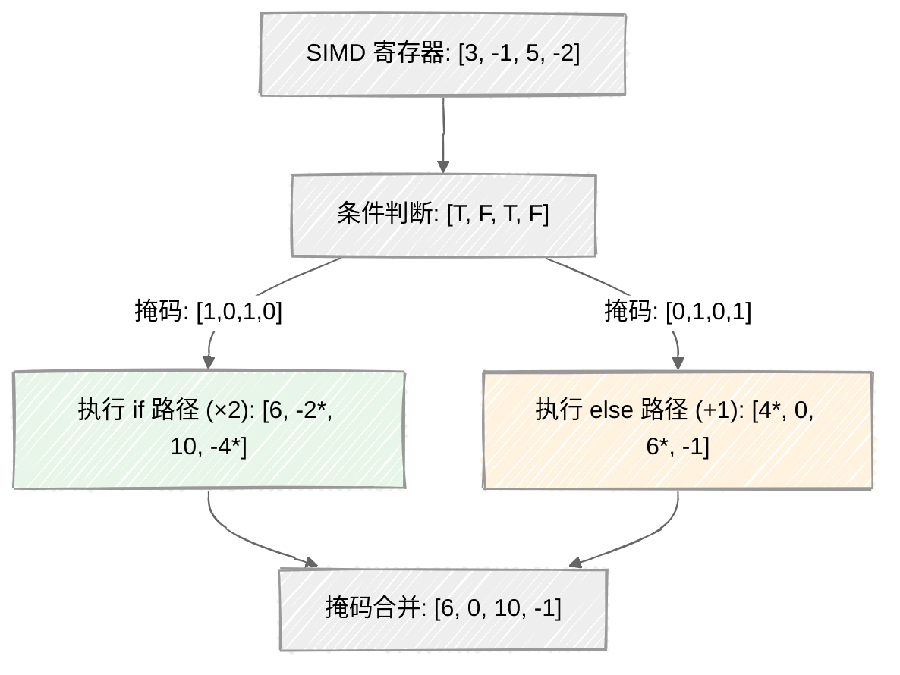
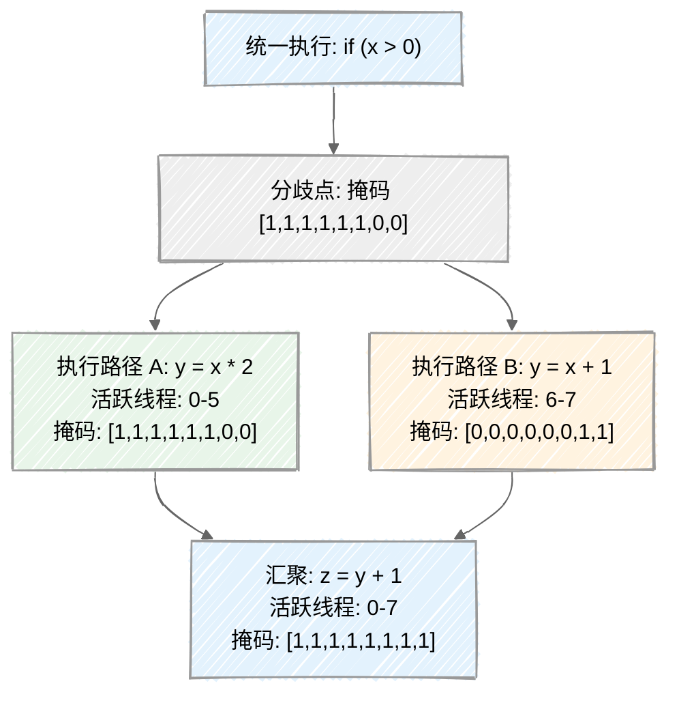
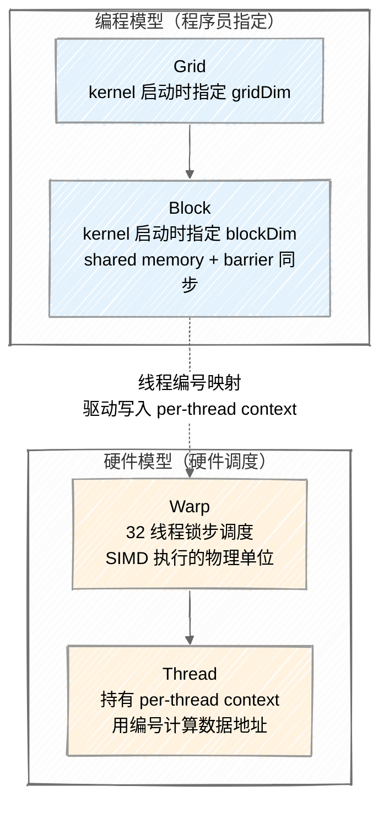
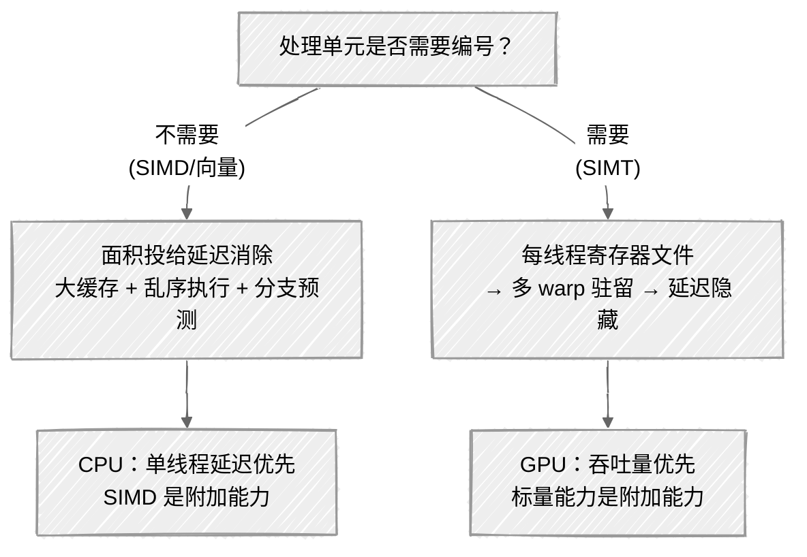
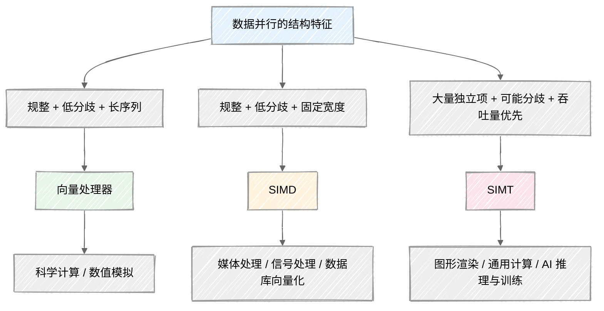

---
tags:
  - 体系结构
  - 数据并行
  - SIMD
  - SIMT
  - GPU
created: 2026-06-10
---
# 数据并行的硬件回答：从标量到 SIMT

当你写一个循环对数组中每个元素做同样的运算，循环本身在做什么？

循环变量递增、边界判断、分支跳转——这些指令服务于"对每个元素做同一件事"这个意图，但它们本身不产生计算结果。元素越多，管理开销在总指令中的占比就越高。标量指令一次取一个数、做一个决定；数据并行计算要对一组数做同一个变换。用标量指令表达数据并行，指令的开销是表达方式造成的，不是计算本身的属性。

这篇笔记追踪一条推理链：数据并行的结构特征如何驱动了从标量到向量到 SIMD 到 SIMT 的硬件执行模型演化。向量处理器、SIMD 和 SIMT 不是三种并列的技术选项，而是对数据并行需求中不同结构特征的差异化响应。

这条因果链中浮现出一个无法回避的 trade-off：**处理单元是否需要可编程的线程索引来寻址不同的数据。** #术/权衡
- 不需要索引：SIMD 的 lanes 没有身份，对自身在整体中的位置毫无感知
	- 向量架构靠 stride 描述访存模式，虽能表达规律间隔，但每个元素仍然不知道“我是第几个”。
- 需要索引：SIMT 的每个线程持有一个可编程的 `threadIdx`，它能用它做任意地址计算，从而独立决定自己该碰哪一块数据。
    
选择“需要”这一侧，就意味着硬件必须背上调度基础设施的固定成本——warp 锁步、thread mask 的生成与维护、分支分歧的处理逻辑。这些不是渐进优化能悄悄绕过去的开销，而是从一开始就写进微架构里的代价。

那它换来了什么？最直接的答案，是灵活寻址不规则数据的能力——间接访问、稀疏矩阵、非连续索引，这些纯 SIMD 很难优雅处理的问题，在线程索引面前变成了寻常的地址计算。但比这更深一层的收益，在于编程模型：SIMT 让程序员可以假装自己在写一条条独立、顺序执行的标量线程，而硬件在底下偷偷按锁步执行。这种抽象让并行代码的思维负担从“管理一组数据的同步变形”降到了“写好一个标量线程的逻辑”，而这份编程模型的统一与简化，恰恰是付出调度代价之后才成立的东西。

## 从标量到数据并行

标量处理器一次做一件事：取一条指令，从一个地址读一个操作数，执行一个运算，写一个结果。这条流水线为单线程的串行逻辑设计得极其精巧——乱序执行、分支预测、深度流水线，全都在降低单条指令的延迟。

但很多计算不是串行逻辑。科学计算中的矩阵运算、信号处理中的滤波、图形渲染中的像素着色、机器学习中的张量运算——它们的共同模式是**对大量数据执行同一个变换**。用标量处理器处理这种模式，唯一的方法是循环：

```c
for (int i = 0; i < N; i++) {
    c[i] = a[i] + b[i];
}
```

这个循环做的事情在语义上等价于"对 N 对元素做加法"，但循环体每次迭代都要付出额外的开销：循环变量的递增、与 N 的比较、条件跳转。这些指令服务于循环控制，而非计算本身。当 N 很大时，标量处理器把可观的比例花在了"管理循环"而非"执行计算"上。

更重要的是，这种开销是**表达方式造成的**，不是计算本身的属性。计算意图是"对一组数据做同一个变换"，标量指令的表达方式是"重复 N 次做一次变换"。这两者之间的鸿沟，正是数据并行硬件要填平的。

三个并行概念需要区分清楚：

- **数据并行（DLP）**：一条指令同时处理多个数据。关键特征是"同一操作"——指令只有一个，数据有多个。
- **指令级并行（ILP）**：同一指令流中多条不同指令同时执行。超标量、乱序执行是 ILP 的典型机制。
- **线程级并行（TLP）**：多个独立指令流在不同核心上并行执行。

DLP 和 ILP 的区别一句话说清：ILP 让多条不同指令同时执行，DLP 让同一条指令同时处理多个数据。两者正交——现代 CPU 同时利用两者（超标量 + SIMD 扩展），但硬件机制和编程模型完全不同。ILP 的机制留给其他笔记，本篇聚焦 DLP。

那么，硬件如何回答"对一组数据做同一个变换"这个需求？第一条回答来自向量处理器。

---

## 向量处理器：时间上的并行

### 一条指令描述一个向量操作

向量处理器的核心思想极其简洁：**用一条指令启动对整个向量的操作**，让硬件自动遍历所有元素，消除循环管理的指令开销。

```c
// 标量循环：N 条加法指令 + N 条循环控制指令
for (int i = 0; i < N; i++) {
    c[i] = a[i] + b[i];
}

// 向量指令：一条指令完成整个向量加法
VADD  v3, v1, v2    // v1、v2 是向量寄存器，v3 = v1 + v2
```

一条 `VADD` 指令，取代了整个循环。程序员或编译器不需要写循环，硬件自动完成向量中所有元素的加法。

### 向量元素如何流过流水线

理解向量处理器的关键在于"流过"这个词——向量操作是**流水线化的时序执行**，不是同时执行。

浮点加法比整数加法复杂——两个浮点数不能直接对位求和，因为指数可能不同，必须先对齐再相加。一个浮点加法流水线通常有 5 个阶段：取操作数（从寄存器文件读出两个浮点数）、对阶（将较小指数的尾数右移，使指数对齐——类比十进制：1.23×10³ + 4.56×10¹ 先对齐为 1.23×10³ + 0.0456×10³）、尾数相加（对齐后的尾数做加减）、规格化（调整结果为标准浮点格式，前导 1 回到正确位置，指数相应调整）、写回（结果写入目标寄存器）。向量加法 `VADD v3, v1, v2` 的执行过程如下：

```mermaid
---
config:
  "look": "handDrawn"
  "theme": "neutral"
---
gantt
    title 向量加法的时间并行：元素逐个流过流水线
    dateFormat X
    axisFormat %s

    section 元素 e0
    取操作数    :0, 1
    对阶        :1, 2
    尾数相加    :2, 3
    规格/写回   :3, 5

    section 元素 e1
    取操作数    :1, 2
    对阶        :2, 3
    尾数相加    :3, 4
    规格/写回   :4, 6

    section 元素 e2
    取操作数    :2, 3
    对阶        :3, 4
    尾数相加    :4, 5
    规格/写回   :5, 7

    section 元素 e3
    取操作数    :3, 4
    对阶        :4, 5
    尾数相加    :5, 6
    规格/写回   :6, 8
```



每个 cycle，一个新元素进入流水线的第一个阶段，同时前一个元素推进到下一个阶段。在任何给定的 cycle，流水线中同时有多个元素处于不同的执行阶段——这就是"时间上的并行"：**不同元素在流水线的不同阶段同时活跃，但每个 cycle 只有一个新元素进入、一个旧元素完成**。

这不是"同时做 N 件事"。更准确地说，是"连续地做 N 件事，中间没有指令开销，且相邻元素在时间上重叠"。元素之间是流水线化的并行关系，不是空间上的同时关系。

### 向量长度：软件可见，硬件无关

向量处理器的一个关键设计决策：**向量长度是软件可见的，不依赖于硬件的流水线深度**。向量寄存器可以容纳任意长度的向量（通常有最大长度限制，如 256 或 512 个元素），程序员或编译器通过向量长度寄存器指定本次操作要处理多少元素。

这意味着同一条向量指令可以处理长度为 1 的向量，也可以处理长度为 256 的向量——硬件会自动调整流水线遍历的次数。向量长度是编程模型的一部分，不是硬件常量。这个设计是一个[[0-理论/0/阳：虚拟化|状态边界的选择]]：把流水线细节推到边界的硬件侧，程序员只需要指定向量长度——优雅且灵活，但代价是硬件必须建设深度流水线和大容量向量寄存器文件来维护这个承诺。

### 向量处理器假定的数据特征

向量处理器的效率建立在几个前提之上：

- **规整的访问模式**：向量元素在内存中连续排列，或以固定步幅排列。硬件可以用流水线化的内存访问高效加载数据。
- **无控制流分歧**：向量中的所有元素走同一条执行路径。不存在"某些元素走 if，某些走 else"的需求。
- **足够长的向量**：向量必须足够长，才能让启动流水线的开销（填充流水线的前几个 cycle）被后续元素的吞吐量摊薄。

这些前提在科学计算中经常成立——矩阵乘法、FFT、线性代数中的操作天然是规整的长向量、无分歧。但在其他领域呢？图像处理中每个像素可能需要不同的处理路径；图形渲染中不同片元可能执行不同的 shader 分支；通用计算中的数据访问模式经常是不规则的。当这些前提不成立时，向量处理器的效率会急剧下降。

### Stride 和 Chaining：指令级参数的表达力与边界

向量架构有两个关键扩展——stride 和 chaining——它们扩展了数据并行的表达力，但扩展方式都是指令级参数，不是让每个元素获得独立的能力。

**Stride（步幅）** 控制向量 load/store 时相邻元素之间的内存地址间隔。Stride-1 是最常见的情况：元素在内存中紧密排列，每个元素的地址 = 基址 + 元素大小 × 元素序号。但 stride 允许间隔任意固定值。一个典型的应用场景是按列访问行优先存储的矩阵：一个 4×4 矩阵在内存中按行排列为 `[a00, a01, a02, a03, a10, a11, ...]`，要取向量 `[a00, a10, a20, a30]`（第一列），stride 就是 4——每隔 4 个元素取一个。这在 SIMD 中需要一个专门的 shuffle 操作来重排数据，而向量架构通过 stride 参数直接表达。

SIMD 要求元素在内存中连续排列（或通过 gather/scatter 间接索引），向量架构通过 stride 直接表达非连续但等间距的访问模式——这是向量架构比 SIMD 更灵活的一个维度。

**Chaining（链式链接）** 解决的是向量操作之间的数据依赖延迟。考虑两条连续的向量指令：

```
VADD  v3, v1, v2    // v3 = v1 + v2
VMUL  v5, v3, v4    // v5 = v3 × v4，依赖上一条的结果
```

没有 chaining 时，VMUL 必须等 VADD 的所有元素都写回寄存器文件后才能开始——即使 VADD 的第一个元素早就计算完了，VMUL 也必须等最后一个元素写回。Chaining 让 VADD 产出的每个元素在写回寄存器文件的同时，直接流入 VMUL 的对应输入——类似于标量流水线中的前递（forwarding），但作用在向量操作之间。结果是一条长链的向量操作可以像一条超长流水线一样连续流动，中间的寄存器写回延迟被消除了。

这个"产出直接流入下游而不中间落盘"的模式，和数据库查询执行中的 pipeline 执行是同一个结构。[[0-理论/数据库系统/Bottom Up/RDBMS/2-Execution/Query Executor Overview|火山模型]]中，每个算子调用子算子的 `next()` 拉取一条元组——算子之间的数据必须跨越函数调用边界，每次跨越都是一次开销。Push-based 执行把数据从扫描算子直接推过过滤和聚合，不物化中间结果——算子之间的边界被消除了，数据流过一条连续的管道。Chaining 做的是同一件事：消除 VADD 和 VMUL 之间的寄存器写回边界，让数据从生产者直接流入消费者。方向是倒转的——从"消费者等生产者完成全部工作后拉取"变成"生产者每完成一个元素就推给消费者"——倒转的不是数据流的方向，而是**控制流的发起者**。

但 stride 和 chaining 都是**指令级参数**——整条向量指令的所有元素共享同一个 stride 值，chaining 的连接点也是指令级别的。向量长度寄存器控制一次向量操作处理多少元素，这同样是指令级参数。每个元素仍然不知道"我是第几个"——它只是被硬件循环自动推进到下一个地址（stride）或直接流入下一个操作（chaining）。

Stride 的表达力有明确边界。考虑稀疏矩阵的行压缩存储（CSR）：非零元素按行连续存储，但每行的非零元素个数不同，行指针数组的偏移是不规则的。要对第 i 行的非零元素做向量 load，需要先从行指针数组读出 `row_ptr[i]` 和 `row_ptr[i+1]`，再按这两个值访问列索引数组——每个元素的地址偏移由另一个数据结构的内容决定，而非由统一的 stride 可以表达。这种"每个元素的地址偏移依赖每个元素各自的数据"的模式，stride 无法覆盖，向量的硬件循环也无法自动推进。

既然向量处理器比 SIMD 更灵活（向量长度可变、stride 表达力更强），为什么 CPU 还要发明 SIMD 扩展，而不是直接采用向量架构？

答案在于硬件代价的应用场景适配。向量处理器需要深度流水线 + 大容量向量寄存器文件，这些硬件对科学计算的长向量操作是合理的投资——向量足够长，启动开销可以被摊薄。但 CPU 的主要工作负载不是长向量加法，而是复杂的串行逻辑（操作系统、数据库、Web 服务），数据并行只是其中一小部分。为了一小部分工作负载去建设完整的向量基础设施，面积效率太低。

"向量基础设施"到底贵在哪里？两个方面。第一，**向量寄存器文件**。一个支持 256 个 64 位元素的向量寄存器文件，单个寄存器就占 2KB（256 × 64 bit），32 个向量寄存器共 64KB——这和 CPU 整个 L1 数据缓存的大小相当。更大的问题是**读写端口**：每个 cycle 需要同时读 2-3 个操作数、写回 1 个结果，每个端口都需要独立的布线连接到所有寄存器，端口数增加时面积按平方增长。第二，**深度流水线的控制逻辑**：可变向量长度意味着硬件要维护一个元素计数器，每个 cycle 递增、与长度寄存器比较、决定是否继续——这些控制状态和标量流水线的乱序执行逻辑竞争同一块芯片面积。

SIMD 回应的是另一个需求：在标量核心上加一点数据并行能力，成本越低越好。

"划分进位链几乎免费"到底是怎么回事？一个 64 位加法器由 64 个全加器组成，每个全加器接收两个数据位和一个进位输入，产生一个和位和一个进位输出。进位从最低位向最高位逐级传播——这就是进位链。如果你在进位链的某些位置加一个控制门，让进位可以被强制为 0（即"切断"进位链），一个 64 位加法器就变成了 8 个独立的 8 位加法器、或 4 个 16 位加法器、或 2 个 32 位加法器。加法器的核心计算单元（64 个全加器）已经存在了——SIMD 只是在进位传播路径上加了几个控制门，让同一个加法器同时处理多个窄操作数。额外的硬件成本是每个切断点一个与门加上指令译码器的几根控制线，和 64 个全加器相比可以忽略。

SIMD 是对已有硬件资源的更充分利用，不需要新建向量寄存器文件和深度流水线。代价是 SIMD 宽度固定、编程模型暴露硬件细节——但这个代价在 CPU 的语境下可以接受，因为数据并行不是 CPU 的核心任务，能做一点就是增量收益。

从[[0-理论/0/阳：虚拟化|状态边界]]的视角看，这是向量处理器到 SIMD 的一次边界重画：向量处理器把"流水线深度和硬件宽度"推到边界的硬件侧（程序员不可见，但硬件必须建设大寄存器文件和深度流水线来维护这个承诺），SIMD 把它们拉回软件侧（程序员必须知道宽度，但硬件成本极低）。边界重画的驱动力是硬件代价在 CPU 工作负载下不可接受——[[1-实践/1/系统编程|系统编程]]中追踪的边界生活周期在硬件层同样成立。

---

## SIMD：空间上的并行

### 从物理动机出发：划分进位链

SIMD 扩展源于一个观察：**许多应用程序操作的数据类型比处理器字宽窄**。图形系统用 8 位表示每种基色和透明度，音频采样用 8 或 16 位。假定有一个 256 位加法器，通过划分进位链，处理器可以同时对多个短向量操作——32 个 8 位操作数、16 个 16 位操作数、8 个 32 位操作数、4 个 64 位操作数。划分进位链的额外硬件成本很小。

这是 SIMD 的物理起点——它不是因为"我们需要一种数据并行机制"而被发明出来的，而是因为"加法器已经很宽了，数据类型比它窄，划分进位链几乎免费"这种物理上的便利。SIMD 是对已有硬件资源的更充分利用，而非全新构建的并行机制。

### 多个 ALU 在同一 cycle 被同一控制信号驱动

SIMD（Single Instruction, Multiple Data）的核心思想同样简洁：**在一个 cycle 内，多个功能单元在同一控制信号下同时处理多个数据元素**。



一条 128 位 SIMD 加法指令，把 128 位寄存器分成 4 个 32 位 lane，4 个 ALU 同时执行加法。所有 lane 在**同一个 cycle** 内完成——这是真正的同时执行，不是流水线化的时间重叠。

### 空间并行 vs 时间并行：为什么这不是同一回事

SIMD 和向量处理器都符合"一条指令操作多个数据"的描述，但它们的执行模型有根本差异。我们来对比：

| 维度 | 向量处理器 | SIMD |
|------|-----------|------|
| 并行方式 | 时间并行（元素在流水线不同阶段同时活跃） | 空间并行（元素在同一 cycle 不同 ALU 中同时执行） |
| 元素完成时间 | 逐个完成，每个 cycle 产出一个结果 | 同时完成，所有 lane 在同一 cycle 产出结果 |
| 向量/SIMD 宽度 | 软件可见且可变（向量长度寄存器） | 硬件固定（128/256/512 位，由 ISA 决定） |
| 编程可见性 | 程序员指定向量长度，硬件宽度不可见 | 程序员必须知道硬件宽度，数据类型决定 lane 数 |
| 功能单元数量 | 一个深度流水线功能单元 | 多个并行功能单元（宽度 = lane 数） |
| 硬件面积代价 | 深流水线 + 向量寄存器文件 | 宽寄存器文件 + 多个并行 ALU |

**最关键的实际后果**：向量处理器屏蔽了硬件细节——程序员只需要表达"我要处理多少元素"（通过向量长度寄存器），不需要知道硬件流水线有多深、一次能处理几个。硬件宽度对程序员不可见，向量长度是程序员的自由度。SIMD 则把硬件宽度作为约束暴露给程序员——你需要知道寄存器是 128 位还是 256 位，数据类型是 32 位 float 还是 16 位 int，才能知道一条指令能处理多少元素。硬件宽度不再是硬件的实现细节，而是编程必须面对的参数。

这就是为什么 x86 的 SIMD 指令名必须带宽度后缀：`addps`（128 位 packed single）、`vaddps`（256 位）、`vaddps` with AVX-512（512 位）。程序员和编译器必须针对具体的硬件宽度编写代码。向新的 SIMD 宽度迁移（从 SSE 到 AVX 到 AVX-512）意味着重写或重新编译向量化的代码。

### Lane 不需要知道自己是谁

对两个 SIMD 寄存器 A 和 B 执行加法，结果 C 的每个 lane 是对应 lanes 的和：

```
A = [a0, a1, a2, ..., a15]
B = [b0, b1, b2, ..., b15]
C = [a0+b0, a1+b1, a2+b2, ..., a15+b15]
```

Lane 0 和 lane 3 执行同样的加法，对同样的相对偏移操作。C 的每个 lane 的计算不依赖 lane 编号——没有哪一步需要"如果我是 lane 5，就去做不同的事"。这让 SIMD 的硬件成本极低：加宽进位链就够了，不需要调度器、不需要编号寄存器、不需要分支分歧处理。

但当工作负载需要每个数据元素映射到不同地址时——稀疏矩阵的间接索引、图计算的邻居遍历、Monte Carlo 的随机采样——lanes 无法自己计算"我的数据在哪里"。Lane 不知道自己的编号，因此无法根据编号做不同的寻址。这个限制不是硬件可以优化掉的——它是计算语义的要求。SIMD 效率的来源（lanes 不需要编号，硬件极简）和表达力的边界（无法做 per-element 寻址）是同一件事的两面。

### VLA：用一条指令把硬件宽度藏起来

SIMD 的硬件宽度对编程模型可见——你写 `__m128` 还是 `__m256`，决定了每轮处理多少元素，换一代 CPU 就得改代码。ARM SVE 和 RISC-V V 扩展回应了这个问题：让编程模型不依赖硬件宽度。循环写法从"每轮处理 4 个"变成"每轮处理硬件告诉我能处理的个数"：

```c
// 传统 SIMD：宽度硬编码在代码里
for (int i = 0; i < N; i += 4) {   // 硬编码 4
    __m128 a = _mm_load_ps(&src[i]);
    __m128 b = _mm_add_ps(a, ones);
    _mm_store_ps(&dst[i], b);
}

// VLA：宽度由硬件在运行时告诉你
while (vl = setvl(N - i)) {         // 硬件返回本轮能处理的元素数
    vfloat32_t a = vlse32_v(&src[i], ...);
    vfloat32_t b = vfadd_vv(a, ones);
    vsse32_v(&dst[i], b, ...);
    i += vl;
}
```

RISC-V V 扩展把这个思想落地为具体的硬件机制。核心是一条 `vsetvli` 指令：程序员告诉硬件"我还有多少元素要处理"（AVL）和"每个元素多宽"（SEW，如 32 位 float），硬件根据自身能力返回"这轮给你处理多少个"（VL）。程序员只管 `i += vl` 然后继续循环——不需要知道硬件寄存器有多宽。

背后的计算：硬件有一个常数 VLEN（向量寄存器位宽，如 256 位），程序员设置的 SEW（元素宽度）和 LMUL（寄存器组乘数，可以把多个寄存器拼成一组）共同决定一次最多能处理多少元素：`VLMAX = LMUL × VLEN / SEW`。比如 VLEN=256, SEW=32, LMUL=1 → VLMAX=8；LMUL=2 → VLMAX=16。如果剩余元素 ≤ VLMAX，`vsetvli` 返回全部；否则返回 VLMAX，让循环多跑几轮。同一个二进制在 VLEN=128 和 VLEN=512 的处理器上都能正确运行。

用汇编看这个循环更直观：

```asm
# void add(float* dst, float* src, float val, size_t n)
loop:
    vsetvli t0, a3, e32, m1, ta, ma   # SEW=32bit, LMUL=1; t0 = 本轮VL
    vle32.v v0, (a1)                  # 加载 vl 个 float
    vfadd.vf v0, v0, a2               # 每个元素加 val
    vse32.v v0, (a0)                  # 存储 vl 个 float
    sub   a3, a3, t0                  # 剩余元素 -= vl
    slli  t0, t0, 2                   # vl × 4 = 本次处理的字节数
    add   a1, a1, t0                  # src 指针前移
    add   a0, a0, t0                  # dst 指针前移
    bnez  a3, loop                    # 还有剩余？继续
    ret
```

VLA 的执行方式仍然是空间并行（宽寄存器 + 多个并行 ALU），和传统 SIMD 一样。区别在于编程模型：传统 SIMD 把硬件宽度硬编码在指令名里（`addps` vs `vaddps`），VLA 通过 `vsetvli` 在运行时动态协商。编程模型像向量处理器一样屏蔽了硬件宽度，但不需要向量处理器的深度流水线和大容量寄存器文件——`vsetvli` 是一条轻量指令，成本远低于建设完整的向量基础设施。

这是[[0-理论/0/阳：虚拟化|状态边界]]的又一次重画：x86 SIMD 把硬件宽度推到软件侧（程序员必须知道），VLA 把它拉回硬件侧（程序员只指定意图），但走的不是向量处理器那条昂贵的路——而是一条更便宜的中间路径：用一条运行时协商指令替代整套向量基础设施。

### 从"几乎免费"到撞墙

SIMD 的起点是"划分进位链几乎免费"——加法器已经存在，切几刀进位链就能并行处理多个窄数据。但这个"免费"只在宽度有限时成立。x86 SIMD 扩展的演化——MMX（64 位）→ SSE（128 位）→ AVX（256 位）→ AVX-512（512 位）——每次宽度翻倍，理论吞吐量翻倍，代价也在翻倍。

代价从哪里来？回到本节开头的物理起点：SIMD 是对已有加法器的更充分利用。当宽度从 128 位增长到 512 位，你不再是在"利用已有的加法器"——你在为 SIMD 专门建造 512 位的宽寄存器文件和 16 个并行的 32 位 ALU。前面分析向量寄存器文件时说过，端口数增加时面积按平方增长。AVX-512 的 ZMM 寄存器文件有 32 个 512 位寄存器，每个 cycle 需要多端口同时读写——这已经不是"划分进位链"的增量成本了，而是接近向量处理器级别的基础设施投入。AVX-512 在某些 Intel 处理器上满负荷运行时功耗过高，迫使核心降频——"几乎免费"的阶段过去了。

SIMD 的发展轨迹因此形成了一条弧线：从"利用已有硬件几乎免费"出发，随着宽度增长逐渐变成"为数据并行建设专用基础设施"，最终撞上和向量处理器同样的面积和功耗墙。CPU 的 SIMD 宽度增长正在这面墙前减速，而 GPU 从一开始就接受了专用基础设施的代价，用不同的方式换来了更宽的并行——下一节会看到。

---

## 纯 SIMD 的困境

真实程序是有条件分支、有非连续数据、有归约和扫描。纯 SIMD 在面对这些"非规整"的模式时会遇到根本性的困境。

### 困境一：条件执行

考虑一个带 if-else 的循环：

```c
for (int i = 0; i < N; i++) {
    if (a[i] > 0) {
        b[i] = a[i] * 2;     // 正数乘 2
    } else {
        b[i] = a[i] + 1;     // 非正数加 1
    }
}
```

在标量处理器上，这很简单：每个元素根据条件走不同的路径。但在 SIMD 上，一条指令同时作用于所有 lane——**所有 lane 必须走同一条路径**。SIMD 怎么处理 if-else？

答案是**掩码（masking）**：两条路径都要执行，用掩码寄存器控制哪些 lane 的结果有效。



标记了 `*` 的值是"被计算但被掩码屏蔽"的结果——它们的计算消耗了 ALU 周期，但最终被丢弃。掩码位为 1 的 lane 采用 if 路径的结果，掩码位为 0 的 lane 采用 else 路径的结果。

**关键代价**：两条路径都必须执行。即使只有 1 个 lane 走 if 路径、其余 31 个走 else 路径，if 路径仍然要被完整执行一次——31 个 lane 的 ALU 周期被浪费了。有效利用率 = 活跃 lane 数 / 总 lane 数。二分支时最好 50%，最差接近 0%。AVX-512 的 mask register 和 ARM SVE 的 predicate register 都实现了这种掩码条件执行——它们是 SIMD 对条件分支的回答，但不改变两条路径都要执行的根本代价。

这就是很多人对数据并行的误解来源：**数据并行不等于"对所有数据无条件执行相同操作"**。教科书例子总是用 `a[i] + b[i]` 这种规整操作，掩盖了真实代码中条件执行的普遍性和代价。

### 困境二：非连续数据访问

SIMD 的另一个隐含假设是数据在内存中**连续排列或以固定步幅排列**。一条 SIMD 加载指令 `__m256 x = _mm256_load_ps(&a[i])` 一次加载 8 个连续的 float。

但真实数据经常不是这样排列的：

- **间接索引**：`a[index[i]]`，其中 `index` 数组的内容在运行时才知道
- **稀疏访问**：只处理矩阵中非零元素
- **结构体的特定字段**：`point[i].x`，x 字段之间隔着 y、z 字段

这些场景需要 **gather-scatter** 操作：根据索引数组从非连续地址收集数据（gather），或将结果分散写回非连续地址（scatter）。早期 SIMD 指令集没有 gather/scatter 支持——AVX2 引入了 gather，AVX-512 才引入了 scatter，且性能远低于连续加载。

gather-scatter 的代价是真实的：一次 gather 需要 N 次独立的内存访问（N = SIMD 宽度），每次访问可能命中不同的缓存行，导致缓存效率急剧下降。而连续加载只需要一次缓存行访问就能获取所有数据。

### 两个困境的共同根源

条件执行和非连续数据访问看起来是两个不同的问题——一个是控制流，一个是数据寻址。但它们有一个共同的根源：当地址或控制流的决策依赖每个元素各自的状态而非指令级参数时，处理单元必须能区分彼此。

指令级参数——stride、基址、向量长度——对所有元素统一生效，不需要每个处理单元有身份。每个元素各自的状态——地址偏移由该元素自身的数据或位置决定——要求处理单元知道"我是第几个"。条件执行是这种状态依赖在控制流上的表现：不同元素根据自己的数据走不同的分支。非连续数据访问是它在寻址上的表现：不同元素根据索引计算不同的地址。GPU kernel 里的 `data[some_function(threadIdx.x)]` 把两者合在一起：每个线程用自己的编号计算数据地址，地址的计算方式因线程而异。

SIMD 的 lanes 和向量架构的元素都不持有编号——它们的地址由指令参数统一决定。这意味着你可以用 gather/scatter 指令做间接寻址（AVX-512 的 `vgather` 按 index vector 从内存收集元素），用 ARM SVE 的 `whilelo` 生成 lane index——但这些扩展让 lanes 获得的只是编号代理，不是编号本身。index vector 需要先被生成，生成 index 的过程等价于在 SIMD 框架内用软件重建一套编号管理基础设施。

当编号管理由硬件原生提供时，代价结构变了。SIMD 的起点是"划分进位链几乎免费"——不需要调度器，不需要编号寄存器，不需要分支分歧处理。给硬件原生地加上编号，就要加上前面说的所有东西：per-thread 寄存器文件（端口数平方增长）、掩码栈、分歧处理逻辑。代价从"几乎免费"跳到"构建调度器"——和 SIMD 宽度从 128 位增长到 512 位时撞上的是同一面墙：从利用已有硬件变成了建设专用基础设施。这不是渐进式优化能平滑过渡的，而是两种根本不同的硬件组织方式。

这种代价跳变在指令级并行中也有对应——ILP 提取到了 4-6 发射就难以继续，因为依赖关系的不可消除性是计算语义的属性，不是硬件优化能绕过的。DLP 方向上有同类约束：当工作负载需要每个元素独立寻址时，不持有编号的架构无法原生表达，必须在软件层补偿或引入硬件原生支持——后者就是 SIMT。

向量处理器同样面对这个问题——它通过 stride 扩展了指令级参数的表达力，但面对 CSR 这种每个元素各自依赖的场景，stride 的表达力用尽了。三种执行模型的边界划分不同，但在"处理单元需不需要编号"这个问题前，向量和 SIMD 站在同一侧，SIMT 站在另一侧。

---

## SIMT：在 SIMD 之上加线程编号

上一节结尾说，在"处理单元需不需要编号"这个问题前，向量和 SIMD 站在同一侧（不需要），SIMT 站在另一侧。SIMT 做的事用一个例子就能说清：

```c
// SIMD：没有编号，只能对连续地址做同样操作
__m128 a = _mm_load_ps(&src[i]);   // 连续加载 4 个 float
__m128 b = _mm_add_ps(a, ones);    // 4 个 lane 同时加 1
_mm_store_ps(&dst[i], b);          // 连续存储

// SIMT：每个线程持有编号，可以独立寻址
int idx = threadIdx.x + blockIdx.x * blockDim.x;  // 线程用自己的编号计算地址
dst[idx] = src[idx] + 1;                          // 每个线程独立读写自己的数据
```

（`threadIdx` 是线程在 Block 内的局部编号，`blockIdx` 是 Block 在整个计算任务中的位置，`blockDim` 是每个 Block 的线程数。三者的组合 `threadIdx.x + blockIdx.x * blockDim.x` 将局部编号映射为全局编号——Block 和 Grid 的详细定义见[[#GPU 执行层次]]。）

SIMD 的代码里没有"我是第几个"的信息——`__m128` 是一个匿名向量，lanes 不知道自己是谁，地址由 `i` 统一决定。SIMT 的代码里 `idx` 由每个线程用自己的编号计算——thread 0 访问 src[0]，thread 1 访问 src[1]，地址的计算方式因线程而异。这正是上一节说的"每个元素各自的状态决定自己的数据在哪里"——SIMT 给了每个处理单元编号，让它能自己回答"我的数据在哪里"。

### 编程模型换来了什么

独立寻址是编号的功能收益——SIMD 做不到的，SIMT 能做到。但编号更深层的回报在于编程模型：它改变了程序员面对问题的方式。

用上一节的条件分支做例子——对数组中大于 0 的元素乘 2，否则加 1：

```c
// 标量逻辑（自然思考方式）
if (src[i] > 0) dst[i] = src[i] * 2;
else            dst[i] = src[i] + 1;

// SIMD：把 if-else 翻译成"两条路径都算 + 掩码选择"
__m256 data = _mm256_load_ps(&src[i]);
__m256 mask = _mm256_cmp_ps(data, _mm256_setzero_ps(), _MM_CMPINT_GT);
__m256 result_if   = _mm256_mul_ps(data, _mm256_set1_ps(2.0f));  // if 路径：所有 lane 都算
__m256 result_else = _mm256_add_ps(data, _mm256_set1_ps(1.0f));  // else 路径：所有 lane 都算
__m256 result = _mm256_blendv_ps(result_else, result_if, mask);  // 掩码选择
_mm256_store_ps(&dst[i], result);

// SIMT：直接写 if-else
int idx = threadIdx.x + blockIdx.x * blockDim.x;
if (src[idx] > 0.0f) dst[idx] = src[idx] * 2.0f;
else                 dst[idx] = src[idx] + 1.0f;
```

SIMD 版本里，程序员必须把 if-else 翻译成一套向量操作：先比较生成掩码，再计算两条路径的结果，最后用掩码选择。`mask`、`result_if`、`result_else` 这些变量名反映的是向量化的思维——程序员同时追踪两条路径的状态，而不是顺序地思考一个分支。SIMT 版本里，程序员写的和标量逻辑一样：if-else。每个线程根据自己的数据走自己的路径，不需要翻译。

这个差异在简单例子里只是"代码更长"。但复杂度会累积——多层嵌套的条件、间接索引、不同元素的异构处理，每多一层，SIMD 的翻译就多一层：嵌套 if-else 需要嵌套的掩码合并，间接访问需要先构造 index vector 再 gather，不同元素走不同的处理路径需要把所有路径都写成向量操作。而 SIMT 的代码只是多了几行标量逻辑——程序员的心智模型始终是"我写好一个线程"，不需要做"标量逻辑→向量操作"的翻译。

SIMT 让并行代码的思维负担从"管理一组数据的同步变形"降到了"写好一个标量线程的逻辑"。这个降低的前提是线程必须有编号——没有编号，线程不知道自己该处理哪个数据，"写好一个线程"就不成立。编号是编程模型收益的前提，编程模型收益是编号的回报。

### 编号 + 锁步：SIMT 的核心设计

SIMT 给了每个线程编号，让程序员能像写标量线程一样写并行代码。但硬件该怎么执行这些线程？

最直接的方案是给每个线程配一个独立核心——每个线程有自己的取指、译码、执行流水线，就像 RISC-V 的 hart 一样。32 个线程就有 32 套前端硬件，每个线程物理上独立执行。这是 MIMD，条件分支没有浪费——走 if 的线程执行 if 路径，走 else 的线程同时执行 else 路径，ALU 利用率可以接近 100%。

但 32 套取指/译码硬件、32 份指令缓存、32 份调度逻辑——这正是 CPU 的做法，成本回到 CPU 的量级。GPU 的目标是吞吐优先，这个成本不可接受。

另一个方案：能不能让 32 个线程共享一条指令流？如果它们在同一个 cycle 执行同一条指令，只需要一套取指/译码硬件，一条指令驱动 32 个 ALU——这就是 SIMD 的做法，硬件效率保持不变。代价是：当线程的控制流分歧时，共享指令流的线程不能同时走不同路径。硬件必须串行化——先让走 if 路径的线程执行、其余线程暂停，再让走 else 路径的线程执行、先前的线程暂停。和 SIMD 的掩码执行一样，两条路径都要执行，ALU 周期被浪费。

这个折衷用"条件分支仍然浪费"换"硬件效率保持 SIMD 级别"。在条件分支的执行效率上，SIMT 相对 SIMD 没有改进——SIMD 的 if-else 最好 50% 利用率，SIMT 的 warp 分歧同样如此。SIMT 比 SIMD 好的地方是编程模型（程序员写 if-else 而不是掩码操作），不是执行效率。执行效率的改进路径确实存在——NVIDIA Volta 架构的 independent thread scheduling 让 warp 内线程不再严格锁步，但它引入了更复杂的调度硬件，是另一个 trade-off（见[[#未来方向：SIMT 的边界在哪里]]）。编译器的 if-conversion（把短分支转为谓词执行）也能在软件层减少分歧，但只在分支体很短时有效——分支体长了，谓词执行反而浪费更多 ALU 周期。

GPU 选择了这个折衷：32 个线程共享指令流，按组锁步执行。这个组叫 **warp**——warp 是 SIMT 模型中映射到 SIMD 硬件的调度粒度，是编程模型（独立线程）和执行模型（共享指令流）之间的桥梁。

> [!note] CUDA thread 和 RISC-V hart 的比较
> 两者都有独立的执行上下文——自己的 PC、自己的寄存器、自己的 ID。从这个层面看，CUDA thread 是 hart 的近亲。
>
> 区别在一个地方：**独立取指**。RISC-V hart 有自己的取指/译码流水线，每个 hart 物理上独立执行——这是 MIMD。CUDA thread 没有独立取指，warp 内 32 个线程共享一条指令流——这是 SIMT。
>
> CUDA thread 保留了 hart 的逻辑独立性（每个线程能走自己的控制流），去掉了物理独立性（没有独立的取指单元）。保留的部分是 SIMT 编程模型收益的前提——线程有了独立上下文才能"写好一个线程的逻辑"；去掉的部分是 SIMT 代价的来源——没有独立取指，分歧时只能串行化路径。
>
> OS 线程可以作为第三个参照点。OS 线程的独立性来自调度器给它时间片——当它被调度到 hart 上运行时，它拥有取指能力；被换出时，另一个 OS 线程使用同一个 hart。CUDA thread 的独立性来自自己的编号和 per-thread 上下文——它始终不拥有取指能力，但始终拥有独立的地址计算和控制流能力。
> 
> | **线程/核心概念**             | **逻辑独立性 (有无独立上下文/PC)** | **物理独立性 (有无独立取指/译码)**      | **调度执行模型**          | **核心代价与折衷**                     |
> | ----------------------------- | ---------------------------------- | --------------------------------------- | ------------------------- | -------------------------------------- |
> | **RISC-V hart** *(MIMD 典型)* | **有** (完全独立)                  | **有** (每个 hart 独享前端)             | 物理上完全并行执行        | 前端硬件成本高 (32 份指令缓存/调度逻辑) |
> | **CUDA thread** *(SIMT 典型)* | **有** (每个线程独立上下文)        | **无** (Warp 内 32 个线程共享前端)      | 按组（Warp）锁步执行      | 分支分歧时硬件串行化，ALU 利用率下降   |
> | **OS 线程** *(软件概念)*      | **有** (由 OS 维护上下文)          | **依赖底层** (借用物理 hart 的取指能力) | 分时复用 / 调度器切时间片 | 线程切换存在上下文开销                 |
> 

我们用 "线程"这个词描述 warp 内的执行单元, NVIDIA 文档倾向于用"thread", 但 AMD 和很多学术文献倾向于用 "lane"

### 线程编号的代价链

线程编号（Thread ID）是软件编程模型给程序员的抽象；而锁步执行（Warp 级别共用取指、译码、发射前端）是硬件为了省下控制芯片面积、最大化 ALU 密度做出的物理选择。这两者的共存构成了 SIMT 架构的特性。

因为有了唯一的线程编号，每个 Lane 在执行同一条代码时，能够独立计算属于自己的内存地址。这种地址的独立性，直接导致了一条指令在不同 Lane 上访问的数据可能完全不同。假设一个 Warp 包含 4 个线程（Lane 0~3），还是运行上面例子的分支

```c
if (data > 0) {
    x = x + 1; // 路径 A (加法)
} else {
    x = x * 2; // 路径 B (乘法)
}

```

当代码推进到条件分支时，每个 Lane 都在判断各自捞回来的那份数据。如果数据分布天然不均匀，导致：
* Lane 0, 1 的 `data > 0` 成立（属于 `if` 线程）
* Lane 2, 3 的 `data > 0` 不成立（属于 `else` 线程）

此时，这个 Warp 内部确实**在空间上同时并存**了两种控制流需求。分支分歧（Branch Divergence）被数据正式触发。

分歧一旦触发，立刻与“锁步执行”这一物理限制迎面撞车。由于一个 Warp 内的所有 Lane 物理上只能共用一个前端，硬件在一个周期内，没办法同时给不同的 Lane 发射不同的指令（即无法同时发射加法和乘法）。为了解决这个物理冲突，硬件被迫选择将**路径串行化执行**：
* **时钟周期 1**：前端发射路径 A（加法）指令。
* **时钟周期 2**：前端发射路径 B（乘法）指令。

为了确保在串行化分批执行时，不该活跃的 Lane 不会污染寄存器，硬件必须引入活跃掩码（Thread Mask）机制。在发射每一条具体的 Warp 指令时，Mask 会以位图的形式精准控制每一个 Lane 的副作用提交（控制寄存器写回或内存写入的使能开关）：
* 在 **时钟周期 1**，Mask 配置为 `1100`。加法指令同样送达所有 Lane，但 Lane 2, 3 的写回开关被关闭。它们的 ALU 产生空泡，不产生任何副作用。
* 在 **时钟周期 2**，Mask 翻转为 `0011`。前端发射乘法指令，换成 Lane 0, 1 关闭写回，Lane 2, 3 真正提交结果。

![[0-理论/计算机体系结构/imgs/线程编号的代价链.png]]

`thread_mask` 这种靠位图按位开关的机制能够成立，反向依赖于**锁步发射**。因为大家在同一个周期面对的是同一条被发射出来的共同指令，Mask 才有了一个天然的、对齐的物理同步锚点。如果每个 Lane 像 CPU 的独立 Hart 一样独立取指、各跑各的 PC，这个统一控制写回的 Mask 就彻底失去了物理对齐的基准。

至此，代价链形成了闭环：

1. 为了压榨出极致的算力密度，硬件选择**共享前端（锁步发射）**。
2. 软件的**线程编号**带来了独立控制流的能力，当数据不均匀时触发分歧。
3. 锁步限制了多路径在同一周期并存，硬件只能选择**路径串行化分批执行**。
4. 串行化控制要求引入 **Thread Mask** 实施按 Lane 开关，而锁步发射刚好为 Mask 提供了同步对齐的**指令锚点**。

这解释了 SIMT 最核心的权衡, 它的基本赌注是： "我假设一大批线程大多数时候会执行相同指令、访问相邻数据、经历相似控制流。只要这个假设成立，我就可以用一份前端驱动很多 ALU，把硬件面积主要花在算术吞吐上。"

这个假设在很多数值计算里很成立。比如矩阵乘、向量运算、图像处理、卷积、stencil、物理仿真里规则网格的更新，大量元素执行同一段代码，数据布局连续，分支也少。此时 SIMT 非常划算：取指、译码、调度这些“控制成本”被一个 warp 共享，真正贵重的硅面积可以堆成很多 lane。程序员看起来写的是每个线程自己的标量代码，硬件实际把它们合并成宽向量执行。

在分支分歧期间，同一个 warp 内的 lane 被分成不同路径，硬件只能按路径分批推进。执行 if 路径时，属于 else 路径的 lane 被 active mask 屏蔽；执行 else 路径时，先前走 if 路径的 lane 又被屏蔽。被屏蔽的 lane 通常不会提交寄存器写回、内存写入等副作用，但它们占据的执行槽位仍然属于这个 warp，因此 ALU 的有效利用率会随路径分裂而下降。

这个代价的本质，是控制流分歧把原本“一条指令驱动多个 lane”的高密度执行，退化成“多条路径轮流占用同一组 lane”的串行推进。分支越碎、路径越多、各路径长度越接近，浪费越明显。极端情况下，一个 warp 被拆成多组很小的活跃 lane，硬件虽然仍在发射 warp 级指令，真正产生有效结果的 lane 却只占一小部分。GPU 可以通过切换其他 warp 来隐藏部分延迟，但对这个发生分歧的 warp 本身来说，总指令时间被拉长，lane 利用率被摊薄。

除了数据交错以外, 其实还有不少其他的场景也都不算是 `SIMT` 的舒适区

|交错类型|在 warp 内的表现|SIMT 的处理方式|直接代价|本质问题|
|---|---|---|---|---|
|控制流交错|同一个 warp 内，部分 lane 走 `if`，部分 lane 走 `else`|分支路径被串行化；执行某一路径时，用 `thread_mask / active mask` 屏蔽其他 lane|inactive lane 增加；分支期间 ALU 有效利用率下降|SIMT 共享一条 warp 级指令流，无法让同一 warp 内的多条控制路径真正独立推进|
|访存地址交错|各 lane 访问的地址分散、跨 cache line、指针跳转或稀疏分布|内存合并效果变差，原本可合并的访问被拆成更多 memory transaction|带宽浪费；访存延迟上升；cache 利用率下降|SIMT 偏好相邻、对齐、规则的内存访问；地址分散会破坏 coalescing|
|等待时间交错|同一个 warp 内，有些 lane 很快拿到数据，有些 lane 因 cache miss、长依赖链或内存等待而变慢|warp 调度器尝试切换其他 warp 隐藏延迟；隐藏失败时，当前 warp 的推进被长尾拖慢|延迟隐藏压力增加；需要更高 occupancy；吞吐下降|SIMT 以 warp 为调度粒度，lane 之间的等待时间差异会被合并成 warp 层面的推进成本|
|工作量交错|各 lane 处理的数据规模不同，例如循环次数不同、邻接边数量不同、递归/迭代深度不同|工作少的 lane 提前 inactive，工作多的 lane 继续执行|长尾 lane 决定 warp 完成时间；大量 lane 空转|SIMT 喜欢每个 lane 做相近数量的工作；负载不均会把并行宽度压窄|
|数据依赖交错|lane 之间的数据依赖形态不同，有些 lane 的计算链短，有些 lane 的计算链长|短依赖 lane 先完成，长依赖 lane 继续占用后续执行阶段|指令级并行性下降；warp 内有效活跃度下降|同一条指令流下，各 lane 最好拥有相似的依赖结构；依赖链不均会制造局部空转|
小结：五种交错的共同根源是同一个 trade-off 在不同维度上的表现：线程拥有独立性（编号），但硬件在 warp 粒度共享执行资源（一条指令流）。独立性在控制流维度上表现为分支分歧，在寻址维度上表现为地址分散，在时序维度上表现为等待不均，在负载维度上表现为工作量差异，在依赖维度上表现为链长不一。共享执行资源意味着这些差异不能各自消化——它们必须被统一到一个执行节奏中，代价是串行化、掩码化、拆分、长尾等待和空转。SIMT 的高效条件是差异小；五种交错是五种差异来源，差异越大，“一条指令流驱动多个 lane”的密度越低。

### 编号落地的硬件代价

前两节追踪了编号带来的运行时代价——分歧触发路径串行化，五种交错降低执行密度。但编号还有一层更基础的代价：支撑编号这个概念本身需要硬件基础设施。在编程模型中，`threadIdx` 看起来就是一个变量，每个线程用它算地址，就像 C 程序用 `i` 访问数组。但当这个概念落到硬件时，它需要什么才能被使用？

**寄存器文件**。SIMD 的 128 位寄存器中，每个 32 位 lane 存储不同元素的同一个变量——lane 0 和 lane 3 都在存 `a[i]` 的值，只是 `i` 不同。SIMT 中每个线程需要自己完整的一套寄存器：thread 0 的 r0 和 thread 1 的 r0 是物理上独立的存储位置，因为不同线程可能持有不同的变量值，走不同的分支，处于不同的执行进度。这是编号的直接硬件后果——线程有了身份，就需要独立的存储来承载身份带来的差异。代价是寄存器文件面积按线程数线性增长，GPU 的寄存器文件是芯片面积的大户。

**逻辑 PC**。每个线程逻辑上维护自己的程序计数器——没有这个，"线程可以走自己的控制流"就不成立。但硬件不会为每个线程维护独立的取指单元（那回到 MIMD 的成本），而是记录分歧信息，按路径分组执行。逻辑 PC 是编程模型的概念，物理实现是掩码栈和路径调度——编程模型假装每个线程有独立 PC，硬件用 mask 栈模拟了这种独立性。

**编号字段本身**。`threadIdx` 在 CUDA 中看起来像变量，但在硬件中它是 kernel 启动时由驱动写入 per-thread 上下文结构体的值，线程通过 CSR 或特殊寄存器读取。编程模型中的变量和硬件中的上下文字段是同一信息在不同抽象层的载体——类似于 CPU 中程序变量和栈帧内存位置的关系。[[0-理论/0/技术虚拟化中的状态放置|状态边界的放置]]决定了信息的载体形式：在编程模型侧它是变量，在硬件侧它是 context 字段，边界两侧的载体不同但信息相同。

SIMD 的 lane 不需要这三样东西——它们是编号的硬件代价的三个维度。Lane 不持有独立的变量值（共享同一套寄存器切片），不需要独立 PC（所有 lane 走同一条路径），编号对 lane 没有意义（lane 不知道自己是谁）。SIMT 给线程加了编号，硬件就必须建设支撑编号的基础设施——这不是可选的优化，是编号能被使用的前提。

QEMU 的 GPGPU 设备模型直接映射了这些概念——`GPGPUSIMTContext` 结构体中的字段对应了编号落地所需的硬件上下文：

| 结构体字段 | 概念 | 含义 | 性质 |
| --- | --- | --- | --- |
| `thread_id[3]` | threadIdx | 线程在 Block 内的位置 | 不可省略——没有它线程无法计算数据地址 |
| `block_id[3]` | blockIdx | Block 在 Grid 内的位置 | 不可省略——同上 |
| `warp_id` | Warp 编号 | 线程所属的 Warp | 工程选择——可从 thread_id 派生，但硬件维护更高效 |
| `lane_id` | Warp 内位置 | 线程在 Warp 中的偏移 0-31 | 工程选择——同上 |
| `thread_mask` | 活跃线程掩码 | 控制分歧时哪些线程的结果生效 | 不可省略——没有它锁步执行无法表达控制流差异 |

### 分歧-汇聚机制

这是 SIMT 最精巧的部分，也是它区别于"SIMD 加个包装层"的关键。

#### 追踪一次 warp 分歧-汇聚

假设一个 warp 有 8 个线程（真实 GPU 通常是 32），执行以下代码：

```c
if (x > 0) {
    y = x * 2;       // 路径 A
} else {
    y = x + 1;       // 路径 B
}
z = y + 1;           // 汇聚点
```

线程 0-5 的 x > 0，线程 6-7 的 x ≤ 0。



**统一执行阶段**：所有 8 个线程执行 `if (x > 0)` 的条件判断。每个线程用自己的寄存器中的 x 值做比较，结果各不相同。

**分歧点**：硬件检测到 warp 内的线程产生了不同的条件结果。掩码 `[1,1,1,1,1,1,0,0]` 记录了哪些线程走路径 A，哪些走路径 B。硬件把当前执行状态压入掩码栈，然后选择先执行路径 A。

**路径 A 执行**：`y = x * 2` 被发射到 SIMD 单元。掩码 `[1,1,1,1,1,1,0,0]` 表示只有线程 0-5 的结果有效——线程 6-7 的 ALU 仍然执行了乘法，但结果被丢弃。这一步的 SIMD 利用率是 6/8 = 75%。

**路径 B 执行**：路径 A 完成后，硬件弹出掩码栈，取反掩码得到 `[0,0,0,0,0,0,1,1]`，执行 `y = x + 1`。这次只有线程 6-7 的结果有效——6/8 的 lane 被浪费。这一步的利用率只有 2/8 = 25%。

**汇聚点**：两条路径都执行完毕，硬件恢复统一掩码 `[1,1,1,1,1,1,1,1]`，所有线程继续执行 `z = y + 1`。

#### 分歧的代价：一个具体的计算

上面这个例子中，warp 完成这个 if-else 块的总执行时间 = 路径 A 的时间 + 路径 B 的时间。如果不分歧，时间 = max(路径 A, 路径 B) 的时间。分歧让执行时间变成了两条路径之和。

推广到一般情况：如果一个 warp 有 W 个线程，产生了 K 条分歧路径，每条路径上有 W_k 个活跃线程，且假设每条路径的执行时间大致相同，那么该 warp 完成这个代码块的有效利用率为：

$$\text{利用率} = \frac{\sum_{k=1}^{K} W_k}{K \times W} = \frac{W}{K \times W} = \frac{1}{K}$$

如果路径的执行时间不同，利用率会更低——长路径不会因为短路径的存在而变快，但短路径执行时浪费的 lane 更多。1/K 是"等长路径"条件下的上界。

二分支分歧，利用率 50%；三分支分歧，利用率 33%。**有效利用率只和分歧路径数有关，和每条路径上的线程数无关**——即使 31 个线程走 if、1 个线程走 else，利用率仍然是 50%，因为两条路径都要执行。

这直接解释了 GPU 编程中最核心的优化原则：**减少 warp 分歧**。如何减少？把走相同路径的数据尽量安排在同一个 warp 中——这叫做"线程束友好"的数据布局。

### 编程模型与执行模型的分离

SIMT 在两个层面上运作：

- **编程模型层面**：程序员写的是独立的线程，每个线程有自己的控制流。CUDA 的 `if (threadIdx.x > 0)` 在语义上和 C 的 `if` 没有区别。
- **执行模型层面**：硬件按 SIMD 方式执行——一条指令驱动整个 warp，分歧时串行化路径执行。

SIMT 不是 SIMD 的升级版或替代——SIMT 的底层执行仍然是 SIMD。SIMT 加的是一套管理"逻辑上独立的线程在物理上共享执行"的机制：每线程寄存器、逻辑 PC、掩码栈、分歧-汇聚。这些机制使得同一套 SIMD 硬件能高效表达非 SIMD 友好的控制流模式。

从 GPU 的历史看，可编程 shader → CUDA 的发展看起来像是"先有 SIMD 后有 SIMT"，但这是编程模型的演化（从固定功能到可编程线程），不是执行模型的替代（底层一直是 SIMD）。GPU 从来没有"放弃 SIMD 改用 SIMT"——SIMT 从一开始就是构建在 SIMD 之上的编程模型。

但编程模型和执行模型的分离有一个被低估的后果：**它制造了一种特定的性能错觉**。程序员写的代码看起来是独立线程——`if (x > 0)` 在 CUDA 和在 C 中写法一样。但执行时如果 warp 内线程产生分歧，性能会断崖式下降——而这个下降在编程模型中完全不可见。前面算过，二分支分歧利用率 50%，但代码本身不透露这个信息。

这不是"程序员不够聪明"的问题。SIMT 的编程模型是一个封闭系统——每个线程逻辑上独立执行，拥有自己的控制流，不感知其他线程的存在。但实际执行发生在开放系统中——32 个线程共享一条指令流，分歧有不可忽视的代价，线程之间的行为互相影响。编程模型隐藏了[[0-理论/0/环境与状态|环境与状态]] 的入侵：锁步执行和分歧代价是线程的执行环境，但编程模型假装这个环境不存在。这个 gap 是 SIMT 能用的前提（没有它，编程模型和纯 SIMD 一样暴露硬件细节），也是性能 bug 的主要来源。[[0-理论/0/技术虚拟化中的状态放置|状态边界的放置]]决定了性能剖面——SIMT 的快路径是边界生效的区域（无分歧），慢路径是边界泄漏的区域（分歧），而慢路径的代价在编程模型中完全不可见。

但这个 gap 同时也是 SIMT 编程模型收益的前提。如果没有它——如果编程模型完全暴露硬件的锁步执行和分歧代价——程序员就必须像写 SIMD 一样手动管理掩码、追踪路径分叉、在每个分支点显式处理 lane 的活跃状态。SIMT 的编程模型收益（从“管理一组数据的同步变形”降到“写好一个标量线程的逻辑”）完全依赖于 gap 的存在：正是因为编程模型假装线程独立执行，程序员才能用标量思维写并行代码。gap 消失了，收益就消失了。

SIMT 做的是 gap 的形态变换：SIMD 的 gap 是“你必须手动管理掩码”——程序员必须感知执行模型，负担是显性的；SIMT 的 gap 是“掩码管理被隐藏了，但分歧的代价也被隐藏了”——程序员可以忽略执行模型写代码，但忽略带来的性能后果不可见。gap 从一种阻断编程生产力的形态变成了另一种隐藏性能特征的形态。[[0-理论/0/环境与状态]]论证的“模型与现实的 gap 不可消灭，只能改变形状”在 SIMT 中有一个精确的实例：gap 被移位了，没有被消灭。

> [!note] 感知编程模型隐藏的信息
> 编程模型隐藏了执行细节——这是它存在的价值。但隐藏的细节影响性能，而性能问题无法通过编程模型本身推理出来（编程模型的设计目标就是让你不需要推理这些）。那怎么发现被隐藏的东西？
> 
> **Profiling**：在执行模型侧观测编程模型看不到的信息——warp 分歧率、occupancy、内存 coalescing 效果。Nsight Compute 这类工具看到的不是“程序在做什么”（编程模型已经告诉你了），而是“硬件在替你承受什么”。Profiling 是最直接的外部信息源，但它是事后的——每次写代码都靠 profiling 代价太高。
> 
> **心智模型**：在脑中维护一个执行模型的层——写代码时不仅想“这个线程在做什么”，同时想“这 32 个线程在一起会怎么执行”。这是从编程模型内部向执行模型侧的主动延伸，成本是每段代码都要做双层推理。
> 
> **编程约定**：把高频场景的执行模型约束固化成规则——warp-friendly 数据布局、避免 warp 内分支、保证内存访问对齐。用“遵守规则”替代“每次推理”，成本最低但适用范围有限：规则只覆盖已知的高频场景，新场景仍然需要 profiling 或心智模型。
> 
> 三种手段从“事后观测”到“事前推理”到“预防性规则”，成本递减但覆盖范围也递减。这不是 SIMT 特有的问题——任何编程模型与执行模型之间存在 gap 的系统都面临同样的结构：**编程模型承诺的封闭系统在性能维度上总是泄漏的，泄漏点的发现需要从模型外部获取信息**。[[1-实践/1/调试|调试]]面对的是同一结构在正确性维度的表现。

### Warp：SIMT 的调度粒度

前面说 warp 是编程模型和执行模型之间的桥梁。这个角色在三个具体机制中体现：

- **Warp 是 GPU 的调度单位**：当一个 warp 因为内存访问而停顿时，SM 可以零开销切换到另一个 warp 执行（硬件多线程）。这个切换是在 warp 粒度上进行的，不是在单个线程粒度。
- **Warp 承载分歧管理**：分歧和汇聚的掩码栈是以 warp 为单位维护的。不同 warp 之间的线程不会有分歧问题——它们本来就独立调度。
- **Warp 影响内存合并**：同一个 warp 中的线程如果访问连续的内存地址，硬件可以将这些访问合并为一次宽事务，大幅提高内存带宽利用率。这种合并只在 warp 粒度上发生。

### GPU 执行层次

GPU 的执行层次由两层概念构成：编程模型侧的 Grid/Block（程序员指定），硬件模型侧的 Warp/Thread（硬件调度）。包含关系是 Grid ⊃ Block ⊃ Warp ⊃ Thread，但更有意义的是两层之间的分界与映射。



- **Grid**：整个计算任务的拓扑。Grid 维度声明了 Block 的排列方式，决定了 kernel 的全局规模
- **Block**：共享内存的执行单元。同一 Block 内的线程通过 shared memory 通信和 barrier 同步。Block 之间不保证执行顺序，也不共享内存——这让 Block 可以被任意调度到任何 SM（Streaming Multiprocessor）上
- **Warp**：硬件锁步调度单位。同一 Warp 的 32 个线程在同一时钟周期执行同一条指令——这是 SIMD 执行的物理实现。Warp 是 GPU 硬件实际调度的最小单位
- **Thread**：最小执行单位。每个线程持有独立的 threadIdx，用它计算自己的数据地址

两层概念之间的映射是确定性的：`threadIdx` 和 `blockIdx` 在 kernel 启动时由驱动写入 per-thread context（前面[[#编号落地的硬件代价]]中看到的 `thread_id[3]` 和 `block_id[3]` 字段），这是编程模型到硬件的桥梁。`warp_id` 和 `lane_id` 不出现在编程模型中，是硬件从 `threadIdx` 计算的派生值（`warp_id = threadIdx.x / 32`，`lane_id = threadIdx.x % 32`），用于硬件调度的内部寻址。编程模型侧的概念（Grid/Block）通过线程编号这个锚点映射到硬件侧（Warp/Thread），映射方向是单向的——程序员不需要知道 warp 的存在就能写 CUDA 代码，但理解 warp 的存在是写出高性能 CUDA 代码的前提。

### SIMT 处于 TLP 和 DLP 的交叉点

SIMT 同时利用了线程级并行和数据级并行。

- 从程序员视角看，SIMT 是 TLP——程序员写的是多个独立线程，每个线程有自己的控制流。
- 从硬件视角看，SIMT 是 DLP——这些线程被组织成 warp，按 SIMD 方式执行。

它用 TLP 的编程模型表达 DLP 的执行——这是它相对于纯 SIMD 的核心优势：程序员可以用熟悉的线程概念表达数据并行，而不需要手动管理掩码、向量长度和路径调度。

但这个优势有代价：当分歧严重时，SIMT 的效率退化为串行执行。纯 SIMD 程序员可以通过手动重排数据来减少掩码浪费，SIMT 程序员把这个问题交给了硬件——但硬件能做的优化是有限的，最终的效率仍然取决于数据布局是否对 warp 友好。
## 延迟与吞吐量：线程编号的下游后果

前文的 trade-off——处理单元是否需要可编程的线程索引——不只是影响执行模型。它向下延伸出一条因果链，最终决定了延迟和吞吐量的取舍。

这条因果链是：线程需要编号 → 每个线程需要独立的寄存器文件 → 大寄存器文件支持多 warp 驻留 → 多 warp 驻留支持延迟隐藏 → 延迟隐藏导向吞吐量优化。GPU 选择吞吐量优先，不是独立于线程编号 trade-off 的另一个工程偏好，而是跨过"线程需要编号"这一侧之后的自然终点。

反过来，CPU 不跨过这条线——SIMD 的 lanes 不需要编号，所以不需要 per-lane 寄存器文件，所以不需要大寄存器文件来驻留多个执行上下文，所以延迟隐藏的机制（乱序执行）服务于单线程的延迟消除。

所以本节讨论的延迟与吞吐量取舍，和开篇提出的线程索引 trade-off 是同一个 trade-off 的两面。核心约束仍然不变：同一块芯片面积，你只能把它花在一种东西上。

这条因果链在第一步就分叉了——处理单元是否需要编号，决定了下游所有硬件组织的选择。



**不需要编号的分支**——SIMD lanes 共享寄存器文件，硬件不需要为 per-lane 上下文买单。省下来的面积投给让单条指令尽快完成：大缓存减少内存访问延迟（Intel 的 L3 缓存可达数十 MB），乱序执行在等待操作数时提前执行后续指令，分支预测减少流水线气泡，深度流水线提高时钟频率。这条投资链的前提是应用场景配合延迟消除——CPU 的典型工作负载（操作系统、数据库、Web 服务）满足这些前提：控制流复杂但分支模式可学习（分支预测器有效），同一组数据被反复访问（大缓存有效），单线程响应时间直接关系到用户��验（延迟消除有价值）。CPU 的度量标准是延迟（latency）——从指令发出到结果可用的周期数。SIMD 扩展在 CPU 上存在（AVX-512），但它是标量核心上的附加能力，不是核心设计目标——CPU 不会为了放更宽的 SIMD 而缩小缓存。

**需要编号的分支**——每线程寄存器文件带来了面积开销，但也带来了一项新能力：大寄存器文件可以驻留多个 warp 的上下文。当一个 warp 因为内存访问停顿时，SM 可以零开销切换到另一个 warp——不需要保存/恢复上下文，因为每个 warp 的寄存器已经物理存在。这是延迟隐藏的前提：停顿的 warp 让出执行槽，其他 warp 填入。延迟消除不再是重点——重点变成让更多 warp 同时活跃，保持执行槽始终满载。面积投给更多简单核心、更宽的 SIMD 单元、更高带宽的内存控制器——全都服务于吞吐量。GPU 的原始场景——图形渲染——满足吞吐量优先的前提：每帧百万像素需要着色，单个像素的着色逻辑简单但像素之间基本独立，延迟不重要（用户只关心整帧在 16ms 内完成），吞吐量决定帧率。GPU 的度量标准是吞吐量（throughput）——单位时间完成的操作数。标量能力在 GPU 上是吞吐量核心上的附加能力，不是核心设计目标——GPU 不会为了改善单线程延迟而减少 warp 驻留空间。

两条分支在延迟策略上的差异不是各自独立的选择——它们是因果链分叉后的自然推导。不需要编号的分支没有多 warp 驻留的前提，只能消除延迟；需要编号的分支有了多 warp 驻留的前提，隐藏延迟是最经济的路径。

### 延迟隐藏的数学与两难

需要编号的分支选择了延迟隐藏——当某个 warp 因为内存访问停顿时，切换到另一个 warp 执行。延迟没有消失，但被其他 warp 的工作覆盖了。这个策略要生效，需要足够多的并发 warp 来填满停顿期间的执行槽——而"足够多"是多少，可以用 Little's Law 算出来。

Little's Law 的形式是：$L = \lambda \times W$，其中 $L$ 是系统中的平均并发数，$\lambda$ 是到达率（吞吐量），$W$ 是平均等待时间（延迟）。换成 GPU 的语言：要完全隐藏延迟，**并发 warp 数 ≥ 内存延迟 × warp 调度吞吐量**。假设一次全局内存访问的延迟是 400 cycles，SM 每 cycle 能调度一条 warp 指令，那完全隐藏这个延迟需要至少 400 个并发 warp 在这个 SM 上活跃——停顿的 warp 释放的每个 cycle 都有另一个 warp 的指令可以发射。如果只有 200 个并发 warp，停顿期间有一半的 cycle 没有指令可发，延迟只被隐藏了一半。

这就是 GPU 为什么需要大量寄存器文件（存储并发 warp 的上下文）和硬件多线程（零开销 warp 切换）——这些机制是延迟隐藏的前提，而延迟隐藏的前提是每线程寄存器文件（因为线程有编号），所以因果链闭环了。

但这里有一个两难。**占用率（occupancy）**——每个 SM 上活跃 warp 数量与最大支持 warp 数量的比值——取决于两个量：寄存器文件总大小和每个 warp 使用的寄存器数量。每个 warp 用更多寄存器，能同时驻留的 warp 就更少，occupancy 就更低。更多寄存器的好处是减少寄存器溢出（spill）到 local memory——单 warp 执行更快。更少 warp 驻留的代价是延迟隐藏能力下降——停顿时没有足够的可执行 warp 来填满执行槽。

这个两难和本篇的主 trade-off 同构：给线程更多资源（独立性的一面）改善了单线程性能，但减少了共享执行资源的并发度（效率的一面）。寄存器使用量是这个 trade-off 在延迟隐藏维度上的具体形态——线程的"独立性"体现为"我需要更多寄存器来做更复杂的事"，"共享资源的效率"体现为"更多 warp 驻留让延迟隐藏更有效"。你可以在单 warp 性能和并发 warp 数之间做取舍，但不能同时最大化两者。

两条分支的终点并非静止。当 CPU 工作负载中出现越来越多的数据并行（ML inference、数据库列式扫描），CPU 需要在延迟优先的框架内追加吞吐量能力——从 MMX 到 AVX-512 的 SIMD 宽度增长回应了这个需求。当 GPU 工作负载中出现越来越多的条件逻辑（通用计算、AI 推理中的不规则访问模式），GPU 需要在吞吐量优先的框架内改善单线程性能——NVIDIA 从 Kepler 到 Hopper 的每个 CUDA core 单线程性能提升回应了这个需求。但两条分支的靠近方式不同：CPU 追加吞吐量时仍然以延迟优化为主轴（SIMD 不会缩小缓存），GPU 改善延迟时仍然以吞吐量为主轴（不会减少 warp 驻留空间来建大缓存）。优先级没变，只是在原有优先级上叠加了另一极的能力。

---

## 共存而非替代

这条推理链是逻辑上的推导路径，不是历史上的替代序列。

向量处理器、SIMD 和 SIMT 现在仍然共存，因为它们各自适应不同的约束条件：

- 向量处理器仍然存在于超级计算领域。NEC SX-Aurora Tsubasa 是当代的向量处理器，向量长度可达 256 个元素，在规整的数值计算上仍然有 SIMD 无法比拟的效率——因为向量长度不受硬件宽度限制，无需为不同宽度重写代码。
- SIMD 在嵌入式和移动端仍然是主流数据并行机制。ARM 的 NEON/SVE 扩展在智能手机的信号处理、图像处理中广泛使用。CPU 的 SIMD 扩展在数据库的列式扫描、压缩/解压等场景中发挥着关键作用。
- SIMT 在 GPU 和 AI 加速器中占主导。NVIDIA 的 CUDA、AMD 的 ROCm、Intel 的 SYCL 都基于 SIMT 编程模型。大模型训练和推理的算力需求推动了 SIMT 硬件的持续演进。

它们不是"先进程度"不同的三种技术，而是对数据并行结构特征的不同区域的最优解：



遇到一个新的加速器或一种新的并行计算需求时，先分析数据并行的结构特征（规整还是不规则、分歧频率、延迟敏感度），然后推断应该采用哪种执行模型——而不是从"哪个更先进"出发做选择。

### 墙的位移：每次 trade-off 都把墙移到另一个位置

这条推理链中有一个反复出现的模式：每种执行模型都解决了一种困境，但解决方案本身制造了新的困境。墙从一个位置被移到了另一个位置，而不是被消灭了。这是[[1-实践/1/系统编程|边界生活周期]]在硬件层的实例——每次边界重画都回应了上一次的泄漏，同时创造了新的泄漏点。

- 向量处理器消除了循环管理开销，但 stride 的表达力在不规则访问面前用尽了——stride 是指令级参数，每个元素的地址偏移依赖于各自的数据时，统一步幅无法表达。
- SIMD 用最小硬件成本提供了空间并行，但 lanes 不持有编号——当工作负载需要 per-element 寻址时，要么在软件层用 gather/scatter 重建编号管理，要么引入硬件原生支持。
- SIMT 给了线程编号和独立寻址的能力，但分歧的代价是利用率 = 1/K——线程的独立性越强，分歧越可能发生，分歧发生时浪费越严重。

这些墙不是硬件不够强造成的，而是计算语义的属性。向量处理器的 stride 表达力不是"可以优化到覆盖 CSR"——CSR 中每个元素的地址偏移依赖于另一个数据结构的内容，这是地址生成函数的本质差异。SIMD 的 lane 无编号不是"可以加个编号寄存器"——加了编号就改变了硬件的组织方式。SIMT 的分歧不是"可以优化掉"——它是线程拥有独立寻址能力的直接后果：给处理单元独立性，就必须为独立性付出调度代价。收益和代价是同一件事的两面。

那么 SIMT 的分歧墙背后，有没有一个更一般的陈述？**任何让处理单元获得独立性的机制，都必须为这种独立性付出调度代价。** 独立性意味着处理单元可以做出不同的决定——走不同的分支、访问不同的地址。但硬件必须在某个粒度上共享执行资源（否则面积回到 MIMD 的量级），共享意味着独立的决定必须被串行化或掩码化，串行化和掩码化的代价就是利用率损失。

### 未来方向：SIMT 的边界在哪里

NVIDIA Volta 架构引入了 independent thread scheduling——warp 内的线程不再严格锁步，可以独立调度。这是在尝试位移分歧墙：让线程真正独立执行，而不是串行化路径。但代价是什么？独立的调度逻辑更接近 MIMD，面积和功耗部分地回到 CPU 的量级。

Volta 的方案是一个具体的工程折衷：它没有完全跨到 MIMD（那太贵了），而是在 SIMT 框架内给了线程更多调度自由度。硬件维护每个线程的独立 PC，分歧时不再按路径串行执行整个 warp，而是可以以更细的粒度调度线程——代价是更复杂的调度硬件和更高的功耗。

这个方向在测试 SIMT 模型的边界：在保持锁步执行效率的同时，线程能获得多大的独立性？这个边界由什么决定？答案指向本篇的 thesis：**处理单元的独立性和调度代价之间的 trade-off 没有通用解，只有特定约束条件下的最优解。** Volta 选择了在固定面积预算下给线程更多独立性——这是 GPU 应用场景中分歧越来越频繁（通用计算、AI 推理中的条件逻辑）时的理性应对，不是 SIMT 被淘汰的信号。

如果未来出现了"超越 SIMT"的执行模型，它位移的墙会是什么？基于本篇的推理链，一个合理的推测是：它会在"处理单元独立性"和"共享执行资源的效率"之间找到一个新的平衡点——但这个平衡点无论在哪里，独立性带来的调度代价都不会消失，只会改变形态。

---

数据并行中的 trade-off——处理单元的独立性与共享执行资源的效率——不是数据并行特有的。任务并行同样面临这条曲线：多核处理器给每个核心完全的取指独立性和执行上下文（MIMD，独立性的最大值），但每个核心只分到总芯片面积的一小份；SIMD 给 lanes 最小的独立性但最高的面积效率。向量处理器、SIMD、SIMT、MIMD 不是四种不同的技术，而是同一条 trade-off 曲线上的不同位置——独立性的收益和代价随位置连续变化，但代价不为零这个事实不变。数据并行和任务并行在这条曲线上选择了不同的区域，面对的是同一个结构性约束。
