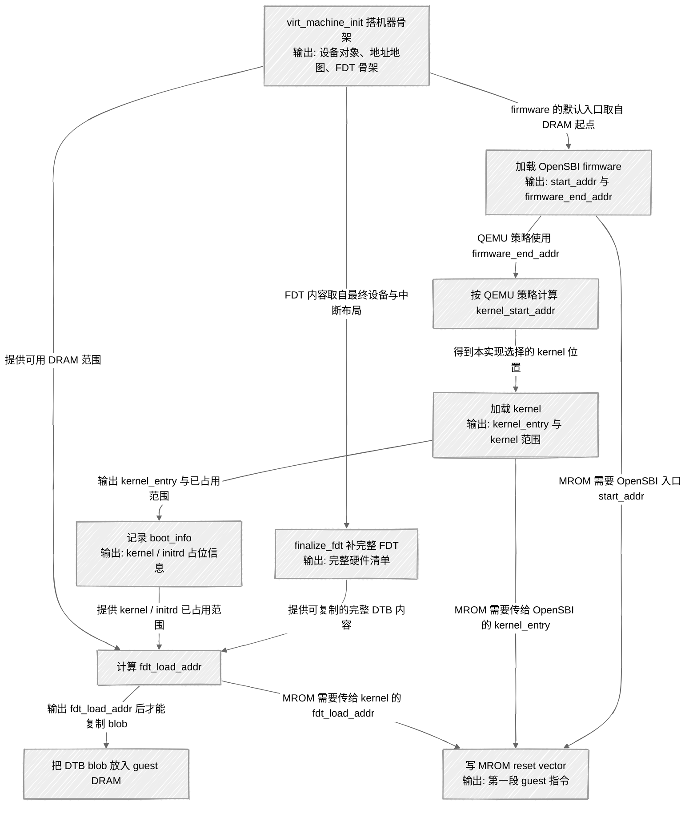

---
tags:
  - 系统模拟
---

# 虚拟机器的软件自举链

[[0-理论/计算机系统模拟/虚拟硬件平台的连接与发现|上篇]] 已经回答了软件启动一台机器时的静态问题：硬件怎么连接，软件怎么发现硬件。QEMU 的 `virt_machine_init()` 做完之后，[[0-理论/计算机系统模拟/虚拟硬件平台的连接与发现#guest physical address space|guest 物理地址空间]]已经有了形状：哪里是 DRAM，哪里是 UART，哪里是 [[0-理论/计算机系统模拟/虚拟硬件平台的连接与发现#^virt-memmap|PCIe ECAM 和 PCIe MMIO]]，哪里会放设备树。

这篇笔记接着补动态问题：**这台机器从哪里取第一条指令，kernel 从哪里来，kernel 又怎么拿到 [[0-理论/计算机系统模拟/虚拟硬件平台的连接与发现#^dtb-fdt-dts|DTB 这份硬件清单]]**。我们先把启动看成一件朴素的事：QEMU host 侧先把几份启动材料放进 guest 地址空间；随后 vCPU reset，guest 才从这些材料里取指和读数据。

因此本文的主线只有一条：

```text
QEMU host 放启动材料
  ↓
vCPU reset 后从固定地址取第一条指令
  ↓
一小段跳板把执行权交给 OpenSBI
  ↓
OpenSBI 把执行权交给 kernel
  ↓
kernel 解析 DTB，开始发现硬件
```

硬件初始化之后确实会分出多条线索。本文覆盖的是软件自举主干，以及它和其他线索的汇合点；其他线索只点到入口，不在这里展开。

```text
virt_machine_init 后
├── 软件自举线
│   └── machine_done → MROM → OpenSBI → kernel → 解析 DTB
├── FDT 收尾线
│   └── create_fdt 骨架 → finalize_fdt 填完整节点 → kernel 解析
├── MMIO 外设线
│   └── UART 等设备挂地址空间 → kernel 按 DTB 找到 → guest 访存落到 handler
├── PCIe 枚举线
│   └── PCIe host bridge 被 DTB 描述 → kernel 初始化 host bridge → 枚举 endpoint
└── GPGPU 设备线
    └── QOM/PCI 设备 realize → BAR 注册 → guest 驱动或 host qtest helper 访问 BAR → gpgpu_ctrl_read
```

这里先不展开 UART 的 [[0-理论/计算机系统模拟/虚拟硬件平台的连接与发现#MMIO 的本质|MMIO handler]]，也不展开 PCIe endpoint 的 [[0-理论/计算机系统模拟/虚拟硬件平台的连接与发现#BAR：设备向系统申请地址空间|BAR 分配]]，更不进入 GPGPU 的 QOM/PCI 生命周期。那些线索会在上篇机制笔记和实践记录里单独处理。本文只把“机器已经造好之后，guest 软件怎么开始跑”讲清。

## 这篇笔记要补的缺口

硬件结构就位以后，CPU 仍然不能凭空运行操作系统。启动链至少要补齐几件事：

- CPU reset 后 PC 指向哪里。
- 这个地址上有什么指令。
- OpenSBI 固件放在哪里。
- Linux kernel 镜像放在哪里。
- DTB 放在哪里。
- kernel 启动时怎样拿到 DTB 地址。

这些问题分属两边：

```text
QEMU host 侧
├── 读 OpenSBI / kernel 文件
├── 把二进制内容写进 guest 地址空间
├── 生成并放置 DTB
└── 写入 reset 后第一小段跳板指令

Guest vCPU 侧
├── reset 后从固定地址取指
├── 执行跳板指令
├── 执行 OpenSBI
└── 执行 Linux kernel
```

读这篇时最重要的是这条分界：**host 负责准备材料，guest 负责执行材料**。函数数量可以先放到后面；我们每看到一个函数，先问“它是在 host 侧放东西，还是在 guest 侧执行东西”，启动链就不会混成一团。

## 启动材料先定名

下面这些词会反复出现。先把它们当作“启动材料”来读，不急着追每个函数的内部细节。

| 启动材料                                             | 先这样理解                                    | 放在哪里                                        | 谁会用它                          |                                              |
| ------------------------------------------------ | ---------------------------------------- | ------------------------------------------- | ----------------------------- | -------------------------------------------- |
| [[0-理论/计算机系统模拟/虚拟硬件平台的连接与发现#^virt-memmap\|MROM]] | reset 后 CPU 最先能读到的一小块只读区域                | ![[0-理论/计算机系统模拟/虚拟硬件平台的连接与发现#^virt-memmap]] | guest 物理地址 `0x1000` 附近        | vCPU reset 后从这里取第一条指令                        |
| reset vector                                     | MROM 开头的跳板指令                             | MROM 里                                      | 把 vCPU 从固定 reset 地址带到 OpenSBI |                                              |
| OpenSBI firmware                                 | RISC-V 上先于 Linux kernel 运行的固件            | guest DRAM 起点附近，常见是 `0x80000000`            | 以 M-mode 执行，然后引导 kernel       |                                              |
| kernel image                                     | Linux kernel 镜像                          | guest DRAM 中的某段安全位置                         | OpenSBI 后续跳到这里                |                                              |
| DTB blob                                         | [[0-理论/计算机系统模拟/虚拟硬件平台的连接与发现#^dtb-fdt-dts | 设备树的二进制形态，硬件清单数据]]                          | guest DRAM 中的某段安全位置           | kernel 读取它来发现 RAM、UART、PCIe root complex 等硬件 |
| fw_dynamic_info                                  | QEMU 写给 OpenSBI 的小型启动信息结构                | MROM 跳板后面                                   | OpenSBI 读取 kernel 入口、目标特权级等信息 |                                              |
除了这些启动材料，还需要固定几个“执行者”和“平台控制器”相关的词。它们会在后面读 MROM、OpenSBI 和 kernel 时会不断出现。

| 名词       | 先这样理解                         | 在软件自举链里的作用                                                         |
| -------- | ----------------------------- | ------------------------------------------------------------------ |
| host     | 运行 QEMU 的真实机器和真实 Linux 进程环境   | `qemu-system-riscv64` 在 host 上读文件、分配内存、写 guest 地址空间                |
| guest    | QEMU 模拟出来的虚拟机器和其中的软件世界        | OpenSBI、Linux kernel、DTB 都属于 guest 可见的世界                           |
| vCPU     | guest 里的虚拟 CPU 执行单元           | reset 后从 `0x1000` 取第一条 guest 指令                                    |
| hart     | RISC-V 的 hardware thread，硬件线程 | `mhartid` 标识当前 hart；OpenSBI 和 kernel 都需要知道当前运行在哪个 hart 上           |
| firmware | 操作系统之前运行的底层软件                 | OpenSBI 是 RISC-V `virt` 机器默认使用的 guest 固件                           |
| kernel   | 操作系统内核                        | OpenSBI 把控制权交给 Linux kernel，kernel 再解析 DTB 并初始化设备                  |
| image    | 可被加载到内存中的程序镜像                 | OpenSBI firmware image 和 Linux kernel image 都会被 QEMU 放入 guest DRAM |
| blob     | 一团按格式组织的二进制数据                 | DTB blob 是设备树的二进制形态，kernel 读取它；它不作为指令执行                            |
`hart`（Hardware Thread）是 RISC-V 用来命名“可独立执行指令流的硬件上下文”的术语。传统 CPU 文档里经常混用 CPU、core、thread、processor，容易让调度单位变得含糊。

例如在带 Hyper-Threading 的 Intel 机器上，操作系统可能看到这样的结构：

```text
1 Socket
  └─ 8 Core
       └─ 每个 Core 暴露 2 个 SMT Thread
```

操作系统最终看到的是多个 logical CPU；底层真实资源却包含 socket、core、SMT thread 等不同层次。RISC-V 用 `hart` 把这一点收拢成一个清晰定义：一个 `hart` 拥有自己的寄存器状态、PC、CSR 和中断状态，操作系统可以把它当成一个逻辑 CPU 来调度。

- `hart`：RISC-V 的硬件线程，也是操作系统看到的调度对象。
- `CSR`：CPU 内部控制寄存器。
- `CLINT`：软件中断和定时器中断控制器。
- `PLIC`：外部中断控制器。

再补充一下 SMT（Simultaneous Multithreading，同时多线程）的背景。一个物理 core 可能暴露出多个逻辑执行上下文：

```text
Core0
 ├── Thread0
 └── Thread1
```

这些线程很多执行资源仍然共享，但操作系统会把它们当作多个可调度对象。`hart` 的价值在这里：我们读 RISC-V 启动代码时，不必反复追问这是 core 还是 SMT thread，只需要知道当前执行流由哪个 `hart` 表示。

`hart` 在软件自举里会频繁出现。MROM 跳板会读取 `mhartid`，把当前 hart ID 放进 `a0` 传给 OpenSBI。OpenSBI 需要它来区分当前启动的是哪个执行流；kernel 后续管理多核启动时也要基于 hart ID 组织 CPU。

## host 准备材料，guest 执行材料

先用地址地图把“放置”和“执行”分开。`virt_machine_done()` 执行时，vCPU 还没有开始从 `0x1000` 取指。它做的是 host 侧准备工作：把未来要执行的代码和未来要读取的数据先放进 [[0-理论/计算机系统模拟/虚拟硬件平台的连接与发现#guest physical address space|guest 地址空间]]。

> [!warning] ROM blob 是“host 字节 → guest 物理地址”的登记
> `rom_add_blob_fixed_as()` 这一步只回答一个问题：**QEMU 手里的这段字节，reset 之后应该出现在 guest 系统地址空间的哪个物理地址上**。
>
> ```text
> QEMU host 侧的数组 / 文件字节
>   ↓ rom_add_blob_fixed_as(..., guest_physical_addr, &address_space_memory)
> guest physical address space 的固定位置
>   ↓ vCPU reset 后按 guest 物理地址取指或读取
> MROM / OpenSBI / kernel 后续消费这些字节
> ```
>
> 这一步不会触发 OpenSBI 执行，也不会把 blob 的解释权交给 OpenSBI。OpenSBI 只有在 vCPU 从 MROM 跳过去之后，才会作为 guest 侧 firmware 读取 `fw_dynamic_info`、接收 kernel 入口和 DTB 地址。

```text
guest physical address space
├── 0x00001000    MROM reset vector / 跳板指令  ←  rom_add_blob_fixed_as("mrom.reset", ...)
├── 0x00001040    fw_dynamic_info               ←  rom_add_blob_fixed_as("mrom.finfo", ...)
├── ...           设备 MMIO 区域                 ←  memory_region_add_subregion() 挂载
│                  UART0 @ 0x10000000
│                  PCIe ECAM @ 0x30000000
│                  PCIe MMIO @ 0x40000000
├── 0x80000000    OpenSBI 固件入口附近           ←  load_elf_ram_sym() 按 ELF header 加载
├── ...           Linux kernel 镜像              ←  riscv_load_kernel() 加载
└── DRAM 某处      DTB blob                     ←  riscv_load_fdt() 写入
```

这张图里有两类东西：

- **会被执行的代码**：MROM 跳板、OpenSBI、kernel。
- **会被读取的数据**：`fw_dynamic_info`、DTB。

QEMU host 侧把它们放进去；guest vCPU 后面才会执行或读取它们。这个顺序是启动本身的最低要求：取指前地址上要有指令，读 DTB 前内存里要有 DTB，跳到 kernel 前 kernel 镜像要已经在 DRAM 里。

再换一种读法：这张地址地图里同时放着“会被执行的代码”和“只会被读取的数据”。MROM、OpenSBI、kernel 是代码路径上的接力对象；DTB 和 `fw_dynamic_info` 是数据路径上的接力对象。MROM 指令会读取 `fw_dynamic_info`，OpenSBI 会读取其中的 kernel 入口；OpenSBI 再把 DTB 地址传给 kernel，kernel 读取 DTB 后才知道硬件结构。代码接力和数据接力交织在一起，构成完整的软件自举链。

调试时也要按这个分界读。host GDB 停在 `riscv_find_and_load_firmware()` 时，我们看到的是 QEMU 进程读文件、解析 ELF、写 guest RAM；OpenSBI 此时还没有运行。等 gdbstub 停在 guest 地址 `0x80000000` 附近时，我们看到的才是 guest vCPU 执行 OpenSBI 指令。

## machine_done 是准备启动材料的收尾点

`virt_machine_init()` 的末尾注册了一个回调：

```c
s->machine_done.notify = virt_machine_done;
qemu_add_machine_init_done_notifier(&s->machine_done);
```

这里的小写 `notify` 是 `Notifier` 结构体的一个成员，也就是一个函数指针。`Notifier` 出自 `include/qemu/notify.h`：

```c
typedef struct Notifier Notifier;

struct Notifier {
    void (*notify)(Notifier *notifier, void *data);
    QLIST_ENTRY(Notifier) node;
};
```

它由两部分组成：一个回调函数指针 `notify`，和一个链表节点 `node`。`NotifierList` 就是由这些节点组成的 `QLIST` 链表头。`qemu_add_machine_init_done_notifier()` 把 `s->machine_done` 这个 `Notifier` 节点插入全局静态链表 `machine_init_done_notifiers`。如果机器已经进入 `PHASE_MACHINE_READY`，注册函数还会立刻调用这个回调，避免 late registration 被漏掉。

`Notifier` 是一个回调列表节点, 它的语义是：“在整个 machine init 基本结束的时候，请执行我注册的回调。” 等 QEMU 进入 `PHASE_MACHINE_READY`，`notifier_list_notify()` 会逐个调用这些回调：

```c
phase_advance(PHASE_MACHINE_READY);
notifier_list_notify(&machine_init_done_notifiers, NULL);
```

这里用回调列表的关键在于它把一个复杂的初始化边界收束成统一阶段钩子。`PHASE_MACHINE_READY` 表示静态 machine 创建已经基本完成，从这个时刻开始，board、bus、fw_cfg、ACPI、IOAPIC 等模块都可能需要做最后整理。每个模块自己注册 `Notifier`，QEMU 到达这个阶段后统一调用它们。这样 `virt_machine_init()` 不需要知道所有模块的收尾细节。

对我们正在看的 RISC-V virt 软件自举链，主线回调是 `virt_machine_done()`；它负责加载 OpenSBI、kernel、DTB，并写入 MROM reset vector。同一个 `machine_init_done_notifiers` 机制里，还可能挂着其他框架级回调：

```text
machine_init_done_notifiers
├── virt_machine_done        # RISC-V virt 的启动材料收尾
├── pcibus_machine_done      # PCI bus 在所有设备稳定后整理 bus mastering 相关结构
└── fw_cfg_machine_ready     # fw_cfg 在 machine ready 后注册 reset 行为
```

这几条线需要分开读。`virt_machine_done()` 是我们这篇笔记的软件自举主线；`pcibus_machine_done()` 和 `fw_cfg_machine_ready()` 更像同一阶段里的旁线收尾。它们共享 `PHASE_MACHINE_READY` 这个时机，但各自处理不同模块的局部状态。

这也解释了为什么 `Notifier` 需要链表节点 `node`。如果只有 `virt_machine_done()` 一个函数，直接调用也能工作；但 QEMU 的 machine 初始化不是单个 board 函数的内部事务。设备、总线、固件配置表、平台后端都可能在 realize 过程中注册自己的 ready hook。链表让这些模块只声明“我需要 machine ready 后执行”，不要求 board 代码手动枚举所有收尾函数。

读这段执行流时，我们先抓住层次：`PHASE_MACHINE_READY` 是阶段边界，`NotifierList` 是阶段边界上的分发器，具体回调才是各模块的收尾动作。对软件自举链来说，我们沿着 `virt_machine_done()` 往下读；对 PCIe 设备后续访问来说，我们再记住 PCI bus 也在同一阶段完成自己的整理。这样读就能把繁密的回调列表拆成几条互不混淆的线。

所以 `virt_machine_done()` 的位置很明确：

```text
virt_machine_init
  ↓ 搭好机器骨架：hart、控制器、地址空间、FDT 骨架
QEMU 继续完成 machine creation
  ↓
PHASE_MACHINE_READY
  ↓
virt_machine_done
  ↓ 放置 OpenSBI、kernel、DTB，写 MROM 跳板
vCPU reset
  ↓ guest 才开始取指
```

为什么适合在这里做？因为它需要已经稳定的机器信息：DRAM 范围、FDT 骨架、设备与中断布局、kernel/initrd 占用范围。这里讲的是 QEMU 当前代码路径里的**数据输入和布局策略**，不是说 RISC-V 架构只能按这一种顺序启动。

## virt_machine_done 怎样摆放启动材料

现在再读 `virt_machine_done()`，就不先看依赖拓扑图，而是把它当成“启动材料摆放脚本”。下面的伪代码保留真实变量和调用顺序，省略 pflash、KVM、ACPI、错误处理等分支。

```c
static void virt_machine_done(Notifier *notifier, void *data)
{
    // 启动地址账本。start_addr 默认取 DRAM 基址，
    // 后面通常作为 OpenSBI 入口附近的地址。
    RISCVVirtState *s = container_of(notifier, RISCVVirtState, machine_done);
    MachineState *machine = MACHINE(s);
    hwaddr start_addr = s->memmap[VIRT_DRAM].base;

    hwaddr firmware_end_addr;
    vaddr kernel_start_addr;
    uint64_t kernel_entry = 0;
    uint64_t fdt_load_addr;
    RISCVBootInfo boot_info;

    // 把 FDT 骨架补成 kernel 可读的硬件清单。
    if (machine->dtb == NULL) {
        finalize_fdt(s);
    }

    // 找到并加载 OpenSBI firmware。
    // 返回值 firmware_end_addr 表示固件占用区间的结束地址。
    const char *firmware_name = riscv_default_firmware_name(&s->soc[0]);
    firmware_end_addr = riscv_find_and_load_firmware(machine, firmware_name,
                                                     &start_addr, NULL);

    // 初始化 host 侧启动账本，再按 QEMU 当前策略计算 kernel 放置位置。
    riscv_boot_info_init(&boot_info, &s->soc[0]);
    kernel_start_addr = riscv_calc_kernel_start_addr(&boot_info,
                                                     firmware_end_addr);

    // 加载 kernel，并记录 kernel 入口。
    riscv_load_kernel(machine, &boot_info, kernel_start_addr, true, NULL);
    kernel_entry = boot_info.image_low_addr;

    // 计算 DTB 放在哪里，再把 DTB blob 写入 guest DRAM。
    // riscv_compute_fdt_addr() 会根据 DRAM 范围、kernel 镜像范围、initrd 位置，
    // 选择一个后续启动过程不容易覆盖的 DTB 地址。
    fdt_load_addr = riscv_compute_fdt_addr(s->memmap[VIRT_DRAM].base,
                                           s->memmap[VIRT_DRAM].size,
                                           machine, &boot_info);
    // riscv_load_fdt() 最终通过 rom_add_blob_fixed_as("fdt", ...)
    // 把 DTB blob 写入 guest physical address space。
    riscv_load_fdt(fdt_load_addr, machine->fdt);

    // 最后写 MROM 跳板。跳板需要知道 OpenSBI 入口、kernel 入口和 DTB 地址。
    riscv_setup_rom_reset_vec(machine, &s->soc[0], start_addr,
                              s->memmap[VIRT_MROM].base,
                              s->memmap[VIRT_MROM].size, kernel_entry,
                              fdt_load_addr);
}
```

这段代码可以按“放材料”的顺序读：

- `finalize_fdt()`：把硬件清单补完整。
- `riscv_find_and_load_firmware()`：把 OpenSBI 放进 DRAM，并得到固件结束位置。
- `riscv_calc_kernel_start_addr()`：按 QEMU 当前策略给 kernel 找一个避开固件的位置。
- `riscv_load_kernel()`：把 kernel 放进 DRAM，并记录 kernel 入口。
- `riscv_compute_fdt_addr()` / `riscv_load_fdt()`：给 DTB 找位置，并把 DTB 放进去。
- `riscv_setup_rom_reset_vec()`：写 MROM 跳板，让 vCPU reset 后能从 `0x1000` 开始走到 OpenSBI。

这里有几条关系需要分清：

- **代码数据流**：前一步产生后一步消费的值，例如 `firmware_end_addr`、`kernel_entry`、`fdt_load_addr`。
- **布局约束**：firmware、kernel、initrd、DTB 不应互相覆盖。
- **QEMU 当前启动策略**：默认先把 OpenSBI 放在 DRAM 起点附近，再用 `firmware_end_addr` 计算 kernel 位置。

这些关系帮助我们读 QEMU 当前实现。它们不等于 RISC-V 架构规定的唯一启动布局。地址空间足够大时，firmware、kernel、DTB 可以放在别的安全位置；只要不重叠、可寻址，并且 OpenSBI 能拿到 kernel 入口、kernel 能拿到 DTB 地址，另一套布局也可以成立。

如果需要把上面的数据流和布局策略压成一张代码考证图，可以这样读。节点说明 QEMU 当前启动路径里做了什么；边说明后一步在这份实现里消费了前一步提供的哪些输入，或者遵守了哪条布局策略。图只是帮助我们回代码定位，不是架构定律。



## reset vector 与 MROM 跳板

前面已经知道 MROM 是 reset 后最早可读的一小块只读区域。现在再看它具体做什么。

vCPU reset 时，QEMU 会在 `riscv_cpu_reset_hold()` 里设置 PC：

```c
env->pc = env->resetvec;
```

RISC-V virt 机器的默认 reset vector 是 `0x1000`。这个地址落在 [[0-理论/计算机系统模拟/虚拟硬件平台的连接与发现#^virt-memmap|MROM 区域]]。`riscv_setup_rom_reset_vec()` 会把一小段机器指令写到这里。

这里要先钉住地址视角：MROM reset vector 里的 `0x1000`、`start_addr`、`fdt_load_addr` 都是 **guest 物理地址**。QEMU host 侧当然用普通 host 内存保存这些字节，但 [`rom_add_blob_fixed_as(..., &address_space_memory)`](https://github.com/jensenojs/qemu/blob/study/include/hw/core/loader.h#L337-L340) 记录的是“这些字节应该出现在 guest 系统地址空间的哪个硬件地址”。Linux 后面建立的 guest virtual address 还没有参与。

这段机器码不用一开始逐条硬啃，先抓它的任务：**把 vCPU 从固定 reset 地址带到 OpenSBI，并顺手把启动参数放进寄存器**。

```c
uint32_t reset_vec[10] = {
    0x00000297,  /* auipc  t0, %pcrel_hi(fw_dyn) */
    0x02828613,  /* addi   a2, t0, %pcrel_lo     */
    0xf1402573,  /* csrr   a0, mhartid           */
    0x0202b583,  /* ld     a1, 32(t0)            */
    0x0182b283,  /* ld     t0, 24(t0)            */
    0x00028067,  /* jr     t0                     */
    start_addr,
    start_addr_hi32,
    fdt_load_addr,
    fdt_load_addr_hi32,
};
```

这段数组写进 MROM 前，QEMU 还会先处理字节序，再把 blob 登记到 guest 系统地址空间：

```c
for (i = 0; i < ARRAY_SIZE(reset_vec); i++) {
    reset_vec[i] = cpu_to_le32(reset_vec[i]);
}
rom_add_blob_fixed_as("mrom.reset", reset_vec, sizeof(reset_vec),
                      rom_base, &address_space_memory);
```

`cpu_to_le32()` 处理的是字节序边界。`reset_vec` 在 QEMU C 代码里是 32 位整数数组；写进 MROM 后，guest vCPU 看到的是连续字节。RISC-V virt 这里按 little-endian 解释指令字，所以 QEMU 要保证每条 32 位指令在 ROM blob 里的字节顺序是 guest 期望的小端顺序。这一步不改变指令含义，也不涉及虚拟内存。

`rom_add_blob_fixed_as()` 处理的是地址空间边界。它会把 host 侧的字节数组登记成一个 ROM blob，并记录目标地址空间 `address_space_memory` 与目标地址 `rom_base`。后续 machine reset 时，QEMU 的 loader 代码会把这些字节写进对应的 MemoryRegion。对 guest 来说，这些字节就出现在 `0x1000` 起始的 MROM 里，可以被 vCPU 取指。

用结果来读，这几条指令完成了几件事：

- 把当前 hart ID 放进 `a0`。
- 把 DTB 地址放进 `a1`。
- 把 `fw_dynamic_info` 地址放进 `a2`。
- 把 OpenSBI 入口地址加载到 `t0`。
- 执行 `jr t0`，跳到 OpenSBI。

紧随 reset vector 后面，QEMU 还会通过 `riscv_rom_copy_firmware_info()` 写入 `fw_dynamic_info`。在 TCG 典型路径中，它包含 `next_mode = S` 和 `next_addr = kernel_entry`，告诉 OpenSBI 下一阶段要进入 Supervisor mode，并跳到 kernel 入口。

所以 MROM 只是启动链上的小跳板：从固定 reset 地址出发，把最少的参数放进寄存器，然后跳到 DRAM 里的 OpenSBI。

从 `env->pc = env->resetvec` 到 MROM 跳进 OpenSBI 这段，仍然按 guest 物理地址顺序读。vCPU reset 后先处在 M-mode；QEMU 的 RISC-V 地址翻译逻辑在 M-mode 下会把当前地址直接当作物理地址返回。`0x1000` 是 MROM reset vector，`0x1018` 附近放 OpenSBI 入口地址，`0x1020` 附近放 DTB 地址。Linux kernel 后面建立页表时的虚拟地址语义，此时还没有接管执行流。

## OpenSBI 与 SBI 服务

OpenSBI 是 RISC-V 生态中的标准固件实现。QEMU 把它加载进 guest DRAM；vCPU 跳过去之后，它以 M-mode（Machine mode，最高特权级）运行。

为什么 Linux kernel 前面还要有 OpenSBI？关键在权限边界。RISC-V 的 Linux kernel 通常运行在 S-mode（Supervisor mode），权限低于 M-mode。管理 hart、设置某些 timer、处理 IPI、执行机器级返回等动作属于 M-mode 权限范围。QEMU 可以把 kernel 镜像直接放进 DRAM，但这不等于 kernel 适合成为 reset 后第一个执行的软件。OpenSBI 先以 M-mode 建好最小运行环境，再把控制权交给 S-mode kernel。

这里要再次固定 host/guest 分界：**OpenSBI 是 guest 地址空间里的一段 RISC-V 二进制，由 guest vCPU 以 M-mode 执行**。QEMU host 侧只做 `riscv_find_and_load_firmware()` / `riscv_load_firmware()` 这类加载动作，把 OpenSBI 放到 DRAM 起始处。vCPU 跳进去以后，OpenSBI 的执行就属于 guest 侧。

SBI（Supervisor Binary Interface）就是 kernel 和 OpenSBI 之间的接口约定。kernel 需要某些 M-mode 服务时，会把功能号和参数放进寄存器，执行 `ecall`，陷入 OpenSBI；OpenSBI 处理后再返回 kernel。

可以用一个历史对比建立位置感：在 x86 平台上，kernel 可能通过 `int 0x10`、BIOS、ACPI 方法、UEFI Runtime Services 等方式获得某些底层平台服务。RISC-V 没有这套历史遗留，SBI 提供的是一组标准化接口。kernel 在 S-mode 下不能直接操作某些 M-mode 专属的 CSR 寄存器，也不能直接发送核间中断或管理某些 timer。SBI 把这些特权操作包装成 `ecall` 调用：kernel 把功能号和服务参数放进 `a6`、`a7` 等寄存器，执行 `ecall`，陷入 M-mode；OpenSBI 在 M-mode 处理请求后返回。

再把 OpenSBI 和 kernel 的角色关系说细一点。M-mode 可以直接访问所有 CSR 寄存器、配置物理内存保护、管理所有 hart。kernel 不能直接做 M-mode 限定的事情，比如不能直接写某些平台上的 `mtimecmp` 寄存器来设置下一次时钟中断；也不能直接写 `mip` / `mie` 来触发或管理机器级中断。OpenSBI 常驻在 guest 地址空间中，kernel 有 M-mode 特权操作需求时，通过 `ecall` 陷入 M-mode，交给 OpenSBI 代理执行。OpenSBI 完成操作后通过 `mret` 返回到 kernel。

常见 SBI 服务包括：

- **timer**：设置下一次时钟中断。kernel 不需要知道底层 timer 硬件是 CLINT 还是 ACLINT，只需通过 SBI 的 `set_timer` 调用。
- **IPI**：核间中断（Inter-Processor Interrupt）。kernel 要让另一个 hart 立刻注意到某件事时，会通过 SBI 发送 IPI。
- **hart 管理**：启动、停止、查询其他 hart。
- **system reset**：关机或重启，kernel 可以通过这一组功能请求系统重启或关机。
- **早期 console**：kernel 早期还没初始化 UART 驱动时，协助输出字符。
- **RFENCE**：远程 TLB 刷新。在多个 hart 共享页表时，一个 hart 修改页表后，需要让其他 hart 丢掉旧的地址翻译缓存。

IPI 可以先按“hart 之间的中断通知”理解。外设中断是 UART、网卡、磁盘、GPU 这类设备通知 CPU；IPI 是一个 hart 通知另一个 hart。典型场景是调度器唤醒别的 hart、CPU hotplug、停止某个 hart、或者要求其他 hart 执行某个内核侧动作。链路大致是：

```text
Linux kernel on hart 0
  ↓ 需要通知 hart 1
SBI ecall: send IPI
  ↓
OpenSBI 在 M-mode 操作底层中断机制
  ↓
hart 1 收到 software interrupt
  ↓
hart 1 进入 Linux kernel 的中断处理路径
```

RFENCE 里的 TLB 也需要单独讨论。TLB 可以理解成**地址翻译 cache**：CPU 用虚拟地址执行 load/store，真正访问内存前要把虚拟页号翻译成物理页号。页表在内存里，完整查页表很贵，于是 CPU 把最近用过的翻译结果缓存起来：

```text
虚拟页号 VPN → 物理页号 PPN + 权限
```

多 hart 系统里，每个 hart 通常有自己的 TLB。如果 hart 0 上的 kernel 修改了某个进程的页表，hart 0 可以清掉自己的旧 TLB 项；但 hart 1、hart 2 可能还缓存着旧翻译。于是 kernel 需要发起 remote fence：

```text
hart 0 修改页表
  ↓
需要其他 hart 清掉旧 TLB 项
  ↓
SBI ecall: remote sfence.vma
  ↓
OpenSBI 协调目标 hart
  ↓
目标 hart 执行本地 sfence.vma，旧翻译失效
```

这里的 “remote” 指另一颗 hart，不是另一台机器。这个例子也说明 kernel 接手之后仍然会和 OpenSBI 交互。OpenSBI 不只是启动早期的跳板；它常驻在 M-mode，作为 S-mode kernel 的平台服务层。kernel 后续仍会通过 SBI 做 timer、IPI、remote fence、hart 管理、system reset 等底层事务。

边界也要同时记住：日常设备驱动通常不经过 SBI。UART、NVMe、GPU 这类设备访问走的是 MMIO 或 PCIe BAR 路径。也就是说，kernel 找 OpenSBI 主要是为了平台级特权服务；kernel 驱动具体外设时，会直接通过 [[0-理论/计算机系统模拟/虚拟硬件平台的连接与发现#^dtb-fdt-dts|DTB 里描述的 MMIO 地址]] 或 [[0-理论/计算机系统模拟/虚拟硬件平台的连接与发现#^bar-mmio-gpgpu|PCIe BAR 地址]] 访问设备寄存器。

SBI 属于 guest 内部的软件接口，不属于 QEMU host API。QEMU 的工作是加载 OpenSBI、写好 [[0-理论/计算机系统模拟/虚拟硬件平台的连接与发现#^virt-memmap|MROM 跳板]] 和 `fw_dynamic_info`。OpenSBI 和 kernel 之间后续的 `ecall` 往返，由 guest vCPU 执行；QEMU 只负责模拟这些指令的执行效果，不介入 SBI 的语义层。

OpenSBI 的 `fw_dynamic` 模式（QEMU 默认加载的 `fw_dynamic.bin`）意味着它的行为由前一级软件通过 `fw_dynamic_info` 结构体配置。QEMU 在 [[0-理论/计算机系统模拟/虚拟硬件平台的连接与发现#^virt-memmap|MROM 区域]]紧随 reset vector 后写入这个结构体，OpenSBI 启动时读取 `next_mode` 和 `next_addr`，从而知道自己应该引导到哪个特权级、跳转到哪个地址的 kernel。

OpenSBI 交给 kernel 时，地址视角开始发生变化，但这个变化并非 QEMU host 预先替 kernel 做好。QEMU 写入 `fw_dynamic_info.next_addr` 和 MROM 数据区里的 `fdt_load_addr`，给的仍是 guest 物理地址。kernel 早期入口先依赖这些物理地址拿到 DTB 和启动上下文；等它建立早期页表并写入 `satp`，后续 S-mode 取指和访存才进入虚拟地址翻译路径。

QEMU 这边对应的是 RISC-V CPU 模型里的 CSR 和 MMU helper：guest 写 [`satp`](https://github.com/jensenojs/qemu/blob/study/target/riscv/csr.c#L4323-L4331) 后，QEMU 更新 `env->satp`；后续地址翻译逻辑才会根据 `satp.mode`、当前特权级和页表配置判断是否走虚拟地址翻译。M-mode reset 早期的取指链和 kernel 开启页表后的 S-mode 访存，属于同一个 guest 执行流里的两个地址阶段。

## kernel 接手后的硬件发现

OpenSBI 最后会把控制权交给 Linux kernel。kernel 入口收到的关键信息之一是 [[0-理论/计算机系统模拟/虚拟硬件平台的连接与发现#^dtb-fdt-dts|DTB 地址]]。这个地址并非 kernel 自己扫描出来；它来自 QEMU host 侧预先计算和写入的启动材料，然后沿着寄存器一路传递。这里和上篇的接口点是：上篇解释 [[0-理论/计算机系统模拟/虚拟硬件平台的连接与发现#硬件清单怎样交给 kernel|硬件清单为什么要交给 kernel]]，本节解释这份硬件清单的地址怎样进入 kernel。

先把这条链路放成代码对照：

```text
virt_machine_done
├── finalize_fdt(s)
│   └── 把 FDT 骨架补成完整 DTB 内容
├── riscv_compute_fdt_addr(...)
│   └── 根据 DRAM 范围、kernel/initrd 占用范围选择 DTB 放置地址
├── riscv_load_fdt(fdt_load_addr, machine->fdt)
│   └── 把 DTB blob 写入 guest DRAM
└── riscv_setup_rom_reset_vec(..., kernel_entry, fdt_load_addr)
    ├── 把 fdt_load_addr 编进 MROM reset vector
    └── 把 kernel_entry 写进 fw_dynamic_info
```

对应的 QEMU 代码位置可以先从公开 `study` 分支打开：[`virt_machine_done()`](https://github.com/jensenojs/qemu/blob/study/hw/riscv/virt.c#L1422-L1502) 里先算出 `fdt_load_addr`，再调用 [`riscv_load_fdt()`](https://github.com/jensenojs/qemu/blob/study/hw/riscv/boot.c#L373-L381) 把 DTB 写进 [[0-理论/计算机系统模拟/虚拟硬件平台的连接与发现#guest physical address space|guest DRAM]]，最后调用 [`riscv_setup_rom_reset_vec()`](https://github.com/jensenojs/qemu/blob/study/hw/riscv/boot.c#L432-L487) 把 `fdt_load_addr` 放进 [[0-理论/计算机系统模拟/虚拟硬件平台的连接与发现#^virt-memmap|MROM 跳板]]。

MROM 跳板里的关键指令是这几条：

```c
0xf1402573,  /* csrr   a0, mhartid */
0x0202b583,  /* ld     a1, 32(t0)  */
0x0182b283,  /* ld     t0, 24(t0)  */
0x00028067,  /* jr     t0           */
...
fdt_load_addr,
fdt_load_addr_hi32,
```

这里的读法是：

- `a0` 得到当前 hart ID。
- `a1` 得到 DTB 地址，也就是后面 kernel 入口最需要的硬件清单地址。
- `a2` 指向紧跟在 reset vector 后面的 `fw_dynamic_info`。
- `t0` 得到 OpenSBI 入口地址。
- `jr t0` 把控制权交给 OpenSBI。

紧接着，QEMU 还会通过 [`riscv_rom_copy_firmware_info()`](https://github.com/jensenojs/qemu/blob/study/hw/riscv/boot.c#L384-L430) 写 `fw_dynamic_info`。在典型 TCG 路径里，这个结构体包含 `next_mode = S` 和 `next_addr = kernel_entry`。OpenSBI 读取它以后，知道下一阶段要进入 S-mode，并跳到 Linux kernel 入口。

于是 DTB 地址的传递链可以写成：

```text
QEMU host 计算 fdt_load_addr
  ↓
riscv_load_fdt 把 DTB 写入 guest DRAM
  ↓
riscv_setup_rom_reset_vec 把 fdt_load_addr 编进 MROM 数据区
  ↓
vCPU reset 后从 0x1000 执行 MROM
  ↓
MROM 把 DTB 地址加载到 a1
  ↓
OpenSBI 启动并读取 fw_dynamic_info
  ↓
OpenSBI 跳到 kernel，同时按 RISC-V boot 约定把 a1 作为 DTB 地址传下去
  ↓
Linux kernel 入口从 a1 取得 DTB 地址
```

kernel 接手后的第一步不会是直接初始化 UART 或 PCIe endpoint。它先解析 [[0-理论/计算机系统模拟/虚拟硬件平台的连接与发现#^dtb-fdt-dts|DTB 这份硬件清单]]。DTB 里有 QEMU 生成的板级硬件描述：

- `/memory@80000000` 节点用 `reg` 描述 DRAM 的基址和大小。kernel 靠它知道可用物理内存的起始和边界。
- `/soc/serial@10000000` 节点用 `reg = <0x0 0x10000000 0x0 0x100>` 和 `compatible = "ns16550a"` 告诉 kernel 串口寄存器在哪、用什么驱动。
- `/soc/pci@30000000` 节点用 `compatible = "pci-host-ecam-generic"` 和 `reg` 标出 ECAM 配置空间窗口，用 `ranges` 描述 IO/MMIO 地址窗口的物理地址映射，用 `bus-range` 声明管理哪些 PCI bus 编号。
- interrupt controller 节点（PLIC 或 AIA）用 `interrupt-controller` 属性和 `interrupts-extended` 描述哪些中断线接到了哪些 hart。

这就是上下篇的汇合点。上篇讲 [[0-理论/计算机系统模拟/虚拟硬件平台的连接与发现#硬件清单怎样交给 kernel|DTB 作为硬件清单如何描述设备]]，也讲 [[0-理论/计算机系统模拟/虚拟硬件平台的连接与发现#^hardware-list-pcie-enum|硬件清单先描述 PCIe root complex，PCIe 再枚举后面的 endpoint]]；这一篇讲 DTB 如何被 QEMU 放进 DRAM，又如何把地址传到 kernel。kernel 解析 DTB 后，才知道 UART 和 PCIe root complex 在哪里；PCIe host bridge 初始化后，kernel 才能继续枚举 endpoint，发现 GPU、NVMe、NIC 等设备。

### 从硬件清单到驱动接管

kernel 拿到 DTB 后，并不会立刻知道每个 endpoint 的私有寄存器语义。它先把启动时硬件清单转成 kernel 内部的设备认知，再由不同层级的 driver 接力。

```text
Linux kernel 入口
  ↓ 从 a1 取得 DTB 地址
解析 DTB
  ↓
发现 memory、UART、中断控制器、PCIe host bridge 等板级节点
  ↓
初始化基础设施 driver
  ├── UART driver：按 DTB 的 reg 访问固定 MMIO 区间
  ├── interrupt controller driver：建立中断接收和分发
  └── PCI host bridge driver：按 DTB 的 reg/ranges 建立 ECAM 和 PCI MMIO 资源
      ↓
PCI core 通过 ECAM 枚举 endpoint
  ↓
读取 config space，分配 BAR
  ↓
具体 device driver 绑定 endpoint
  ↓
driver 根据设备规格 / register map 读写 BAR window 内 offset
```

这里有两类 driver。第一类是**基础设施 driver**，例如 UART、PLIC/AIA、PCI host bridge。它们主要消费 DTB 里的 `compatible`、`reg`、`interrupts`、`ranges` 等板级描述。第二类是**具体设备 driver**，例如 NVMe driver、GPU driver、网卡 driver。它们通常先由总线枚举机制发现，再根据 Vendor ID / Device ID / Class Code 或其他匹配规则绑定设备。

PCIe endpoint 的私有寄存器不写在 DTB 里。kernel 通过 DTB 找到 PCIe host bridge，通过 ECAM 读 config space，通过 BAR 得到 MMIO window；最后，具体 driver 才根据设备规格解释这个 window 内部的 offset。换句话说，软件自举链把 kernel 带到“能初始化 bus 和绑定 driver”的阶段；BAR window 内部协议则回到 [[0-理论/计算机系统模拟/虚拟硬件平台的连接与发现#从发现到驱动接管|上篇的驱动接管链]]。

对当前 GPGPU 实验，真实 guest 路径和 qtest 路径在这里分开：

```text
真实 guest
  DTB → PCI host bridge driver → PCI core → GPGPU driver → readl/writel BAR0 offset

qtest
  QPCI/QOS helper → qpci_device_enable → qpci_iomap → qpci_io_readl/writel BAR0 offset
```

qtest 省掉了 kernel 自举、DTB 解析、driver 绑定这些环节。直接测试 endpoint 的 config space、BAR window 和 handler 行为

> [!note] 同一上游问题的分层答案
> kernel 拿到控制权后，怎样从“只有 CPU 和一段启动上下文”走到“知道设备入口、能识别设备、能访问设备状态”。这个问题可以分成三个阶段：先获得硬件描述入口，再识别可枚举设备，最后建立控制或数据访问通道。
>
> 在 RISC-V `virt` 这条线里，FDT/DTB 交付板级清单，kernel 从中找到 PCIe host bridge、ECAM 和 PCIe MMIO window；随后 PCI 子系统通过 ECAM 读取 endpoint config space，用 Vendor ID / Device ID / Class Code / BAR 识别并配置设备；BAR 分配完成后，驱动通过 MMIO window 访问设备寄存器或数据窗口。
>
> x86 传统平台给同一组层次留下了更多历史答案：BIOS/UEFI 与 ACPI 表常承担启动服务和平台描述；PCI config access 既有 PCIe ECAM，也有旧式 I/O port `0xcf8` / `0xcfc`；运行时设备访问既可能走 port I/O，也可能走 MMIO。OpenSBI 和 SBI 位于另一层：OpenSBI 是执行中的 M-mode 固件，SBI 是 S-mode kernel 请求 M-mode 服务的 ABI，它补的是特权服务边界，不承担完整硬件清单描述。
>
> 我们把这些机制按“平台描述、配置枚举、运行时访问、特权服务”归位。本文沿 RISC-V `virt` 主线展开；BAR register 与 BAR window 的细节交给 [[0-理论/计算机系统模拟/虚拟硬件平台的连接与发现#BAR：设备向系统申请地址空间|上篇 BAR 小节]]，port I/O 和 MMIO 的地址空间边界交给 [[0-理论/计算机系统模拟/虚拟硬件平台的连接与发现#地址空间与 MMIO|上篇地址空间与 MMIO]]。

对后续 GPGPU 设备模型来说，这里也是两条线索的交汇：上篇建立了 [[0-理论/计算机系统模拟/虚拟硬件平台的连接与发现#PCI 配置空间|PCIe config space]]、[[0-理论/计算机系统模拟/虚拟硬件平台的连接与发现#BAR：设备向系统申请地址空间|BAR]]、[[0-理论/计算机系统模拟/虚拟硬件平台的连接与发现#^mmio-to-gpgpu-ctrl-read|MMIO handler]] 这些机制的心智模型；这一篇解释了这些机制被激活之前，启动链怎样把 host bridge 交到 kernel 手里。真实 guest 路径中，kernel 初始化 host bridge 后由 PCI bus 层枚举设备，再由设备驱动访问 BAR；qtest 路径中，host 侧测试 helper 用 `qpci_device_enable()`、`qpci_iomap()` 和 `qpci_io_readl()` 直接驱动 QEMU 的 PCI 测试接口。两条路径进入 QEMU PCI / MemoryRegion 路由后，才会落到 `gpgpu_ctrl_read()` 这类设备 handler。

kernel 解析这些节点后，依次初始化 UART console 驱动、中断控制器驱动、定时器驱动，然后初始化 PCIe host bridge 驱动。PCIe host bridge 一旦就位，kernel 就开始扫描 ECAM 空间，逐个 bus/device/function 读取 Vendor ID 和 Device ID——这正是上篇里 [[0-理论/计算机系统模拟/虚拟硬件平台的连接与发现#PCIe 枚举是什么|PCIe 枚举]] 和 [[0-理论/计算机系统模拟/虚拟硬件平台的连接与发现#^hardware-list-pcie-enum|硬件清单与 PCIe 枚举分工]] 讨论的过程。扫描到 `0x1234:0x1337` 就是 GPGPU 设备，读 [[0-理论/计算机系统模拟/虚拟硬件平台的连接与发现#^pci-config-identity|config space 身份字段]] 和 BAR，分配 MMIO 地址，加载驱动。

上篇的核心链——“[[0-理论/计算机系统模拟/虚拟硬件平台的连接与发现#^hardware-list-pcie-enum|DTB 告诉 kernel PCIe root complex 的位置]] → PCIe 枚举发现 root complex 下的具体设备 → 设备驱动通过 [[0-理论/计算机系统模拟/虚拟硬件平台的连接与发现#^bar-mmio-gpgpu|BAR 分配的地址]] 与设备交互”——在 kernel 解析 DTB 完成的那一刻进入第二段。DTB 里的 PCI 节点接上了 kernel 的 PCI bus 扫描代码，上篇画的链路开始运转。

完整链路可以收束为：

```text
QEMU host 进程
  ↓ 创建 virt machine 与 guest 地址空间
virt_machine_init
  ↓ 创建 hart、控制器、地址空间、FDT 骨架
  ↓ 注册 virt_machine_done 回调
PHASE_MACHINE_READY
  ↓ 调用 virt_machine_done
virt_machine_done
  ├── finalize_fdt              # 补完设备树
  ├── load OpenSBI              # 放固件
  ├── load kernel               # 放 kernel
  ├── load DTB                  # 放硬件清单
  └── setup MROM reset vector   # 写第一段跳板指令
vCPU reset
  ↓ PC = 0x1000
MROM 跳板
  ↓ 传 hart ID、DTB 地址、fw_dynamic_info，跳到 OpenSBI
OpenSBI
  ↓ M-mode 初始化，读取 kernel 入口，跳到 kernel
Linux kernel
  ↓ 从 a1 取得 DTB 地址
  ↓ 解析 DTB
  ↓ 初始化 UART / 中断控制器 / PCIe host bridge
  ↓ 启动 PCIe 枚举，发现 endpoint
  ↓ 绑定具体 device driver
  ↓ driver 通过 BAR / MMIO window 访问设备
```

## 回到 QEMU 代码的考证路径

回代码时，我们按线索分层：先看 host 侧怎样摆材料，再看 ready 阶段怎样触发收尾回调，最后才切到 guest 侧从 reset vector 取指。每一层只回答一个问题，避免在 `virt.c`、`boot.c`、`cpu.c` 和 OpenSBI 之间跳层。

### 从 machine 骨架读到 ready 阶段

先看 [`virt_machine_init()`](https://github.com/jensenojs/qemu/blob/study/hw/riscv/virt.c#L1520-L1746)

```text
virt_machine_init
├── 创建 hart / socket 相关对象
├── 创建中断控制器、timer、PCIe host bridge、fw_cfg 等基础设备
├── 把 RAM、MROM、UART、PCIe 等 MemoryRegion 挂进 guest 物理地址空间
├── create_fdt 搭硬件清单骨架
└── 注册 machine_done 回调
```

在这里先观察两类输出：一类是硬件结构输出，比如 `s->memmap`、MROM region、PCIe host bridge、FDT 骨架；另一类是阶段钩子输出，也就是末尾的：

```c
s->machine_done.notify = virt_machine_done;
qemu_add_machine_init_done_notifier(&s->machine_done);
```

注册函数在 [`qemu_add_machine_init_done_notifier()`](https://github.com/jensenojs/qemu/blob/study/hw/core/machine.c#L1683-L1691)。真正触发点在 [`qdev_machine_creation_done()`](https://github.com/jensenojs/qemu/blob/study/hw/core/machine.c#L1715-L1742)：QEMU 推进到 `PHASE_MACHINE_READY` 后，调用 `notifier_list_notify()`。这条线回答的问题是：**为什么 `virt_machine_done()` 不在注册时立即执行，而是在 machine ready 阶段统一执行。**

### 从 ready 回调读到启动材料摆放

进入 [`virt_machine_done()`](https://github.com/jensenojs/qemu/blob/study/hw/riscv/virt.c#L1422-L1518) 后，我们只追启动材料，不追所有分支。核心观察点是：

```text
virt_machine_done
├── finalize_fdt(s)
├── riscv_find_and_load_firmware(...)
├── riscv_load_kernel(...)
├── riscv_compute_fdt_addr(...)
├── riscv_load_fdt(...)
└── riscv_setup_rom_reset_vec(...)
```

这里要记录的重点不在于“函数都被调用了”；更关键的是每一步产出的地址：

| 变量 | 来源 | 后续用途 |
|------|------|----------|
| `start_addr` | 默认取 DRAM 基址 | MROM 跳到 OpenSBI 的入口 |
| `firmware_end_addr` | `riscv_find_and_load_firmware()` 返回 | QEMU 当前策略用它计算 kernel 放置位置 |
| `kernel_entry` | `riscv_load_kernel()` 填入 `boot_info.image_low_addr` | 写进 `fw_dynamic_info`，给 OpenSBI 作为下一阶段入口 |
| `fdt_load_addr` | `riscv_compute_fdt_addr()` 返回 | 写进 MROM reset vector，最后传给 kernel |

`riscv_compute_fdt_addr()` 的代码在 [`hw/riscv/boot.c`](https://github.com/jensenojs/qemu/blob/study/hw/riscv/boot.c#L312-L367)。它会先 `fdt_pack()`，再根据 DRAM 末端、kernel/initrd 已占用范围选择 DTB 放置地址。`riscv_load_fdt()` 在 [`hw/riscv/boot.c`](https://github.com/jensenojs/qemu/blob/study/hw/riscv/boot.c#L373-L381)，用 `rom_add_blob_fixed_as("fdt", ...)` 把 DTB blob 写进 guest DRAM。

### 从 MROM 读到寄存器传参

下一层看 [`riscv_setup_rom_reset_vec()`](https://github.com/jensenojs/qemu/blob/study/hw/riscv/boot.c#L432-L487)。它做两件事：写 MROM reset vector，写 OpenSBI 需要的 `fw_dynamic_info`。

这里先确认 ROM blob 的写入路径。`reset_vec[]` 是 QEMU host 侧构造出来的 32 位指令数组。QEMU 先用 `cpu_to_le32()` 把每个 word 转成 guest 期望的小端字节序，再用 `rom_add_blob_fixed_as("mrom.reset", ..., rom_base, &address_space_memory)` 把它登记到 guest 系统地址空间的 MROM 基址。`address_space_memory` 指向 QEMU 的系统地址空间；它不是 Linux kernel 后面看到的虚拟地址空间。

如果继续追 loader 代码，可以看 [`rom_add_blob_fixed_as()`](https://github.com/jensenojs/qemu/blob/study/include/hw/core/loader.h#L337-L340) 的宏定义和 [`rom_add_blob()`](https://github.com/jensenojs/qemu/blob/study/hw/core/loader.c#L1161-L1179) 的实现：host 侧会保存一份 `rom->data`，同时记录 `rom->as` 和 `rom->addr`。等 machine reset 流程处理 ROM 时，这段数据会被写入对应地址空间。读代码时要同时抓住两层：字节在 host 进程内存中存放，语义上对应 guest 物理地址 `0x1000`。

reset vector 里最关键的寄存器传参是：

```text
a0 = mhartid
a1 = fdt_load_addr
a2 = fw_dynamic_info 地址
t0 = start_addr，即 OpenSBI 入口
jr t0
```

所以这一步回答的问题是：**QEMU host 算出的地址怎样变成 guest vCPU 启动时能看到的寄存器值。**我们不需要一开始逐条反汇编所有机器码，只要确认 `fdt_load_addr` 被写入 reset vector 数据区，随后被 `ld a1, 32(t0)` 取出即可。

紧接着看 [`riscv_rom_copy_firmware_info()`](https://github.com/jensenojs/qemu/blob/study/hw/riscv/boot.c#L384-L430)。它把 `next_mode = S` 和 `next_addr = kernel_entry` 写进 `fw_dynamic_info`。这一步回答的问题是：**OpenSBI 怎样知道下一阶段该进入 S-mode，并跳到哪个 kernel 入口。**

### 从 vCPU reset 读到 guest 执行

host 侧材料摆好之后，vCPU reset 才让 guest 真正开始执行。入口在 [`riscv_cpu_reset_hold()`](https://github.com/jensenojs/qemu/blob/study/target/riscv/cpu.c#L682-L724)：

```c
env->pc = env->resetvec;
```

`env->resetvec` 对 RISC-V virt 来说通常是 `0x1000`，也就是 MROM reset vector。执行到这里后，我们的观察视角要切换：host GDB 里看到的是 QEMU C 代码；gdbstub 里看到的是 guest RISC-V 指令。

这里还要加上一层地址边界：reset 后 vCPU 先处在 M-mode。QEMU 的 RISC-V 地址翻译逻辑在 M-mode 下会把当前地址直接当作物理地址返回；`satp` 只有在非 M-mode 且 mode 非 Bare 时才让页表参与翻译。对应代码可以从 [`riscv_cpu_virt_enabled()`](https://github.com/jensenojs/qemu/blob/study/target/riscv/cpu_helper.c#L204-L216) 和地址翻译路径里的 M-mode 分支看起。于是从 `env->pc = env->resetvec` 到 MROM 跳进 OpenSBI 这段，可以按 guest 物理地址顺序读：`0x1000` 取 reset vector，`0x1018` 附近取 OpenSBI 入口，`0x1020` 附近取 DTB 地址。

kernel 后面建立早期页表并写入 [`satp`](https://github.com/jensenojs/qemu/blob/study/target/riscv/csr.c#L4323-L4331) 后，地址视角才进入虚拟地址翻译路径。这个转换属于 guest kernel 早期启动逻辑，不是 `virt_machine_done()` 额外替它完成的事情。

建议调试顺序：

```text
host GDB
├── virt_machine_init
├── qdev_machine_creation_done
├── virt_machine_done
├── riscv_setup_rom_reset_vec
├── rom_add_blob_fixed_as / rom_add_blob
└── riscv_cpu_reset_hold

然后切到 guest gdbstub
├── 0x1000       # MROM reset vector
├── 0x80000000   # OpenSBI 入口附近
└── kernel_entry # Linux kernel 入口
```

这个顺序的目的，是让我们先确认“谁往 guest 地址空间放了什么”，再确认“guest 从哪里开始执行”。

### 从硬件清单读到设备发现

最后再接回上篇。FDT 相关代码有两处：[`create_fdt()`](https://github.com/jensenojs/qemu/blob/study/hw/riscv/virt.c#L1147-L1186) 搭骨架，`finalize_fdt()` 在 [`hw/riscv/virt.c`](https://github.com/jensenojs/qemu/blob/study/hw/riscv/virt.c#L1121-L1130) 做收尾。我们现在不用追每一条 `qemu_fdt_setprop_*()`，只要确认三件事：

- DTB 里描述 DRAM、UART、中断控制器、PCIe host bridge。
- `fdt_load_addr` 被传给 kernel。
- kernel 解析 DTB 后才有条件初始化 PCIe host bridge，再枚举 endpoint。

这条线接到后续 GPGPU 时要分成两种入口：真实 guest 需要先由 kernel 解析 DTB、初始化 PCIe host bridge，再通过 config space 找到 `0x1234:0x1337`，最后由设备驱动访问 BAR；qtest 作为 host 侧测试 helper，可以在不启动完整 guest kernel 的情况下，通过 QPCI/QOS 工具完成同类 config space 和 BAR 访问。两者共用后半段 QEMU PCI / MemoryRegion 路由，最终都可能落到 `gpgpu_ctrl_read()`。

### 暂时搁置的分支

这篇笔记不继续追这些细节：

- `create_fdt_sockets()` 里每条 `qemu_fdt_setprop_*()` 的参数。
- `riscv_aclint_mtimer_create()` 的寄存器布局。
- OpenSBI 源码里的 `fw_base.S` 启动汇编。
- Linux kernel 早期 `head.S` 如何建立初始页表、写 `satp`、切到虚拟地址运行。
- QEMU SoftMMU 的 TLB 缓存、页表 walk 和异常注入细节。
- KVM direct boot 路径下绕过默认 OpenSBI firmware 的差异。
- Linux kernel 内部解析 DTB 的完整代码。
- PCIe endpoint 的 BAR 分配细节。

这些内容都有价值，但它们属于后续分支。当前主线只需要把 **QEMU host 放材料 → MROM 传参数 → OpenSBI 交给 kernel → kernel 解析 DTB** 这条链路拨清楚。
