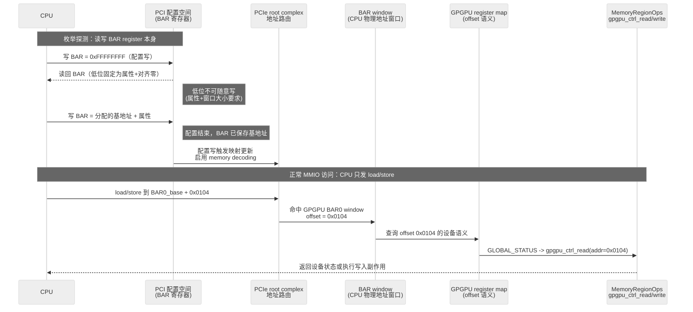

---
tags:
  - 系统模拟
---

# 虚拟硬件平台的连接与发现

软件启动一台机器时必须解决两个问题：**硬件怎么连接**，以及**软件怎么发现这些硬件**。前者由总线协议和地址空间映射共同定义——地址如何路由、数据如何传输、多个设备如何共享同一连接域、CPU 发出的物理地址最终落到 RAM 还是某个设备寄存器；后者在启动阶段靠一份硬件清单，在运行阶段靠总线自身的枚举机制。启动时交给 kernel 的硬件清单，后面会逐步引出 DTB、FDT 和 DTS 这些名字。

这篇笔记不以某个实验设备立论。我们先把稳定机制放稳：FDT/DTB 让 kernel 找到板级固定硬件和 PCIe root complex；PCI config space 让 kernel 发现 root complex 后面的 endpoint；BAR 让 endpoint 的私有窗口进入 guest 物理地址空间；MMIO handler 承接窗口命中后的设备行为。GPGPU 只在末尾作为一个具体 endpoint 例子，用来校准这些层次在 QEMU 代码里的落点。

这篇按一条主线读：先看一台机器由哪些角色组成，再看这些角色如何通过总线和地址空间连接，接着看 PCI/PCIe 为什么能枚举高速外设，然后拆开 BAR register、BAR window 和窗口内部 register map 的分工，最后回到 QEMU 里的 `virt_machine_init()`、`pci_register_bar()` 和一个 endpoint 设备的 `MemoryRegionOps` handler。

这篇解决的是硬件层面的连接与发现。至于这些硬件造好之后，guest 软件如何从第一条指令开始跑起来——从 reset vector 到 OpenSBI 到 kernel 读取硬件清单——我们把它放在 [[0-理论/计算机系统模拟/虚拟机器的软件自举链|下篇]] 单独讨论。两篇的分界点在“kernel 读取硬件清单”：上篇回答这份清单里写了什么、为什么需要这些描述；下篇回答这份清单怎么跑到 DRAM 里、kernel 怎么拿到它的地址。

## 阅读前的基本词汇

先把几个词放稳，后面读 QEMU 代码时才不会在称呼上绕晕。

| 词               | 先这样理解                          | 在这篇笔记里的作用                                               |
| --------------- | ------------------------------ | ------------------------------------------------------- |
| host            | 运行 QEMU 的真实机器和真实操作系统           | QEMU 是 host 上的一个普通进程，负责模拟一台虚拟机器                         |
| guest           | 被 QEMU 模拟出来的那台机器，以及在里面运行的软件    | guest 看到自己的 CPU、内存、设备和物理地址空间                            |
| Machine / Board | 一整台机器的板级模型                     | 决定 CPU、DRAM、ROM、UART、PCIe root complex 等部件如何组合          |
| vCPU            | QEMU 模拟出来的 CPU 执行单元            | guest 的指令由 vCPU 执行；在 RISC-V 里常对应一个 hart                 |
| hart            | RISC-V 里的 hardware thread，硬件线程 | `mhartid`、`num-harts`、`hart array` 都在描述 CPU 执行流的编号和组织方式 |
| device          | 被 CPU 通过总线或地址空间访问的硬件对象         | UART、PLIC、PCIe host bridge、GPGPU endpoint 都是设备          |
| region          | guest 物理地址空间里的一段区间             | RAM、MROM、UART MMIO、PCIe ECAM、PCIe MMIO 都是地址地图上的区间       |

---

| 名称    | 全称                   | 是否可写   | 是否断电保留 | 主要用途            | 启动阶段角色         |
| ----- | -------------------- | ------ | ------ | --------------- | -------------- |
| ROM   | Read-Only Memory     | 通常不可写  | 保留     | 固件、启动代码         | CPU最早执行的代码     |
| RAM   | Random Access Memory | 可写     | 不保留    | 程序运行数据          | 系统运行主体         |
| DRAM  | Dynamic RAM          | 可写     | 不保留    | 主内存             | Linux、应用程序所在位置 |
| SRAM  | Static RAM           | 可写     | 不保留    | 高速缓存、小容量片上存储    | 早期启动常用         |
| Flash | Flash Memory         | 可写（较慢） | 保留     | 存放固件、Bootloader | ROM之后的下一阶段     |
| Cache | Cache Memory         | 可写     | 不保留    | CPU缓存           | 加速访存           |

这里最容易混的是 host 和 guest。host 侧的 QEMU C 代码创建 `MemoryRegion`、注册设备、生成 DTB；guest 侧的 kernel 后续读取 DTB、访问 MMIO、枚举 PCIe。两边可能谈论同一个地址，例如 `0x80000000`，但含义不同：host 侧是在 QEMU 数据结构里描述 guest 物理地址，guest 侧是在 CPU 取指或访存时使用这个物理地址。

`hart` 也要提前放稳。RISC-V 使用 `hart` 来命名一个可执行硬件线程，避免把 core、thread、processor 混在一起。一个物理 core 可以有一个或多个 hart；在 QEMU `virt` 机器里，我们先把 hart 当成“guest 里可以独立执行指令的 CPU 执行流”。所以 `s->soc[i]` 创建的 `TYPE_RISCV_HART_ARRAY`，核心是在创建一组 hart；完整 SoC 芯片还包含中断控制器、定时器、总线和外设等更多部分。


## 机器的基本结构

先从硬件角度把系统的组成部分梳理清楚。以下结构不代表某个具体芯片，而是 RISC-V `virt` 机器的概念模型。图里的注释先给直觉，后面的正文再展开机制：

```text
Machine / Board                         # 一整台机器：芯片、内存、固件存储、外设的组合
├── SoC                                 # CPU 加上系统运行所需的控制器，不等于单个 CPU
│   ├── CPU core / hart                  # 真正执行指令的计算单元
│   ├── cache                            # 缓存，夹在 CPU 与内存访问之间
│   ├── memory controller                # 内存控制器，负责连接 DRAM
│   ├── interrupt controller (PLIC / AIA)# 中断控制器，负责把外设事件送到 CPU
│   ├── timer (CLINT / ACLINT)           # 定时器，提供时钟中断
│   ├── UART / SPI / I2C                 # 低速外设控制器，常用于串口、传感器、Flash 等
│   ├── PCIe root complex                # PCIe 总线入口，用来接 GPU、NVMe、网卡等高速外设
│   └── internal interconnect (AXI / TileLink) # SoC 内部互连，把这些模块接起来
├── DRAM                                # 主内存，也就是平时说的内存条/系统内存
├── Flash / ROM                         # 固件或启动代码所在的非易失存储，不等同于普通硬盘
└── PCIe devices                         # 挂在 PCIe 总线下的高速外设，可通过 PCIe 枚举发现
    ├── GPU                              # 图形/通用计算加速器
    ├── NVMe SSD                         # 高速块设备，接近“硬盘”的角色
    └── NIC                              # 网卡
```

### 先按角色读这张图

从上往下读这张图时，我们先不急着背缩写。这张图实际是在回答一台机器里的角色分工：

- **DRAM 就是系统主内存**。CPU 跑程序时，大部分普通 load/store 最终都落到 DRAM。QEMU 里的 `machine->ram` 就是在 host 上分配一块内存，然后映射成 guest 能看到的 DRAM。
- **Flash / ROM 更接近固件存储，不是普通硬盘**。ROM 常放 reset vector 或启动跳板代码；Flash 常放 BIOS、OpenSBI、U-Boot 这类固件。硬盘/NVMe 的职责是持久化文件系统和数据，通常作为一个块设备出现，在这张图里更接近 PCIe devices 下的 NVMe SSD。
- **SoC 不是 CPU 的同义词**。CPU 是执行指令的核，SoC 是把 CPU、内存控制器、中断控制器、定时器、外设控制器和内部互连放到一颗芯片里的系统。用户直觉里的“麻雀虽小五脏俱全”适合描述 SoC，但要记住它仍然只是整台 Machine 的一部分。
- **PCIe 是外设总线，不是某个具体设备**。GPU、NVMe、网卡可以挂在 PCIe 下。SoC 里有一个 PCIe root complex，提供进入 PCIe 总线的入口；具体外设是挂在这个入口后面的 endpoint。

这组角色解释清楚后，再看 CPU、SoC 与 Machine 的层次才不会断。

### CPU、SoC 与 Machine 的层次

**CPU core / hart** 只做一件事：取指令、执行指令。它不关心内存从哪来、中断从哪来、串口怎么通信。CPU 提供的是一套指令集架构接口（ISA），比如 RISC-V RV64GC。

**SoC（System on Chip，片上系统）** 把 CPU 能够运转所需的**外围硬件基础设施**和 CPU core 集成在一块芯片内。这些外围硬件包括：中断控制器（让 CPU 能响应外设事件）、定时器（提供时钟中断）、内存控制器（让 CPU 能访问 DRAM）、UART/SPI/I2C 控制器（提供低速外设接口），以及 PCIe root complex（为高速外设提供入口）。SoC 内部还需要一条互连总线（如 AXI、TileLink）把所有组件连在一起。

**Board / Machine** 把 SoC、DRAM 颗粒、Flash 芯片、外部 PCIe 设备通过物理电路板组织成完整的计算机系统。Board 定义了一组**地址映射**——DRAM 从哪个物理地址开始、UART 的寄存器映射到哪个地址区间、PCIe ECAM 空间放在哪里——这些都属于板级设计决策，跟 SoC 芯片本身没有必然绑定关系。

在 QEMU `virt_machine_init()` 的代码里，`s->soc[i]` 的名字虽然带 "soc"，但它实际上是一个 **hart array**（CPU 核心集合）加上每 socket 的 CLINT/PLIC，更接近「一个 socket 上的计算资源」而非完整 SoC 芯片。`s->memmap` 数组里 `[VIRT_DRAM]`、`[VIRT_UART0]`、`[VIRT_PCIE_ECAM]` 等地址映射才是 Machine 级别的设计。

从 `virt_memmap[]` 可以看到 RISC-V `virt` 机器的实际地址布局。我们先不把它当成一堆十六进制常量，而把它当成**CPU 看到的地图图例**：CPU 只发出“我要读写某个物理地址”，地址解码决定这次访问落到哪类对象上。 ^virt-memmap

| 区域        | 基地址          | 大小    | 先理解成                          | 谁会访问                    | 为什么重要                                                                                          |
| --------- | ------------ | ----- | ----------------------------- | ----------------------- | ---------------------------------------------------------------------------------------------- |
| MROM      | `0x1000`     | 60KB  | 上电后第一小段只读启动代码                 | vCPU reset 后最早执行        | reset vector 在这里，负责把执行流跳到 OpenSBI 或后续固件入口(OpenSBI 在 DRAM 中, 但 DRAM 这个时候可能还没初始化完成, 它机器启动时的确定入口) |
| UART0     | `0x10000000` | 256B  | 串口设备的一小排控制寄存器                 | 固件、kernel、早期 console 驱动 | 这是最小的 MMIO 外设样本，guest 写这个地址区间就等价于向串口发送字符                                                       |
| PCIe ECAM | `0x30000000` | 256MB | PCIe 配置空间的内存访问窗口              | kernel 的 PCI bus 枚举代码   | kernel 通过这里读取 Vendor ID、Device ID、BAR 等标准配置寄存器，先发现“有什么设备”                                      |
| PCIe MMIO | `0x40000000` | 1GB   | 给 PCIe endpoint BAR 使用的设备地址窗口 | PCIe 设备驱动               | GPU/NVMe/NIC 的控制寄存器或显存窗口会被分配到这里，驱动后续靠这些地址访问设备                                                  |
| DRAM      | `0x80000000` | 可配    | guest 的系统主内存                  | 固件、kernel、用户程序、DMA 设备   | OpenSBI、kernel、页表、堆栈、用户程序最终主要都放在这里                                                             |
再多补一嘴 MROM。MROM 可以先理解成“CPU reset 后一定能读到的固定入口区域”。真实硬件里，DRAM 上电后未必立刻可用(而 OpenSBI 通常就位于 DARM 上, DDR 控制器/时钟/PHY 训练等等一系列流程之后 DRAM 才可用)，所以 CPU 往往先从芯片内一小块 ROM 取指。QEMU 里没有真实 DRAM 初始化时序，但为了模拟真实机器的启动形状，仍然保留了这块 MROM 区域：vCPU reset 后先到 `0x1000`，执行几条跳板指令，再跳到 DRAM 里的 OpenSBI。`fw_dynamic_info` 是紧跟在 MROM 跳板后面的一小段结构体。MROM 跳板把它的地址传给 OpenSBI，OpenSBI 再从里面读取下一阶段软件的入口地址和目标特权级。[[0-理论/计算机系统模拟/虚拟机器的软件自举链#reset vector 与 MROM 跳板|MROM跳版]]部分会有更详细的展开

这张表最关键的区分是：**DRAM 背后有普通内存，MROM 背后有启动代码，UART0 / PCIe ECAM / PCIe MMIO 背后是设备行为**。CPU 看起来都在读写地址，但地址区间不同，背后的执行逻辑完全不同。

源码里的落点是 [`virt_memmap[]`](https://github.com/jensenojs/qemu/blob/study/hw/riscv/virt.c#L82-L104)。这张表本身只是板级地址规划，真正把规划接进 guest 物理地址空间的是 `virt_machine_init()`：它把 DRAM 和 MROM 挂进 `system_memory`（[`hw/riscv/virt.c`](https://github.com/jensenojs/qemu/blob/study/hw/riscv/virt.c#L1665-L1673)），再通过 [`gpex_pcie_init()`](https://github.com/jensenojs/qemu/blob/study/hw/riscv/virt.c#L1192-L1262) 把 PCIe ECAM、低位 MMIO、高位 MMIO 和 PIO 窗口接到同一张地址地图里。后面 DTB 里的 `reg` 和 `ranges` 必须和这张地图一致；否则 kernel 即使解析到了硬件清单，也会去错误的物理地址初始化设备。

## 总线的通用框架

**总线（bus）或互连（interconnect）是上位概念**，指的是多个硬件组件之间共享的通信通道。PCIe、USB、I2C、SPI、AXI 都是具体总线协议，各自面向不同的通信距离、带宽和复杂度需求。

```text
总线 / interconnect
├── 内存总线（CPU ↔ DRAM 之间的高带宽通道，如 DDR 接口）
├── SoC 内部总线（如 AXI / TileLink，连接 CPU、内存控制器、外设控制器）
├── PCIe（高速外设总线，GPU / NVMe / NIC 常挂在这里）
├── USB（中速外设连接，支持热插拔）
├── I2C（低速板级设备控制，传感器、PMIC）
└── SPI（中低速串行外设，Flash、显示屏）
```

一条总线协议至少要把这些事情说清楚：

- **谁能发起访问**。CPU 通常可以发起读写，但 DMA 控制器、GPU、网卡也可能绕过 CPU 直接访问内存。
- **地址怎么被送到正确对象**。同样是一个地址，落在 DRAM 区间就交给内存控制器，落在 UART 区间就交给串口控制器，落在 PCIe ECAM 区间就变成 PCI 配置空间访问。
- **数据怎么传输**。有的总线一次传很少的数据，适合控制类设备；有的总线有多条 lane，能承载 GPU、NVMe 这类高速外设的数据吞吐。
- **读写结果怎么返回**。读操作需要把数据带回来，写操作可能需要确认，错误也要能返回给发起方。
- **设备怎么被识别**。有些总线默认设备是“板子上焊死的”，软件必须提前知道它在哪里；有些总线支持运行时扫描，软件可以自己发现设备。

这些差异决定了同样叫“外设”，软件发现它们的方式完全不同。I2C、SPI 这类板级低速总线常用于传感器、电源管理芯片、Flash 等设备。它们通常不支持完整的自动发现：主板设计者知道某个 I2C 地址上接了什么设备，kernel 需要从启动时硬件清单或 ACPI 这类固件表里拿到这条信息。

PCIe 面向的是另一类场景：GPU、NVMe、网卡这类高速外设可能来自不同厂商，也可能通过插槽、switch 或虚拟化方式出现。系统不能假设“某个固定地址上一定是什么设备”，所以 PCIe 提供了标准化的 config space。OS 可以扫描 PCIe 总线，先读 Vendor ID、Device ID、Class Code，再根据 BAR 了解设备需要多少地址空间。也正因为 PCIe 能枚举，它和启动时那份硬件清单不是重复机制：**硬件清单先告诉 kernel PCIe 入口在哪里，PCIe 再告诉 kernel 入口后面挂了什么设备。** ^hardware-list-pcie-bootstrap

### 硬件发现的自举过程

“自动发现”不是从零开始的。USB、PCIe 这类总线可以发现自己下面挂了什么 endpoint，但前提是 kernel 已经知道对应的 host controller 或 root complex 在哪里、寄存器基址是多少、中断线怎么接、时钟和 reset 如何配置。也就是说，系统必须先发现“发现机制本身”，然后才能靠这个机制去发现后面的设备。

启动过程可以这样看：

```text
CPU 从 reset vector 开始执行
  ↓
固件 / bootloader 准备内存、加载 kernel、传入硬件清单
  ↓
kernel 解析硬件清单
  ↓
知道 RAM、中断控制器、定时器、UART、PCIe root complex、USB host controller 等板级固定硬件在哪里
  ↓
初始化这些基础控制器
  ↓
PCIe / USB 这类可枚举总线开始扫描或接收热插拔事件
  ↓
发现 GPU、NVMe、U 盘、键盘、网卡等 endpoint
```

这里的“主板设计者知道”指的是板级固定事实：某个 UART 被接到哪个物理地址、某个 I2C 控制器下的电源管理芯片使用哪个地址、PCIe ECAM 窗口从哪里开始、中断控制器怎么连到 CPU。这些事实不会从设备本身自动冒出来，必须由一份启动时硬件清单描述给 kernel。现代系统通常不把它们硬编码在 kernel 源码里，而是放进 DTB、ACPI 表或固件配置中；下一节会再解释 DTB/FDT 这组名字。 ^hardware-discovery-bootstrap

I2C/SPI 设备尤其能说明这个区别。一个 I2C 地址只表示“这个地址上可能有设备响应”，但地址本身不告诉 kernel 这是温度传感器、触摸板、电源管理芯片还是 EEPROM，也不告诉 kernel 它的寄存器布局和中断线。所以 kernel 需要从启动时硬件清单或 ACPI 得到类似这样的信息：这个控制器下面，`0x48` 地址处是某个型号的温度传感器，使用哪条中断线，驱动应按哪个 `compatible` 字符串匹配。

USB/PCIe 热插拔则发生在基础设施初始化之后。主板设计者不需要预先知道用户会插哪只 U 盘或哪张网卡；但系统必须先知道 USB host controller 或 PCIe root complex 的位置和配置。**静态描述负责把发现机制带起来，动态枚举负责发现机制后面的可变设备。**

## 地址空间与 MMIO

总线协议回答了硬件怎么连接，但没有回答 CPU 怎么**看到**这些连接。地址空间（address space）就是 CPU 的视角：CPU 发出一次次 load/store，每次附带一个物理地址，这个地址落在哪里——RAM 的某个字节、UART 的发送寄存器、还是 PCIe 设备的 BAR 窗口——由地址解码逻辑决定。MMIO（Memory-Mapped I/O）是让设备寄存器看起来像内存地址的技术手段，是地址空间中除 RAM 之外最重要的组成部分。

如果熟悉操作系统里的虚拟内存和 `mmap()`，可以先借这个直觉理解地址空间：进程看到一大片连续虚拟地址，但不同地址背后可能是匿名内存、文件页、共享内存或设备映射。硬件平台里的 guest physical address space 也有类似的“统一地址视图”：CPU 发出的物理地址看起来都在同一张地图里，但不同区间背后的处理方式不同。

这个类比只能用来建立入口，不能完全等同。进程虚拟地址空间是 OS 给进程的视图，由页表把虚拟地址翻译到物理页、文件页或设备映射；这里讨论的是 guest CPU 看到的**物理地址空间**，由机器的地址映射和 QEMU 的 `MemoryRegion` 树决定访问落到 RAM、ROM 还是某个设备 handler。

> [!note] MMIO 和 port I/O 是两种设备控制入口
> MMIO 把设备寄存器放进 CPU 物理地址空间，CPU 用普通 load/store 指令访问这些寄存器。x86 历史上还有另一条入口：port I/O，也叫 PIO。PIO 使用独立的 I/O address space，软件用 `in` / `out` 这类专门指令读写设备端口。
>
> 二者解决的问题相近：CPU 需要读写设备控制状态。差异在地址空间和指令语义。MMIO 使用普通物理地址和普通访存指令；PIO 使用独立端口地址和专门 I/O 指令。RISC-V `virt` 平台没有 x86 风格的 `in` / `out` 指令，当前 GPGPU 设备的 BAR0、BAR2、BAR4 都声明为 PCI Memory Space BAR，走 MMIO 路径。
>
> 这就是历史资产和历史负载同时存在的例子。x86 早期保留独立 I/O 端口空间，使设备控制可以绕开普通内存地址空间，早期硬件译码也更简单；随着系统规模扩大，MMIO 更适合统一到物理地址空间、页表属性、缓存属性和总线桥接中。PCI 为了兼容两类世界，在 BAR 的 bit 0 中同时保留 Memory Space 与 I/O Space 两种声明。RISC-V 这类较新的平台通常直接走 MMIO，机制更统一，代价是平台必须把地址地图、缓存属性和设备窗口描述清楚。

### guest physical address space

在真实硬件上，CPU 执行的每条访存指令最终都产生一个物理地址，送到内存总线或 SoC 内部互连上。芯片组里的地址解码器（address decoder）根据预设的地址映射表判定：这个地址属于 DRAM 控制器 → 读写 DRAM；属于 UART → 读写 UART 寄存器；属于 PCIe ECAM 窗口 → 生成 PCIe 配置空间访问。

在 QEMU 中，`get_system_memory()` 返回的 `MemoryRegion *` 就是这个 guest physical address space 的表示。它是一个**树状结构**：根 container 之下挂着一系列子 region，每个子 region 占据一段连续的 guest 物理地址区间。QEMU 的 soft MMU 在每次 guest 访存时查找这棵树，找到命中的 region 后决定是该直接读写 host 内存（RAM 类型）还是调用回调函数（MMIO 类型）。

**guest physical address space 不等于 host 内存。** 它只是 QEMU 为 guest CPU 构建的一个虚拟地址地图。地图上的大部分地址区间指向普通 RAM（背后有 `malloc` 分配的 host 内存），但也有大量区间指向设备 MMIO 区域，这些区域没有 host 内存作为后备存储，每次读写都由对应的设备 handler 处理。

这里的“回调函数”可以类比 OS 里“同样是 read/write，但不同文件描述符背后可以是普通文件、管道、终端或设备驱动”。不过 QEMU 的 MMIO 不需要先把设备包装成文件：guest 执行的是普通 load/store，QEMU 在模拟访存时直接根据 `MemoryRegionOps` 调用 C 函数。文件抽象是 host OS 的接口；`MemoryRegionOps` 是 QEMU 内部模拟设备寄存器的接口。

### MemoryRegion 的类型

QEMU 用 `MemoryRegion` 及其子类型来表示地址空间中的不同区域。常见类型：

| 类型 | 初始化函数 | 行为 |
|------|-----------|------|
| RAM | `memory_region_init_ram()` | 分配 host 内存作为后备存储。guest 读写直接操作这段内存。用于系统主内存。 |
| ROM | `memory_region_init_rom()` | 只读内存。guest 读返回数据，guest 写被忽略。用于启动 ROM。 |
| IO（MMIO） | `memory_region_init_io()` | **无后备存储**。每次 guest 读写都会调用注册的 `read`/`write` 回调函数。用于设备寄存器。 |
| Container | `memory_region_init()` | 不包含实际数据，只是一个子 region 的容器。地址空间树的内部节点。 |
| Alias | `memory_region_init_alias()` | 指向另一个 region 的窗口，可设定不同的地址偏移和大小。用于在不同地址重复映射同一设备。 |

`Container` 和 `Alias` 难懂，是因为它们都不是“真实的一块内存”。可以这样区分：

```text
Container：目录
├── 自己不存数据
├── 负责装下别的 region
└── 例子：system_memory 是整张 guest 物理地址地图的根容器

Alias：快捷方式 / 映射窗口
├── 自己也不存数据
├── 指向另一个已经存在的 region
└── 例子：GPEX host bridge 把 PCI memory space 映射到 guest 物理地址窗口
```

所以 `Container` 解决的是“地址空间怎么组织成树”，`Alias` 解决的是“同一个设备 region 如何出现在另一个地址位置”。这和文件系统里的目录、软链接只是粗略类比：目录本身不是文件内容，软链接本身也不是文件内容，但它们让名字空间和访问路径变得可组织。

如果要用源码校准这张表，可以先看 QEMU 对 [`memory_region_init_io()`](https://github.com/jensenojs/qemu/blob/study/include/system/memory.h#L1347-L1365)、[`memory_region_init_alias()`](https://github.com/jensenojs/qemu/blob/study/include/system/memory.h#L1540-L1556) 和 [`memory_region_add_subregion()`](https://github.com/jensenojs/qemu/blob/study/include/system/memory.h#L2321-L2336) 的注释。这里容易误读成“分配一块内存”。更稳的读法是：`init_io` 定义访问命中后调用哪个 handler，`init_alias` 定义这段窗口引用哪个已有 region，`add_subregion` 定义一个 region 出现在容器里的哪个 offset。只有 RAM/ROM 需要后备存储；IO、Container、Alias 更多是在定义访存路由。

`virt_machine_init()` 的代码里能看到所有这些类型：

```c
// RAM: system_memory 树下的 DRAM 子区域
memory_region_add_subregion(system_memory, s->memmap[VIRT_DRAM].base,
                            machine->ram);  // machine->ram 是 RAM 类型

// ROM: mask_rom 用于 reset vector
memory_region_init_rom(mask_rom, NULL, "riscv_virt_board.mrom",
                       s->memmap[VIRT_MROM].size, &error_fatal);
memory_region_add_subregion(system_memory, s->memmap[VIRT_MROM].base,
                            mask_rom);

// Alias: PCIe ECAM 窗口指向 GPEX host bridge 的 ECAM region
memory_region_init_alias(ecam_alias, OBJECT(dev), "pcie-ecam",
                         ecam_reg, 0, ecam_size);
memory_region_add_subregion(get_system_memory(), ecam_base, ecam_alias);
```

GPGPU 的 BAR0 也会用到同类思想，但在 `hw/gpgpu/gpgpu.c` 里通常不会直接看到 `memory_region_init_alias()`。设备代码只声明“我有一段 `s->ctrl_mmio`，它可以作为 BAR0”。当 guest 或测试框架给 BAR0 分配基地址并打开 memory decoding 后，QEMU PCI 子系统把 `s->ctrl_mmio` 加到 PCI bus 的 `address_space_mem`；RISC-V `virt` 的 GPEX host bridge 再通过 `pcie-mmio` alias 把这个 PCI memory space 暴露到 `system_memory` 的 `VIRT_PCIE_MMIO` 窗口。也就是说，设备模型声明 BAR region，PCI 子系统负责配置写入后的映射更新，host bridge 负责把 PCI memory space 路由到 guest 物理地址窗口。GPEX 内部的落点在 [`gpex_host_realize()`](https://github.com/jensenojs/qemu/blob/study/hw/pci-host/gpex.c#L90-L158)：它创建 `s->io_mmio`，再把这块 PCI memory space 传给 `pci_register_root_bus()`。

### MMIO 的本质

MMIO 的核心思想是把设备寄存器放进 CPU 可访问的地址空间，让普通 load/store 指令承担设备控制访问。CPU 不需要知道自己在跟哪个具体设备对话——它只是执行普通的 load/store 指令，地址解码器负责把落在设备区间的访问路由到设备。

我们可以把 CPU 视角先理解成“一张很大的地址数组”，但这张数组不是每个下标背后都有普通内存：

- 落在 DRAM 区间，读写的是内存单元。
- 落在 ROM 区间，读到的是固化的启动代码，写通常无效。
- 落在 UART 或 GPGPU BAR0 区间，读写的是设备寄存器，可能触发副作用。
- 没被任何 region 覆盖的地址，可能产生访问错误或返回平台定义的默认结果。

设备寄存器也不一定像普通数组一样连续、可缓存、可随便读写。有些偏移是保留洞，有些寄存器写入后会启动 DMA，有些寄存器读一次就清除状态位。MMIO 给 CPU 提供的是“统一用地址访问”的接口，不保证背后的对象都具有普通内存语义。

在 QEMU 中，MMIO 的工作流程是：

1. 设备用 `memory_region_init_io()` 创建一个 MMIO region，注册 `MemoryRegionOps`——包含 `.read` 和 `.write` 函数指针。
2. 设备把 region 挂到 system memory 的某个地址区间（直接挂，或通过 PCIe BAR 间接挂）。
3. 当 guest CPU 执行 load 指令命中这个区间时，QEMU 的 soft MMU 查找发现这个地址对应的 region 是 IO 类型，于是调用 `MemoryRegionOps.read(opaque, addr, size)`。
4. 回调函数（即设备作者写的 handler）根据 `addr`（相对于 region 起始地址的偏移）和 `size` 决定返回什么值。

整个过程对 guest 透明：guest 代码就是一条 `lw t0, 0(t1)`，其中 `t1` 恰好指向设备 MMIO 区域。QEMU 在模拟这条指令时发现地址落在 MMIO 范围，转而调用设备 handler。设备的内部状态变化通过 handler 的返回值或副作用来体现。

这个机制是后续理解 PCIe BAR 和 `gpgpu_ctrl_read()` 的基础。BAR 解决的问题是如何让 PCIe 设备的 MMIO region 出现在 guest physical address space 的合适位置上。 ^mmio-to-gpgpu-ctrl-read

## PCIe 协议的核心机制

PCIe（PCI Express）这一节，我们先不从“总线是不是共享”开始理解。更直接的入口是：**CPU 和内存系统需要一套标准方式连接高速外设**。GPU、NVMe、网卡这类设备带宽高、厂商多、型号多、可能插拔或通过虚拟化出现，系统不能把它们都写死在某个固定地址上。PCIe 解决的就是“高速外设怎么接入系统、软件怎么发现它、发现后怎么给它分配地址资源”。

先按角色记住 PCIe：

- **root complex** 是 CPU/内存侧进入 PCIe 世界的入口。CPU 对 PCIe 设备的配置访问和 MMIO 访问，都要先经过它。
- **endpoint** 是真正的设备，比如 GPU、NVMe、网卡。它实现 config space，声明自己的身份和资源需求。
- **switch** 是扩展器。它上游接 root complex 或上级 switch，下游接更多 endpoint 或下级 switch。

```text
CPU / Memory
  ↓
PCIe root complex（PCIe 世界的入口）
  ↓
PCIe switch（可选，用来扩展更多端口）
  ├── endpoint A（如 NVMe）
  ├── endpoint B（如 GPU）
  └── endpoint C（如 NIC）
```

这里的“串行点对点”说的是物理传输方式：每条 PCIe link 只连接两个端点，例如 root complex 到 switch，或者 switch 到 endpoint。数据在这条 link 上按 lane 串行传输。它不像早期 PCI 那样让多个设备电气上共享同一组并行信号线，所以不会出现多个设备同时争用同一条物理并行总线的模型。

这不等于 PCIe 系统里完全没有“共享”。共享发生在更高层：多个 endpoint 共享 root complex 到 CPU/内存这一侧的上游通路，switch 下游多个设备也会共享 switch 的上游带宽。这种共享的模式是“每段 link 点对点传输，中间设备负责转发和仲裁”，不像旧 PCI 那样“大家接在同一组电线上一起说话”。这也是 PCIe 能比旧 PCI 更快、更可扩展的原因。

软件仍然需要给这些设备编号和扫描。kernel 不能只看物理 lane，因为 lane 只说明线怎么连，不说明“这是什么设备、需要多少 MMIO 地址、应该加载什么驱动”。所以 PCIe 保留了 PCI 的软件模型：用 bus/device/function 给设备定位，用 config space 描述设备身份和资源需求。

可以把关系压成一句话：**硬件传输是点对点 link，软件发现是一棵 PCI bus 拓扑。** link 负责快；bus/device/function 负责让 kernel 能枚举、命名和配置设备。

```text
PCIe root complex（CPU/内存侧的 PCIe 入口）
├── PCI bus 0
│   ├── endpoint A（如 onboard NVMe）
│   └── PCIe switch
│       ├── PCI bus 1
│       │   ├── endpoint B（如 GPU）
│       │   └── endpoint C（如 NIC）
```

### PCI 配置空间

每个 PCI/PCIe 设备（endpoint）必须实现一组标准化的配置寄存器，称为 **config space**。OS 可以在不加载任何设备驱动的情况下，通过读取 config space 知道总线上有什么设备、每个设备的身份、以及设备需要多少地址空间资源。

这也是 PCIe 比 I2C/SPI 更“自描述”的地方：I2C 设备常常需要 FDT 先告诉 kernel「某个地址上是什么芯片」；PCIe endpoint 至少会在标准位置放 Vendor ID、Device ID 和 Class Code。kernel 读到这些字段后，才决定要不要加载具体驱动。

config space（Type 0，endpoint 用）包含的关键字段：

| 偏移 | 字段 | 说明 |
|------|------|------|
| `0x00` | Vendor ID | 16 位厂商编号，由 PCI-SIG 分配。真实硬件如 NVIDIA 是 `0x10DE`，QEMU 虚拟设备可以自定义 |
| `0x02` | Device ID | 16 位设备编号，由厂商自行分配 |
| `0x08` | Revision ID | 硬件版本号 |
| `0x09` | Class Code | 24 位设备类别码。`0x030200` = 3D 显示控制器，`0x010802` = NVMe SSD |
| `0x10`-`0x24` | BAR0-BAR5 | 六个 Base Address Register，每个声明设备需要的一段 MMIO 或 IO 地址空间 |

> [!note] config space 是语义，config access 是入口
> config space 指 endpoint 必须提供的标准寄存器集合：Vendor ID、Device ID、Class Code、BAR 等字段都在这里。ECAM、`0xcf8` / `0xcfc` 这类机制回答的是另一层问题：CPU 或 kernel 通过哪条入口去读写这组标准寄存器。
>
> RISC-V `virt` 通过 DTB 描述 `pci-host-ecam-generic`，kernel 因此知道 ECAM 窗口在哪里，之后用普通 MMIO 形态访问 config space。x86 早期平台常通过 `0xcf8` / `0xcfc` 这组 I/O port 完成 PCI config access，现代 PCIe 平台也常通过 ACPI MCFG / MMCONFIG 找到 ECAM。config space 这套语义保持统一，访问入口随着平台历史和固件约定变化。
>
> 这个分层能避免一个常见误读：ECAM 是访问 config space 的映射方式，Vendor ID、Device ID 和 BAR 才是 config space 中的软件可见字段。

### BAR：设备向系统申请地址空间

PCIe endpoint 启动时不会自己决定“我住在哪个物理地址”。它只声明自己的资源需求：需要一块 MMIO 空间、大小是多少、是否希望使用 64-bit 地址、这块空间能不能被 prefetch。系统软件负责给它分配地址。

整体交互先看成这样：

```text
OS / firmware
    ↓ 通过 PCI config access 读写 endpoint config space
endpoint 的 BAR 寄存器
    ↓ 暴露资源需求和接收分配结果
OS / firmware
    ↓ 给 BAR 写入基地址
PCIe host bridge / root complex
    ↓ 建立 CPU 地址 → PCIe 事务的路由
CPU load/store 到该地址
    ↓
endpoint 收到 Memory Read/Write TLP
    ↓
设备内部 BAR offset 对应寄存器或显存窗口
```

理解 BAR 需要分两层：它在 PCI 协议层面的语义，以及它在 QEMU 里的实现。我们先把协议层面的交互讲清楚，再回到 `pci_register_bar()` 的 QEMU 实现。

> [!note] BAR 链路里的五层边界
> 后面读[[1-实践/examples/qemu-camp-2026/device-model/GPGPU 设备模型过测记录|GPGPU设备]]时，最容易把几个“地址”和“寄存器”弄混
>
> - **FDT / DTB**：描述 PCIe root complex 的入口，包括 ECAM 配置访问窗口和 PCIe MMIO window 映射。它帮助 kernel 找到 PCIe 总线入口。
> - **PCI config space**：endpoint 的标准身份与资源声明区。Vendor ID、Device ID、Class Code、BAR0-BAR5 都在这里，访问方式是配置访问。
> - **BAR register**：config space 里的资源声明寄存器。它告诉系统窗口类型、大小约束和属性，并接收系统写回的基地址。
> - **BAR window / MMIO MemoryRegion**：BAR 配置完成后出现在 CPU 物理地址空间里的设备窗口。CPU 对这段地址执行普通 load/store，QEMU 路由到对应 `MemoryRegionOps`。
> - **GPGPU BAR0 / BAR2 / BAR4 window**：设备自己定义窗口内部 offset 的含义。BAR0 是控制寄存器窗口，BAR2 是 VRAM 数据窗口，BAR4 是 doorbell 窗口。
>
> 这一层次关系可以压成一句话：DTB 让 kernel 找到 PCIe 入口，config space 让 kernel 发现 endpoint，BAR register 让系统分配窗口，MemoryRegion handler 定义访问命中后的行为，GPGPU 的窗口定义决定每个 offset 的语义。

#### PCI 协议层面的资源声明

每个 BAR 是一个 32 位或 64 位的可读写寄存器，位于设备 config space 中。低几位保存属性，高位用于存放基地址。

| 位        | 用途（以 32-bit MMIO BAR 为例）              |
|----------|---------------------------------------|
| bit 0    | 0 = MMIO，1 = I/O 空间                   |
| bit 1–2  | 00 = 32-bit BAR，10 = 64-bit BAR       |
| bit 3    | 1 = prefetchable，0 = non-prefetchable |
| bit 4–31 | 地址部分（其中低若干位硬件强制为 0，高位可写）              |

bit 0 保留了 PCI 的两类资源声明：Memory Space BAR 和 I/O Space BAR。Memory Space BAR 映射到 CPU 物理地址空间，后续访问走 MMIO；I/O Space BAR 映射到独立 I/O 端口空间，主要服务 x86 这类保留 port I/O 机制的平台。当前 GPGPU 只使用 Memory Space BAR；I/O Space 在这里主要帮助我们理解 PCI 兼容语义和历史包袱。

如果设备使用 64-bit BAR，它会占用连续两个 BAR 槽位：低 32 位放在 BAR0，高 32 位放在 BAR1。因此某些设备只使用 BAR0、BAR2、BAR4，中间的 BAR1、BAR3 被前一个 64-bit BAR 占用。

#### 配置访问与 MMIO 访问的低位含义

这里先补一个容易漏掉的区分：**读写 BAR 寄存器本身**和**读写 BAR 映射出来的 MMIO 窗口**属于两类访问。

| 访问类型 | 访问目标 | CPU 操作的地址空间 | 低位规则 |
|----------|----------|--------------------|----------|
| 枚举配置 | BAR 寄存器本身 | PCI 配置地址（通过 CF8/CFC 或 ECAM） | bit 0-3 是属性位；一部分地址低位因对齐要求硬件返回 0 |
| 正常运行 | BAR 窗口内的 MMIO 地址 | CPU 物理地址空间（普通 load/store） | 低位作为设备内部偏移使用 |

枚举配置时，低位告诉系统“这个 BAR 的类型和大小约束”。正常运行时，CPU 发出的地址低位会变成设备窗口内部的 offset。比如 `BAR0_base + 0x0104` 里的 `0x0104`，最后会变成设备看到的 BAR0 内部偏移。

#### 探测窗口大小

系统软件先要知道这个 BAR 要多大。PCI 规范里用了一个很典型的探测技巧：

- OS 向 BAR 写入 `0xffffffff`
- OS 再读回 BAR
- 根据哪些 bit 读回来仍然是 0，推断 BAR 的大小

为什么这样能推断大小？因为 BAR 寄存器的地址部分有一段低位由硬件固定返回 0。这段固定为 0 的低位，表达的是对齐约束。

假设设备需要 1 MiB MMIO 空间。`1 MiB = 0x100000`，所以系统分给它的基地址必须按 1 MiB 对齐。地址低 20 位必须是 0。

那么这个 BAR 的地址部分大概表现为：

- 可写地址位：高位
- 固定为 0 ：低 20 位

当 OS 写入全 1：

```text
写入：0xffffffff
读回：0xfff00000  # 这里先忽略最低几位属性 bit
```

系统看到低 20 位被硬件压成 0，就知道这个 BAR 请求的是 2^20 = 1 MiB。

更形式化地表达就是：

```text
size = ~(read_back & address_mask) + 1
```

低位属性 bit 要先 mask 掉，因为 bit 0、bit 1-2、bit 3 表示属性而非地址。探测过程中，设备通常还没有开启 memory decoding，因此不会响应对该窗口的普通 MMIO 访问。这里仍处在 config space 访问阶段，尚未进入设备寄存器文件。

#### 写回基地址

知道大小之后，系统软件会在全局地址空间里找一段空闲范围。例如：

- BAR0 需要 1 MiB
- 系统给它分配 `0x40000000 - 0x400fffff`
- 然后系统把基地址写回 BAR：

```text
BAR0 = 0x40000000 | 属性位
```

写回之后，BAR0 里保存的是“系统给这个设备窗口分配的基地址”。设备仍然按自己的寄存器偏移定义窗口内部含义。

#### 建立地址路由

写 BAR 只是让 endpoint 这边知道“我的窗口地址是多少”。还需要 root complex / host bridge 知道：CPU 访问哪段地址时，要转成 PCIe memory transaction。

所以系统还必须配置 PCIe host bridge，使得 CPU 访问该物理地址区间时，能够生成 PCIe Memory Read / Memory Write 事务并转发至对应的 endpoint。访问路径如下：

```text
CPU physical address
0x40000000 - 0x400fffff
        ↓ 命中 PCIe MMIO window
PCIe root complex
        ↓ 生成 Memory Read / Memory Write TLP
PCIe fabric / switch
        ↓ 根据 bus/device/function 和地址路由
GPGPU endpoint
        ↓ BAR0 命中，offset = addr - BAR0_base
gpgpu BAR0 register file
```

CPU 后续执行普通 load/store 时，并不知道自己在“访问 PCIe”。CPU 只是发出地址。地址解码和 root complex 把这次访存变成 PCIe 事务。

#### 窗口内部协议：BAR 只交付字节，设备解释 offset

建立 BAR 路由之后，PCI 通用层的工作已经基本结束了。它只保证一件事：CPU 对某段物理地址的访问会被送到某个 endpoint 的某个 BAR window。它不负责解释这个窗口里的每个 offset。

因此 `BAR0_base + 0x0104` 要拆成两层读：

```text
BAR0_base                  # 系统分配的窗口基地址，属于 PCI/BAR 层
+ 0x0104                   # 窗口内部 offset，属于设备私有协议层
```

PCI config space 和 BAR register 能回答的问题是：这个 endpoint 有哪些窗口、窗口多大、窗口类型是什么、系统把窗口放到了哪个物理地址。它不能回答 `0x0104` 是状态寄存器、命令寄存器、FIFO 入口，还是一段普通显存。这个答案来自设备自己的 **register map**。

register map 可以理解成设备窗口内部的第二张小地址地图。它通常至少要说明这些字段：

| 字段                       | 说明                  | 例子                                 |
| ------------------------ | ------------------- | ---------------------------------- |
| offset                   | 相对 BAR window 起点的偏移 | `0x0104`                           |
| width                    | 支持的访问宽度             | 4 字节读                              |
| access                   | 读写属性                | RO、RW、WO、RW1C                      |
| reset/read value         | 复位后读到什么，读操作返回什么     | `GLOBAL_STATUS.ready = 1`          |
| write side effect        | 写入会不会触发动作或清状态       | 写 `DISPATCH` 启动 kernel，写 1 清错误位    |
| backing state / behavior | 设备模型里由哪个状态字段或行为承接   | `s->global_status`、`gpgpu_reset()` |

真实硬件里，这张表通常写在厂商 **datasheet** 或 programming manual 里。这里的 datasheet 指设备规格书，不是 QEMU 的某个通用概念：它告诉驱动作者“每个 offset 怎么用”。驱动和设备必须共同遵守这份约定，驱动按表读写，设备按表解释。

[[1-实践/examples/qemu-camp-2026/device-model/GPGPU 设备模型过测记录|GPGPU]] 里没有一份完全等价于真实厂商 datasheet 的稳定文档。最接近规格书的是实验仓库里的 [`docs/specs/gpgpu.rst`](https://github.com/gevico/qemu-camp-2026-exper-jensenojs/blob/main/docs/specs/gpgpu.rst)，它描述设计意图和 BAR0 register layout；[`hw/gpgpu/gpgpu.h`](https://github.com/gevico/qemu-camp-2026-exper-jensenojs/blob/main/hw/gpgpu/gpgpu.h) 把这些 offset 写成 `GPGPU_REG_*` 常量；`tests/qtest/gpgpu-test.c` 复制测试需要的常量并断言行为；[`hw/gpgpu/gpgpu.c`](https://github.com/gevico/qemu-camp-2026-exper-jensenojs/blob/main/hw/gpgpu/gpgpu.c) 里的 handler 承接真实访问。在训练营中，“设备规格”实际分布在 spec、头文件、测试和 handler 四处。

对 GPGPU BAR0 来说，这张窗口内部地图大致下面这样的, 我们以这个东西作为例子

| BAR0 offset 范围  | register group        | 设备语义                                     | 当前访问入口                                                |
| --------------- | --------------------- | ---------------------------------------- | ----------------------------------------------------- |
| `0x0000-0x00ff` | Device information    | 设备私有 ID、版本、能力、VRAM 大小                    | `gpgpu_ctrl_read()` 返回常量或属性字段                         |
| `0x0100-0x01ff` | Global control/status | enable/reset、ready/busy/error、错误清除       | `s->global_ctrl`、`s->global_status`、`s->error_status` |
| `0x0200-0x02ff` | Interrupt control     | 中断使能、 pending 状态、ack 清除                  | `s->irq_enable`、`s->irq_status`                       |
| `0x0300-0x03ff` | Kernel dispatch       | kernel 地址、参数地址、grid/block 维度、dispatch 门铃 | `s->kernel` 和后续 dispatch 行为                           |
| `0x0400-0x04ff` | DMA control           | DMA 源/目标/大小/方向/状态                        | `s->dma` 和后续 DMA 行为                                   |
| `0x1000-0x1fff` | SIMT context          | 当前线程/warp/block 身份                       | `s->simt`                                             |
| `0x2000-0x2fff` | Synchronization       | barrier、thread mask 等同步/分歧辅助状态           | `s->simt` 相关状态                                        |

一次 `GLOBAL_STATUS` 读取可以完整拆成：

```text
guest physical address = BAR0_base + 0x0104
    ↓
QEMU PCI / host bridge 路由确认：这落在该 endpoint 的 BAR0 window
    ↓
MemoryRegionOps.read(opaque=s, addr=0x0104, size=4)
    ↓
gpgpu_ctrl_read() 解释 BAR0 内 offset
    ↓
case GPGPU_REG_GLOBAL_STATUS:
    return s->global_status;
```

这里的关键是层次：**系统决定窗口基地址，设备定义窗口内部 offset 的含义。** PCI 标准提供 BAR window 这条寻址机制；设备 register map 定义 `BAR0 + 0x0104` 到底是什么。

> [!example] 这层约定在代码里的四处落点
> 对一个 QEMU 设备模型来说，设备私有 register map 通常会同时落在几处代码或文档里。读代码时要把它们当成同一份协议的不同投影，而不是彼此独立的事实。
>
> - `docs/specs/gpgpu.rst` 是 **设计规格说明**：它用表格描述 BAR0、BAR2、BAR4 和寄存器 offset 的预期语义。真实硬件的 datasheet 扮演的就是这个角色。
> - `hw/gpgpu/gpgpu.h` 是 **offset 名字表**：它把规格里的偏移写成代码常量，例如 `GPGPU_REG_DEV_ID = 0x0000`、`GPGPU_REG_GLOBAL_STATUS = 0x0104`、`GPGPU_REG_DISPATCH = 0x0330`。
> - `tests/qtest/gpgpu-test.c` 是 **外部使用者样本**：测试代码像驱动一样按这些 offset 读写，并把期望行为写成断言。
> - `hw/gpgpu/gpgpu.c:gpgpu_ctrl_read()` / `gpgpu_ctrl_write()` 是 **offset 解释点**：通用 PCI/QEMU 层只把访问送到 BAR0；这里的 `switch (addr)` 才把 `0x0104` 解释成 `GLOBAL_STATUS`。
>
> ```text
> 设备规格 / register map
> ├── docs/specs/gpgpu.rst          # 人读的设计意图
> ├── hw/gpgpu/gpgpu.h              # offset 名字和 bit 定义
> ├── tests/qtest/gpgpu-test.c       # 使用者如何读写这些 offset
> └── hw/gpgpu/gpgpu.c
>     ├── gpgpu_realize()
>     │   ├── memory_region_init_io(&s->ctrl_mmio, ..., &gpgpu_ctrl_ops, ...)
>     │   └── pci_register_bar(pdev, 0, ..., &s->ctrl_mmio)
>     ├── gpgpu_ctrl_ops
>     │   ├── .read  = gpgpu_ctrl_read
>     │   └── .write = gpgpu_ctrl_write
>     └── gpgpu_ctrl_read/write()
>         └── switch (addr)
>             └── case GPGPU_REG_GLOBAL_STATUS:
>                 └── return s->global_status
> ```
>
> 如果这些落点不一致，问题通常不在 PCI 或 BAR 机制本身，而在设备私有协议没有被同步维护。当前实验中过测时读 `gpgpu.h`、`gpgpu-test.c` 和 handler，就是在核对这份 register map 合同有没有闭合。

所以 BAR 的心智模型可以先收束成一句话：**系统决定窗口基地址，设备定义窗口内部 offset 的含义。**



这里的 prefetchable 也可以先按直觉理解：如果一个 BAR 标记为 prefetchable，系统可以更积极地合并、预取或缓存这段访问，通常适合显存这类普通数据窗口；控制寄存器 MMIO 往往有读写副作用，不适合被预取。GPGPU 的 BAR2 VRAM 可以标记 prefetchable，BAR0 控制寄存器则更像普通 MMIO 控制窗口。

#### QEMU 实现层面的映射

`pci_register_bar()` 把上述过程转化为 QEMU 的 `MemoryRegion` 操作：

```c
// 先创建 MMIO region，绑定 read/write 回调
memory_region_init_io(&s->ctrl_mmio, OBJECT(s), &gpgpu_ctrl_ops, s,
                      "gpgpu-ctrl", GPGPU_CTRL_BAR_SIZE);  // 1MB

// 注册为 PCI BAR 0
pci_register_bar(pdev, 0,
                 PCI_BASE_ADDRESS_SPACE_MEMORY |
                 PCI_BASE_ADDRESS_MEM_TYPE_64,
                 &s->ctrl_mmio);
```

`pci_register_bar()` 这条链路要拆成几处源码：

- [`pci_register_bar()`](https://github.com/jensenojs/qemu/blob/study/hw/pci/pci.c#L1497-L1551) 在 `pci_dev->io_regions[region_num]` 中记录 BAR 的大小、类型、对应的 `MemoryRegion`，并在 PCI config space 的 BAR 字段设置可写掩码和类型标志。
- guest 写 BAR 或写 `PCI_COMMAND_MEMORY` 时，默认配置写路径 [`pci_default_write_config()`](https://github.com/jensenojs/qemu/blob/study/hw/pci/pci.c#L1801-L1825) 会触发映射更新。
- [`pci_update_mappings()`](https://github.com/jensenojs/qemu/blob/study/hw/pci/pci.c#L1723-L1765) 重新计算 BAR 基地址；如果 BAR 已启用，就把 `r->memory` 加到 `r->address_space` 的对应地址上。这意味着 guest 对该地址区间的访问最终会落到 `gpgpu_ctrl_ops.read` / `gpgpu_ctrl_ops.write`。 ^bar-mmio-gpgpu

这段源码也修正一个常见误解：`pci_register_bar()` 本身不决定最终物理地址，它只把“这块 region 可以作为 BAR”登记到 PCI 设备上。最终地址来自 guest 对 BAR 寄存器的配置写入；RISC-V `virt` 上这段 PCI memory space 再经由 [`gpex_pcie_init()`](https://github.com/jensenojs/qemu/blob/study/hw/riscv/virt.c#L1238-L1249) 暴露到 `0x40000000` 起的 PCIe MMIO 窗口。

到这里先收束一条分界：**config space 身份字段说明“这是什么设备”，BAR 说明“这个设备需要哪些地址窗口”，register map 说明“窗口内部每个 offset 怎么解释”。** 这三层都叫“寄存器”，但访问路径和消费者不同。具体 endpoint 的 BAR 形状和 handler 落点，放到后面的 QEMU 示例里再核对。 ^pci-config-identity

### 设备反向影响系统：DMA 与中断

到这里为止，我们主要讲的是 CPU 怎样主动访问设备：CPU 通过 MMIO 或 port I/O 写控制寄存器，通过 BAR window 读写设备暴露的寄存器和内存窗口。但真实外设不会只被动等待 CPU 逐字节搬运数据。高速设备通常还需要两条反向路径：设备自己访问内存，以及设备把事件送回 CPU。

可以把外设交互拆成三条通道：

| 通道 | 方向 | 典型机制 | 解决的问题 |
|------|------|----------|------------|
| 控制通道 | CPU → device | MMIO、port I/O、doorbell | CPU 配置设备、写命令、启动任务 |
| 数据通道 | device ↔ memory | DMA、VRAM、host memory buffer | 大块数据搬运，避免 CPU 逐字节复制 |
| 通知通道 | device → CPU | 中断、MSI、MSI-X、PLIC/AIA/IMSIC | 设备完成任务或出错后通知 CPU |

这三条通道解决的问题不同。控制通道回答“CPU 怎样下命令”；数据通道回答“大块数据怎样移动”；通知通道回答“设备完成后怎样让 CPU 知道”。许多设备寄存器正是这三条通道的交界处：CPU 通过 MMIO 写 DMA 源地址、目标地址和长度，设备随后作为 bus master 访问内存；设备完成后设置状态位，并通过中断路径提醒 CPU。

历史上这些通道也经历过多套实现。早期设备常依赖 PIO 或简单中断，CPU 参与度高，吞吐受限；DMA 把大块数据搬运移给设备，提升吞吐，也引入一致性、地址翻译和权限隔离问题；PCIe 的 MSI/MSI-X 又把“拉一根中断线”的模型改成“设备向内存系统发一条中断消息”，更适合多队列、高并发设备。RISC-V `virt` 里，PLIC 或 AIA/IMSIC 负责平台侧中断接收与分发；PCIe endpoint 侧可以使用 MSI/MSI-X 产生中断消息。

对教学 GPGPU 来说，BAR0 里的 DMA 和 IRQ 寄存器只是这些通道的控制面：`DMA_SRC`、`DMA_DST`、`DMA_SIZE`、`DMA_CTRL` 描述数据通道任务，`IRQ_ENABLE`、`IRQ_STATUS`、`IRQ_ACK` 描述通知通道的使能和状态。具体寄存器位和测试断言属于实践记录；理论层面先抓住方向关系：**MMIO/PIO/BAR 是 CPU 访问设备，DMA 是设备访问内存，中断/MSI 是设备通知 CPU。**

## 硬件清单与 PCIe 枚举

这是最容易混淆的地方，需要单独展开 : kernel 怎么知道 PCIe root complex 在哪里？知道入口之后，它又怎样发现入口后面的 endpoint？

> [!warning] 先关注三层：FDT 找入口，config space 识别设备，BAR 暴露窗口
> 这三层解决的问题不同，读代码时要分开看：
>
> ```text
> FDT / DTB
> └── 告诉 kernel：PCIe root complex 在哪里，ECAM 和 MMIO window 在哪里
>     ↓
> PCI config space
> └── kernel 通过 ECAM 扫描 endpoint，读 Vendor ID / Device ID / Class Code / BAR 声明
>     ↓
> BAR0 / BAR2 / BAR4
> └── endpoint 暴露给 CPU 的 MMIO 窗口；窗口内部 offset 由设备自己定义
> ```
>
> FDT 不列出 PCIe endpoint 的每个控制寄存器；它只让 kernel 找到 PCIe 总线入口。以实验 GPGPU 为例，`pc->device_id` 是 config space 里的设备身份，`GPGPU_REG_DEV_ID` 是 BAR0 窗口内部 offset `0x0000` 的设备自定义寄存器。两者名字相近，但所在层次、访问路径和消费者都不同。

### 硬件清单怎样交给 kernel

kernel 刚启动时，需要一份**硬件清单**。它要知道 DRAM 从哪个地址开始、UART 映射在哪里、PCIe root complex 在哪里、中断控制器怎么接到 CPU。没有这份清单，kernel 就不知道该去哪些地址初始化哪些驱动。

QEMU 在启动前准备这份清单，把它放进 guest 内存，并把清单地址传给 kernel。kernel 启动后先读取这份清单，再根据里面的信息初始化 RAM、UART、中断控制器和 PCIe host bridge。

这份清单传给 kernel 时是二进制形态，叫 **DTB**（Device Tree Blob）。DTB 使用的设备描述格式叫 **FDT**（Flattened Device Tree，扁平设备树）。当前阶段可以先把 FDT/DTB 合起来理解成：**QEMU 传给 kernel 的硬件清单**。 ^dtb-fdt-dts

在 x86 世界里，类似的板级硬件发现问题常由 ACPI 表、UEFI 或历史上的 BIOS 机制处理；在 ARM/RISC-V 这类平台上，FDT/DTB 是常见答案。这里的“二进制数据结构”也不代表它像一段不可理解的随机字节。人类通常看的文本形态叫 **DTS**（Device Tree Source）。工具可以把 DTS 编译成 DTB。我们现在不需要先掌握 DTS 语法，只需要知道它大致长成一棵树：

```dts
/ {
    #address-cells = <2>;
    #size-cells = <2>;

    memory@80000000 {
        device_type = "memory";
        reg = <0x0 0x80000000 0x0 0x40000000>;
    };

    soc {
        #address-cells = <2>;
        #size-cells = <2>;
        compatible = "simple-bus";

        serial@10000000 {
            compatible = "ns16550a";
            reg = <0x0 0x10000000 0x0 0x100>;
            interrupts = <10>;
        };

        pci@30000000 {
            compatible = "pci-host-ecam-generic";
            reg = <0x0 0x30000000 0x0 0x10000000>;
            bus-range = <0x0 0xff>;
            device_type = "pci";
            ranges = <...>;
        };
    };
};
```

这里的节点名通常形如 `serial@10000000`、`pci@30000000`：前半段说明设备角色，`@` 后面通常是设备寄存器所在的基地址。`compatible` 告诉 kernel 用什么驱动或匹配规则；`reg` 告诉 kernel 这组寄存器映射在哪段物理地址；`interrupts` 告诉 kernel 这个设备的中断怎么接。

这段 DTS 示例在 QEMU 里分别落到两个生成函数：[`create_fdt_uart()`](https://github.com/jensenojs/qemu/blob/study/hw/riscv/virt.c#L950-L973) 写出 `serial@10000000` 的 `compatible`、`reg`、`interrupts` 和 `stdout-path`；[`create_fdt_pcie()`](https://github.com/jensenojs/qemu/blob/study/hw/riscv/virt.c#L863-L907) 写出 `pci@30000000` 的 `compatible = "pci-host-ecam-generic"`、`reg`、`bus-range` 和 `ranges`。这里要特别分清：PCI 节点的 `reg` 描述 ECAM 配置访问窗口；`ranges` 描述 PCI IO、低位 MMIO、高位 MMIO 这些 PCI 地址空间如何映射到 CPU 物理地址空间。kernel 先靠 `reg` 找到“怎么读 config space”，再靠 `ranges` 给 endpoint BAR 分配可访问的 CPU 物理地址。

所以 DTB/FDT 不是代码，它不会“执行”。它更像启动时递给 kernel 的硬件清单。kernel 读取这棵树后，才知道该去初始化 UART、PLIC/AIA、PCIe host bridge 等基础设施。

### PCIe 枚举是什么

PCIe 枚举是 kernel（或 UEFI firmware）在运行时通过**读取 PCI config space** 来发现 PCIe 总线拓扑的过程。它回答的问题是：「这个 PCIe root complex 下面，具体挂了哪些 endpoint？」——它不问“**有没有** PCIe root complex”，问的是 root complex 后面**具体是什么设备**。

### 硬件清单与 PCIe 枚举的分工

**硬件清单描述「让 PCIe 总线存在的入口」，PCIe 枚举再发现那个入口后面挂的具体设备。** 传给 kernel 的这份硬件清单在 RISC-V `virt` 机器上是 DTB，里面按 FDT 格式组织。 ^hardware-list-pcie-enum

具体到 RISC-V `virt` 机器：

1. QEMU 的 `create_fdt()` → `finalize_fdt()` → `create_fdt_pcie()` 在 DTB 里写入一个 `/soc/pci@30000000` 节点，描述 PCIe host bridge 的入口信息：
   - `compatible = "pci-host-ecam-generic"`：告诉 kernel 这个 PCIe host bridge 使用 ECAM 配置访问方式
   - `reg = <0x0 0x30000000 0x0 0x10000000>`：ECAM 空间的物理地址和大小
   - `ranges`：三个地址窗口——IO port、32-bit MMIO、64-bit MMIO 的地址映射
   - `bus-range = <0, 0xFF>`：这个 host bridge 管哪些 PCI bus 号
2. kernel 解析 DTB 后，发现 `/soc/pci@30000000` 这个节点，从而知道「在物理地址 `0x30000000` 处有一个 PCIe host bridge，类型是 ECAM」。
3. kernel 初始化 PCIe host bridge 驱动，然后扫描 ECAM 空间——遍历 bus number、device number、function number，对每个可能的 PCIe 设备读 config space 的 Vendor ID / Device ID。
4. 如果这台虚拟机启动时挂了实验 GPGPU endpoint，扫描过程中读到 Vendor ID = `0x1234`、Device ID = `0x1337`，kernel 或测试框架就能识别这个 endpoint；随后读取它的 BAR0-BAR5 获取 MMIO 地址需求，给它分配地址，最后绑定对应的驱动或测试访问对象。

用一条链表示：

```text
QEMU create_fdt() / finalize_fdt() 生成硬件清单 DTB
  ↓ 放入 guest 内存并传递地址给 kernel
kernel 解析 DTB，发现 pci-host-ecam-generic 节点
  ↓ 节点标明 ECAM 空间基址 0x30000000
kernel 初始化 PCIe host bridge 驱动
  ↓ 对 ECAM 空间发出 PCI config space 读取
扫描 config space，逐个 bus/dev/func 读取 Vendor ID / Device ID
  ↓ 如果挂了实验 GPGPU：读到 0x1234:0x1337
发现对应 endpoint
  ↓ 读取 BAR0-BAR5
分配 MMIO 地址，加载设备驱动
  ↓
驱动通过 BAR 地址访问 endpoint 的控制寄存器、VRAM 等私有窗口
```

### 类比：插槽标签与插槽内容

启动时硬件清单像是在主板上贴了一张标签：「此处有一个 PCIe 插槽，规格是 x16 Gen4」。kernel 通过这张标签知道插槽存在且能用。但插槽里插的是 GPU 还是 NVMe SSD、各自厂商是谁——这些信息不在标签上，必须等 kernel 初始化 PCIe 总线后去读配置空间才能知道。在 QEMU RISC-V `virt` 机器里，这张“标签”以 DTB 的形式传给 kernel。

### 从发现到驱动接管

到这里，系统已经能回答“设备在哪里”和“设备需要哪些窗口”。但这还没有回答“软件怎样正确使用这个设备”。中间还差一层：**设备专用软件把 register map 翻译成 CPU 会执行的 MMIO 访问**。在 Linux 里，这层通常是 device driver；在固件里可能是固件内置的小驱动；在 qtest 里则是 host 侧测试 helper 暂时扮演了同一类消费者。

这条接力可以这样看：

```text
FDT / DTB
  └── 描述 PCIe root complex、ECAM、PCIe MMIO ranges
      ↓
PCI host bridge driver
  └── 让 kernel 能通过 ECAM 访问 config space
      ↓
PCI core
  └── 扫描 bus/device/function，读取 Vendor ID / Device ID / Class Code / BAR
      ↓
资源分配
  └── 给 BAR 写入基地址，启用 memory decoding
      ↓
device driver
  └── 根据设备规格 / register map 解释 BAR window 内 offset
      ↓
CPU 执行普通 load/store
  └── QEMU 路由到对应 MemoryRegionOps handler
```

这里的 driver 不改变硬件发现机制，它消费发现结果。FDT 给的是 root complex 入口；PCI config space 给的是 endpoint 身份和资源声明；BAR 给的是一段可访问窗口。driver 需要额外知道设备私有协议：哪些 offset 能读、哪些能写、哪些 bit 是状态、哪些写入会触发动作。

以一个控制寄存器为例，driver 里的代码通常不会写成“访问 GPGPU 的状态”。它会落成更具体的地址运算和访问原语：

```text
bar0 = 映射后的 BAR0 window 基址
status = readl(bar0 + GPGPU_REG_GLOBAL_STATUS)
writel(GPGPU_CTRL_ENABLE, bar0 + GPGPU_REG_GLOBAL_CTRL)
```

CPU 执行的仍然只是 load/store。`GPGPU_REG_GLOBAL_STATUS` 的含义来自设备规格和 driver 代码，不来自 CPU。QEMU 设备模型中的 `gpgpu_ctrl_read()` 是这份协议在模拟器侧的对应解释点：driver 或 qtest 读 `BAR0 + 0x0104`，handler 用 `switch (addr)` 把 `0x0104` 解释为 `GLOBAL_STATUS`。

这也解释了为什么 qtest 可以在没有完整 guest driver 的情况下测试设备。`tests/qtest/gpgpu-test.c` 复制 `GPGPU_REG_*` 常量，用 `qpci_iomap()` 拿到 BAR window，用 `qpci_io_readl()` / `qpci_io_writel()` 发起访问。它没有经历 Linux driver 绑定流程，但它承担了“知道 register map 并按 offset 读写”的职责。

所以这篇硬件笔记在 driver 问题上只需要收束到这里：**硬件发现把窗口交给软件，driver 把设备规格变成对窗口的具体读写。** driver 内部如何组织 probe、`ioremap`、中断注册、DMA buffer 管理，属于操作系统驱动模型或实践记录的范围。

## QEMU 中的完整路径

前面用四节拆解了机器的组成部分、连接它们的总线、CPU 看到的地址空间与 MMIO 机制、PCIe 的配置空间与 BAR 语义、以及硬件清单与 PCIe 枚举的分工。这一节把所有概念串回 QEMU 代码——从 `virt_machine_init()` 创建硬件，到 GPGPU 设备注册，再到 guest 最终访问 GPGPU 控制寄存器的完整调用链。

### virt_machine_init 的设备创建流程

`hw/riscv/virt.c` 里的 `virt_machine_init()` 在做一张虚拟主板，按阶段把**计算资源、地址空间、基础外设、硬件清单**接起来。

1. **先确定计算资源在哪里**
   - 代码会先计算 socket / cluster / hart 的组织方式。
   - `object_initialize_child()` 创建 `TYPE_RISCV_HART_ARRAY` 类型的 `s->soc[i]`，设置 `cpu-type`、`hartid-base`、`num-harts`。
   - 这里的 `soc[i]` 名字容易误导：它不是完整 SoC 芯片，更接近“某个 socket 上的一组 hart，加上本 socket 相关的基础控制器”。
   - 回代码考证时，重点看 `object_initialize_child()`、`object_property_set_*()`、`sysbus_realize()` 这一组调用，不必先钻进每个 CPU 属性。

2. **再创建 CPU 能运转所需的基础控制器**
   - 中断控制器负责把外设事件送到 CPU。RISC-V `virt` 里会根据配置选择 PLIC 或 AIA（APLIC + IMSIC）。
   - 定时器负责产生时钟中断，常见实现是 ACLINT 或 SiFive CLINT。
   - 这一步回答的问题是：CPU 核心造出来后，怎样接收中断、怎样获得定时事件。
   - 回代码考证时，重点看 PLIC/AIA/ACLINT 的创建函数和它们接到 hart 的方式，不必先记住每个中断号。

3. **把 RAM、ROM、PCIe、UART 等区域挂到 guest 物理地址空间**
   - `memory_region_add_subregion(system_memory, s->memmap[VIRT_DRAM].base, machine->ram)` 把 DRAM 挂到 `0x80000000` 一带。
   - `memory_region_init_rom()` 创建 MROM，并把它挂到 `0x1000`，作为 reset vector 附近的启动代码区域。
   - `gpex_pcie_init(system_memory, ...)` 创建 PCIe host bridge，并把 ECAM 窗口、PCIe MMIO 窗口挂到系统地址空间。
   - UART、RTC、VirtIO MMIO、flash 等平台外设也在这一阶段接入地址空间或平台总线。
   - 回代码考证时，重点追 `s->memmap[...]`、`memory_region_init_*()`、`memory_region_add_subregion()`。这条线能把前面的地址地图和具体代码对应起来。

4. **准备让 kernel 能发现这些硬件的 FDT**
   - 如果用户没有指定外部 DTB，QEMU 会调用 `create_fdt(s)` 创建设备树框架。
   - 早期 `create_fdt()` 先搭出 `/`、`/soc`、`/soc/pci@...` 这类骨架；许多完整字段会到后面的 `finalize_fdt()` 才填入。
   - 这里的重点是要理解 FDT 的内容必须和前面的地址空间接线一致：UART 地址、PCIe ECAM 地址、DRAM 起点、中断控制器类型都要写进去。

5. **把需要延后处理的启动材料放到 machine_done 阶段**
   - `virt_machine_init()` 末尾注册 `virt_machine_done` 回调。
   - 这个回调在机器和设备基本初始化完成后执行，继续补全 FDT，并加载 kernel、initrd、DTB 等启动材料。
   - 这样做的原因是：加载固件和 kernel 需要地址空间已经稳定，FDT 也需要知道最终设备和中断布局。

小结 : 这部分要看的是能把函数里的代码归到几类问题里：CPU/hart 怎么造，基础控制器怎么连，地址空间怎么挂，FDT 怎么描述，哪些动作为什么延后到 machine_done。 能做到这一点，再回代码看细节就有抓手了。

### endpoint 示例：GPGPU 如何声明身份和 BAR

这一节只把前面的通用机制落到实验设备上。GPGPU 在这里不是理论主角，它只是一个具体 endpoint：它有 PCI config space 身份，有几个 BAR window，也有自己的窗口内部 register map。

先把 QEMU 内部生命周期和 guest 可见机制分开：

```text
host 侧 QEMU 对象生命周期
└── type_init(gpgpu_register_types)
    └── type_register_static(&gpgpu_type_info)
        └── 注册 TYPE_GPGPU 这个 QOM 类型
            ↓
-device gpgpu 或 qtest 设备图创建实例
            ↓
gpgpu_class_init() 提供 PCI class 元数据
            ↓
gpgpu_realize() 初始化设备实例状态、MemoryRegion、BAR、MSI/MSI-X capability


guest 可见机制
└── PCI config space 里看到 vendor/device/class/BAR/capability
    ↓
OS 或测试框架配置 BAR 和 command register
    ↓
BAR window 被映射后，MMIO 访问才会进入 gpgpu_ctrl_read/write
```

`type_init()` 和 `gpgpu_class_init()` 都是 host 侧 QEMU 创建设备模型的步骤。guest 不会“调用”这些函数，也不会在枚举时看见函数名。guest 能看见的是 QEMU PCI core 暴露出来的 config space 字段和 BAR 资源。

GPGPU 设备模型里几个关键动作对应的层次是：

| QEMU 代码动作                                                                                             | 属于哪一层                                          | guest / qtest 后续看到什么                                      |
| ----------------------------------------------------------------------------------------------------- | ---------------------------------------------- | --------------------------------------------------------- |
| `pc->vendor_id = GPGPU_VENDOR_ID`、`pc->device_id = GPGPU_DEVICE_ID`、`pc->class_id = GPGPU_CLASS_CODE` | PCI class 元数据，供 PCI core 初始化 config space 身份字段 | PCI 枚举读到 `0x1234:0x1337` 和 3D controller class            |
| `pci_config_set_interrupt_pin(pdev->config, 1)`                                                       | 具体设备实例 config bytes                            | legacy interrupt pin 字段有值；这不等于 MSI/MSI-X 已经完成一次中断投递       |
| `memory_region_init_io(&s->ctrl_mmio, ..., &gpgpu_ctrl_ops, s, ...)`                                  | QEMU 设备内部的 MMIO region 定义                      | 命中该 region 时调用 `gpgpu_ctrl_ops.read/write`                |
| `pci_register_bar(pdev, 0, ..., &s->ctrl_mmio)`                                                       | 把 `s->ctrl_mmio` 声明成 PCI BAR0 资源               | config space 的 BAR0 表达窗口类型和大小；最终基地址仍由枚举配置写入决定             |
| `msix_init()` / `msi_init()`                                                                          | 暴露 MSI/MSI-X 相关能力和表结构                          | guest 可以枚举并配置中断能力；真正中断送达还需要 guest 启用、设备事件发生、设备模型发起 notify |

这里尤其要注意 `pci_register_bar()` 的边界。它不会直接替 BAR0 选择一个 guest physical address；它只是告诉 QEMU PCI core：这个 endpoint 的 BAR0 背后是 `s->ctrl_mmio` 这段 `MemoryRegion`，大小和属性按参数声明。后续 guest 或 qtest 写 BAR、启用 memory decoding 后，QEMU PCI core 才把这段 region 挂进 PCI memory address space 的对应位置。

GPGPU 声明的窗口可以按这张表理解：

| BAR | 背后的 QEMU region | PCI 属性 | 设备私有语义 |
|-----|--------------------|----------|--------------|
| BAR0 | `s->ctrl_mmio` | 64-bit memory BAR，1 MiB | 控制/状态寄存器，读写进入 `gpgpu_ctrl_read()` / `gpgpu_ctrl_write()` |
| BAR2 | `s->vram` | 64-bit prefetchable memory BAR，默认 64 MiB | VRAM 数据窗口，读写进入 `gpgpu_vram_read()` / `gpgpu_vram_write()` |
| BAR4 | `s->doorbell_mmio` | memory BAR，64 KiB | doorbell 窗口，当前作为命令提交扩展入口保留 |

BAR0 和 BAR2 是 64-bit BAR，所以它们各占用两个连续 BAR 槽位：BAR0 使用 BAR0/BAR1，BAR2 使用 BAR2/BAR3。软件枚举时看到 BAR0、BAR2、BAR4，并不表示 BAR1、BAR3 是空闲独立窗口；它们是前一个 64-bit BAR 的高 32 位。

### 从 BAR 访问到 gpgpu_ctrl_read 的完整链路

这条链路要拆成三段，否则很容易把“设备创建”“PCI 枚举”和“正常 MMIO 访问”搅在一起。

#### 设备创建链：QEMU host 侧先准备 endpoint

```text
QEMU 启动参数或 qtest 设备图要求创建 gpgpu
    ↓
QOM 创建 TYPE_GPGPU 实例
    ↓
gpgpu_realize(pdev)
    ├── 分配/初始化设备状态，例如 s->vram_ptr、s->global_status
    ├── memory_region_init_io(&s->ctrl_mmio, ..., &gpgpu_ctrl_ops, s, ...)
    ├── pci_register_bar(pdev, 0, ..., &s->ctrl_mmio)
    ├── memory_region_init_io(&s->vram, ..., &gpgpu_vram_ops, s, ...)
    ├── pci_register_bar(pdev, 2, ..., &s->vram)
    └── 初始化 MSI/MSI-X capability 所需的数据结构
```

这一步完成后，endpoint 模型已经存在，但 BAR0 未必已经有最终 guest physical base。设备模型只是把“我有哪些窗口、窗口背后是什么 handler”声明给 QEMU PCI core。

#### 枚举配置链：kernel 或 qtest 给 BAR 分配可访问窗口

真实 guest 路径是：

```text
kernel 解析 DTB
    ↓
发现 pci-host-ecam-generic 节点，知道 ECAM 窗口和 PCI MMIO ranges
    ↓
初始化 PCI host bridge
    ↓
通过 ECAM 扫描 bus/device/function，读取 endpoint config space
    ↓
读到 Vendor ID / Device ID / Class Code
    ↓
探测 BAR0 大小和属性
    ↓
给 BAR0 分配一个落在 PCI MMIO window 内的地址
    ↓
写 BAR0 register，启用 PCI_COMMAND_MEMORY
    ↓
QEMU PCI core 更新映射，把 s->ctrl_mmio 挂到对应 PCI memory address space
```

qtest 路径不启动 guest kernel，也不验证 DTB → kernel PCI host driver 这段自举。它在 host 侧用 libqos/QPCI helper 做等价的 PCI 配置和 BAR 访问准备：

```text
host qtest 进程
    ↓
QOS/QPCI 创建测试对象，定位 QPCIDevice
    ↓
qpci_device_enable(pdev)
    └── 配置 PCI command 等字段，使设备响应 memory/bus-master 访问
    ↓
qpci_iomap(pdev, 0, NULL)
    └── 为测试拿到 BAR0 的访问对象
```

所以 qtest 能证明“endpoint 的 config space、BAR 和 MemoryRegion handler 是否按预期工作”，但它不等同于完整 guest 启动链。完整 guest 链还包括 FDT 传递、kernel 初始化 PCI host bridge、驱动绑定等步骤。

#### 正常访问链：一次读怎样落到 handler

BAR0 配置完成后，无论上层入口是真实 guest driver 还是 qtest helper，进入 QEMU MemoryRegion 路由后的关键路径相同。

真实 guest 访问：

```text
GPGPU driver
    ↓
对 BAR0_base + GPGPU_REG_DEV_ID 执行 32-bit MMIO read
    ↓
guest CPU 发出普通 load
    ↓
QEMU soft MMU / MemoryRegion 树查找 guest physical address
    ↓
命中 PCIe MMIO window 中的 GPGPU BAR0 region：s->ctrl_mmio
    ↓
调用 gpgpu_ctrl_ops.read(opaque=s, addr=0x0000, size=4)
    ↓
gpgpu_ctrl_read() switch(addr)
    ↓
case GPGPU_REG_DEV_ID:
    return GPGPU_DEV_ID_VALUE;
```

qtest 访问：

```text
qpci_io_readl(pdev, bar0, GPGPU_REG_DEV_ID)
    ↓
测试框架对 BAR0 offset 0x0000 发起 4 字节读
    ↓
QEMU PCI / MemoryRegion 路由
    ↓
命中 s->ctrl_mmio
    ↓
gpgpu_ctrl_read(opaque=s, addr=0x0000, size=4)
```

两条路径上层入口不同：真实 guest 从 kernel/driver 的 MMIO load/store 进入，qtest 从 host 侧测试 helper 进入。进入 `MemoryRegion` 路由后，它们命中同一个 BAR0 region，最终调用同一个 `gpgpu_ctrl_read()` / `gpgpu_ctrl_write()`。

这条链里的每个环节对应一个前面讨论过的概念：

- **FDT / DTB**：让 guest kernel 找到 PCIe root complex 和 ECAM/MMIO ranges；qtest 路径通常绕过这一层。
- **ECAM / config access**：让 kernel 或测试框架读取 endpoint config space。
- **PCI config space**：`vendor_id` / `device_id` / `class_id` / BAR 字段所在的标准化区域，服务于枚举和资源分配。
- **BAR register**：接收系统分配的窗口基地址，声明窗口类型和大小。
- **BAR window / MemoryRegion**：配置完成后出现在 PCI memory address space 里的设备窗口。
- **设备私有 register map**：解释 `addr=0x0000`、`addr=0x0104` 这些窗口内部 offset。
- **MemoryRegionOps handler**：QEMU 设备模型中真正执行读写语义的函数。

### DEV_ID 的层次区分

在上述链路中，有两组「设备 ID」，位于不同层次：

|           | PCI config space 里的身份                                                          | GPGPU BAR0 控制寄存器里的 `DEV_ID`                                       |
| --------- | ------------------------------------------------------------------------------ | ----------------------------------------------------------------- |
| **所在位置**  | PCI config space（ECAM 访问，偏移 `0x00`-`0x02`）                                     | BAR0 + offset `0x0000`（MMIO 访问）                                   |
| **由什么定义** | `pc->vendor_id` / `pc->device_id` / `pc->class_id`（在 `gpgpu_class_init()` 中设置） | `GPGPU_DEV_ID_VALUE = 0x47505055`（`"GPPU"` 的 ASCII），对应的读写 handler |
| **谁在读**   | PCIe 枚举流程（kernel PCI bus 层）                                                    | GPGPU 设备驱动（加载后的具体驱动程序）                                            |
| **读的目的**  | **发现**设备存在、决定匹配哪个驱动                                                            | **确认**设备身份和功能版本，进行设备级操作                                           |
| **读的时机**  | 启动阶段的 PCIe 枚举                                                                  | 驱动加载后、设备操作前                                                       |

实践记录会把这个分界落到 qtest 访问路径里。理论层面只需要保留这个分界：PCI config space 的 `pc->device_id` 服务于枚举，BAR0 的 `DEV_ID` 服务于设备驱动或测试访问窗口后的设备级确认。具体测试如何读 offset，见 [[1-实践/examples/qemu-camp-2026/device-model/GPGPU 设备模型过测记录|GPGPU 设备模型过测记录]]。

上面这整段链路——从 QOM 类型注册到 `pci_register_bar()` 再到 `gpgpu_ctrl_read()` ——对应实验仓库里 GPGPU 设备模型的核心代码。我们会在 `path/to/qemu-camp-2026-exper-jensenojs/hw/gpgpu/gpgpu.c` 里看到 `gpgpu_class_init()` 和 `gpgpu_realize()` 的完整实现，再沿着 BAR0、BAR2 和对应 handler 观察控制寄存器与 VRAM 访问如何落到设备状态。这篇笔记里建立的心智模型——config space 身份与 BAR0 控制寄存器是不同层次、MMIO handler 如何被 BAR 访问触发——会直接指导后续的编码和调试。

## 核心论点

回头看开篇的两个问题——硬件怎么连接、软件怎么发现：

- **硬件连接**靠总线协议、地址空间映射和 MMIO 机制。总线定义数据如何传输和设备间如何共享连接域；地址空间定义 CPU 发出的物理地址最终落到哪个组件；MMIO 让设备寄存器对 CPU 来说就像普通内存地址。在 QEMU 里体现为 `MemoryRegion` 树、`memory_region_add_subregion()` 构建的地址空间层级、`memory_region_init_io()` 注册的设备回调、以及 PCIe host bridge 把 ECAM/MMIO/PIO 窗口挂到全局地址空间。
- **启动时的硬件发现**靠 FDT/DTB。在 QEMU 里体现为 `create_fdt()` → `finalize_fdt()` → `create_fdt_pcie()` 生成的设备树节点。它解决的是“kernel 从哪里进入发现机制”，例如 PCIe root complex 的 ECAM 和 MMIO ranges 在哪里。
- **运行时的外设发现**靠 PCI/PCIe 枚举。在 QEMU 里体现为 `PCIDeviceClass::vendor_id` / `device_id` / `class_id` 进入 config space，以及 ECAM 窗口让 guest 能读到这些标准字段。
- **发现之后的设备访问**靠 BAR window 和设备私有 register map。BAR register 接收系统分配的窗口基地址；BAR window 让普通 load/store 命中设备 `MemoryRegion`；窗口内部 offset 的含义由设备规格、头文件常量、测试/驱动和 handler 共同维护。

这些机制在一台机器的完整启动流程中依次接合：FDT 告诉 kernel PCIe root complex 的位置 → PCIe 枚举发现 root complex 下的具体 endpoint → 系统通过 BAR 给 endpoint 分配窗口 → 驱动通过 BAR 地址访问设备私有 register map → 每次 MMIO 访问最终落到设备 handler。
